API Reference
=============
Here are all public functions in the uAdmin, their syntax, and how to use them in the project.

* `uadmin.Action`_
* `uadmin.AdminPage`_
* `uadmin.All`_
* `uadmin.BindIP`_
* `uadmin.Choice`_
* `uadmin.ClearDB`_
* `uadmin.CookieTimeout`_
* `uadmin.Count`_
* `uadmin.CustomTranslation`_
* `uadmin.DashboardMenu`_
* `uadmin.Database`_
* `uadmin.DBSettings`_
* `uadmin.DEBUG`_
* `uadmin.DebugDB`_
* `uadmin.Delete`_
* `uadmin.DeleteList`_
* `uadmin.EmailFrom`_
* `uadmin.EmailPassword`_
* `uadmin.EmailSMTPServer`_
* `uadmin.EmailSMTPServerPort`_
* `uadmin.EmailUsername`_
* `uadmin.ERROR`_
* `uadmin.F`_
* `uadmin.Filter`_
* `uadmin.FilterBuilder`_
* `uadmin.GenerateBase32`_
* `uadmin.GenerateBase64`_
* `uadmin.Get`_
* `uadmin.GetDB`_
* `uadmin.GetID`_
* `uadmin.GetString`_
* `uadmin.GetUserFromRequest`_
* `uadmin.GroupPermission`_
* `uadmin.HideInDashboarder`_
* `uadmin.INFO`_
* `uadmin.IsAuthenticated`_
* `uadmin.JSONMarshal`_
* `uadmin.Language`_
* `uadmin.Log`_
* `uadmin.Login`_
* `uadmin.Login2FA`_
* `uadmin.Logout`_
* `uadmin.MaxImageHeight`_
* `uadmin.MaxImageWidth`_
* `uadmin.MaxUploadFileSize`_
* `uadmin.Model`_
* `uadmin.ModelSchema`_
* `uadmin.MongoDB`_
* `uadmin.MongoModel`_
* `uadmin.MongoSettings`_
* `uadmin.NewModel`_
* `uadmin.NewModelArray`_
* `uadmin.OK`_
* `uadmin.OTPAlgorithm`_
* `uadmin.OTPDigits`_
* `uadmin.OTPPeriod`_
* `uadmin.OTPSkew`_
* `uadmin.PageLength`_
* `uadmin.Port`_
* `uadmin.Preload`_
* `uadmin.PublicMedia`_
* `uadmin.Register`_
* `uadmin.RegisterInlines`_
* `uadmin.ReportingLevel`_
* `uadmin.ReportTimeStamp`_
* `uadmin.ReturnJSON`_
* `uadmin.RootURL`_
* `uadmin.Salt`_
* `uadmin.Save`_
* `uadmin.Schema`_
* `uadmin.SendEmail`_
* `uadmin.Session`_
* `uadmin.SiteName`_
* `uadmin.StartSecureServer`_
* `uadmin.StartServer`_
* `uadmin.Tf`_
* `uadmin.Theme`_
* `uadmin.Trail`_
* `uadmin.Translate`_
* `uadmin.Update`_
* `uadmin.UploadImageHandler`_
* `uadmin.User`_
* `uadmin.UserGroup`_
* `uadmin.UserPermission`_
* `uadmin.Version`_
* `uadmin.WARNING`_
* `uadmin.WORKING`_

Functions
---------

**uadmin.Action**
^^^^^^^^^^^^^^^^^
Action is the process of doing something where you can check the status of your activities in the uAdmin project.

Syntax:

.. code-block:: go

    type Action int

There are 7 types of actions:

* Added
* Deleted
* LoginDenied
* LoginSuccessful
* Logout
* Modified
* Read

Go to the logs in the uAdmin dashboard. You can see the Action field inside it as shown below.

.. image:: assets/actionhighlighted.png
    
**uadmin.AdminPage**
^^^^^^^^^^^^^^^^^^^^
AdminPage fetches records from the database with some standard rules such as sorting data, multiples of, and setting a limit that can be used in pagination.

Syntax:

.. code-block:: go

    AdminPage func(order string, asc bool, offset int, limit int, a interface{}, query interface{}, args ...interface{}) (err error)

Parameters:

    **order string:** Is the field you want to specify in the database.

    **asc bool:** true in ascending order, false in descending order.

    **offset int:** Is the starting point of your list.

    **limit int:** Is until where an element should be taken in your list from database.

    **a interface{}:** Is the variable where the model name was initialized.

    **query interface{}:** Is an action that you want to perform with in your data list.

    **args ...interface{}:** Is the variable or container that can be used in execution process.

See `Tutorial Part 8 - Customizing your API Handler`_ for the example.

.. _Tutorial Part 8 - Customizing your API Handler: https://uadmin.readthedocs.io/en/latest/tutorial/part8.html

**uadmin.All**
^^^^^^^^^^^^^^
All fetches all object in the database.

Syntax:

.. code-block:: go

    All func(a interface{}) (err error)

Parameters:

    **a interface{}:** Is the variable where the model name was initialized.

Before we proceed to the example, read `Tutorial Part 7 - Introduction to API`_ to familiarize how API works in uAdmin.

.. _Tutorial Part 7 - Introduction to API: https://uadmin.readthedocs.io/en/latest/tutorial/part7.html

Create a file named friend_list.go inside the api folder with the following codes below:

.. code-block:: go

    // FriendListHandler !
    func FriendListHandler(w http.ResponseWriter, r *http.Request) {
        r.URL.Path = strings.TrimPrefix(r.URL.Path, "/friend_list")

        res := map[string]interface{}{}

        friend := []models.Friend{}
        uadmin.All(&friend) // <-- place it here

        res["status"] = "ok"
        res["todo"] = friend
        uadmin.ReturnJSON(w, r, res)
    }

Establish a connection in the main.go to the API by using http.HandleFunc. It should be placed after the uadmin.Register and before the StartServer.

.. code-block:: go

    func main() {
        // Some codes

        // FilterListHandler
        http.HandleFunc("/friend_list/", api.FriendListHandler) // <-- place it here
    }

api is the folder name while FilterListHandler is the name of the function inside api.go.

Run your application and see what happens.

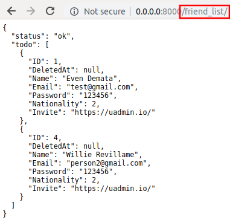

**uadmin.BindIP**
^^^^^^^^^^^^^^^^^
BindIP is the IP the application listens to.

Syntax:

.. code-block:: go

    BindIP string

Go to the main.go. Set your own IP address within the range of 127.0.0.1 - 127.255.255.254 by using BindIP. Let's say **127.0.0.2**

.. code-block:: go

    func main() {
        // Some codes are contained in this line ... (ignore this part)
        uadmin.BindIP = "127.0.0.2" // <--  place it here
    }

If you run your code,

.. code-block:: bash

    [   OK   ]   Initializing DB: [12/12]
    [   OK   ]   Server Started: http://127.0.0.2:8080
             ___       __          _
      __  __/   | ____/ /___ ___  (_)___
     / / / / /| |/ __  / __  __ \/ / __ \
    / /_/ / ___ / /_/ / / / / / / / / / /
    \__,_/_/  |_\__,_/_/ /_/ /_/_/_/ /_/

In the Server Started, it will redirect you to the IP address of **127.0.0.2**.

But if you connect to other IP address within the range of 127.0.0.1 - 127.255.255.254 it will not work as shown below (User connects to 127.0.0.3).

.. image:: tutorial/assets/bindiphighlighted.png

**uadmin.Choice**
^^^^^^^^^^^^^^^^^
Choice is a struct for the list of choices.

Syntax:

.. code-block:: go

    type Choice struct{
        V        string
        K        uint
        Selected bool
    }

**uadmin.ClearDB**
^^^^^^^^^^^^^^^^^^
ClearDB clears the database object.

Syntax:

.. code-block:: go

    ClearDB func()

**uadmin.CookieTimeout**
^^^^^^^^^^^^^^^^^^^^^^^^
CookieTimeout is the timeout of a login cookie in seconds.

Syntax:

.. code-block:: go

    CookieTimeout int

Let's apply this function in the main.go.

.. code-block:: go

    func main() {
        // Some codes are contained in this line ... (ignore this part)
        uadmin.CookieTimeout = 10 // <--  place it here
    }

.. WARNING::
   Use it at your own risk. Once the cookie expires in your user account, your account will be permanently deactivated. In this case, you must have an extra user account in the User database.

Login your account, wait for 10 seconds and see what happens.

.. image:: tutorial/assets/loginform.png

It will redirect you to the login form because your cookie has already been expired.

**uadmin.Count**
^^^^^^^^^^^^^^^^
Count return the count of records in a table based on a filter.

Syntax:

.. code-block:: go

    Count func(a interface{}, query interface{}, args ...interface{}) int

Parameters:

    **a interface{}:** Is the variable where the model name was initialized.

    **query interface{}:** Is an action that you want to perform with in your data list.

    **args ...interface{}:** Is the variable or container that can be used in execution process.

See `uadmin.Get`_ for the example.

**uadmin.CustomTranslation**
^^^^^^^^^^^^^^^^^^^^^^^^^^^^
CustomTranslation allows a user to customize any languages in the uAdmin system.

Syntax:

.. code-block:: go

    CustomTranslation []string

**uadmin.DashboardMenu**
^^^^^^^^^^^^^^^^^^^^^^^^
DashboardMenu is a system in uAdmin used to check and modify the settings of a model.

Syntax:

.. code-block:: go

    type DashboardMenu struct {
	    Model
	    MenuName string `uadmin:"required;list_exclude;multilingual;filter"`
	    URL      string `uadmin:"required"`
	    ToolTip  string
	    Icon     string `uadmin:"image"`
	    Cat      string `uadmin:"filter"`
	    Hidden   bool   `uadmin:"filter"`
    }

**uadmin.Database**
^^^^^^^^^^^^^^^^^^^
Database is the active Database settings.

Syntax:

.. code-block:: go

    Database *DBSettings

See `uadmin.DBSettings`_ for the example.

**uadmin.DBSettings**
^^^^^^^^^^^^^^^^^^^^^
DBSettings is a feature that allows a user to configure the settings of a database.

Syntax:

.. code-block:: go

    type DBSettings struct {
	    Type     string // SQLLite, MySQL
	    Name     string // File/DB name
	    User     string
	    Password string
	    Host     string
	    Port     int
    }

Go to the main.go in your Todo list project. Add the codes below above the uadmin.Register.

.. code-block:: go

    func main() {
        uadmin.Database = &uadmin.DBSettings{
            Type:      "sqlite",
            Name:      "todolist.db",
            User:      "admin",
            Password:  "admin",
            Host:      "192.168.149.108",
            Port:      8000,
        }
        // Some codes are contained in this line ... (ignore this part)
    }

If you run your code,

.. code-block:: bash

    [   OK   ]   Initializing DB: [12/12]
    [   OK   ]   Initializing Languages: [185/185]
    [  INFO  ]   Auto generated admin user. Username: admin, Password: admin.
    [   OK   ]   Server Started: http://0.0.0.0:8000
             ___       __          _
      __  __/   | ____/ /___ ___  (_)___
     / / / / /| |/ __  / __  __ \/ / __ \
    / /_/ / ___ / /_/ / / / / / / / / / /
    \__,_/_/  |_\__,_/_/ /_/ /_/_/_/ /_/

The todolist.db file is automatically created in your main project folder.

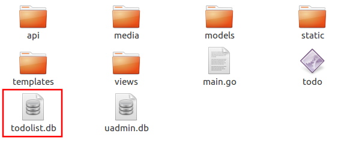

**uadmin.DEBUG**
^^^^^^^^^^^^^^^^
DEBUG is the process of identifying and removing errors.

Syntax:

.. code-block:: go

    const DEBUG int = 0

See `uadmin.Trail`_ for the example.

**uadmin.DebugDB**
^^^^^^^^^^^^^^^^^^
DebugDB prints all SQL statements going to DB.

Syntax:

.. code-block:: go

    DebugDB bool

Go to the main.go. Set this function as true.

.. code-block:: go

    func main(){
        uadmin.DebugDB = true
        // Some codes contained in this part
    }

Check your terminal to see the result.

.. code-block:: bash

    [   OK   ]   Initializing DB: [13/13]

    (/home/dev1/go/src/github.com/uadmin/uadmin/db.go:428) 
    [2018-11-10 12:43:07]  [0.09ms]  SELECT count(*) FROM "languages"  WHERE "languages"."deleted_at" IS NULL  
    [0 rows affected or returned ] 

    (/home/dev1/go/src/github.com/uadmin/uadmin/db.go:298) 
    [2018-11-10 12:43:07]  [0.17ms]  SELECT * FROM "languages"  WHERE "languages"."deleted_at" IS NULL AND ((active = 'true'))  
    [1 rows affected or returned ] 

    (/home/dev1/go/src/github.com/uadmin/uadmin/db.go:238) 
    [2018-11-10 12:43:07]  [0.16ms]  SELECT * FROM "languages"  WHERE "languages"."deleted_at" IS NULL AND ((`default` = 'true')) ORDER BY "languages"."id" ASC LIMIT 1  
    [1 rows affected or returned ] 

    (/home/dev1/go/src/github.com/uadmin/uadmin/db.go:162) 
    [2018-11-10 12:43:07]  [0.32ms]  SELECT * FROM "dashboard_menus"  WHERE "dashboard_menus"."deleted_at" IS NULL  
    [13 rows affected or returned ] 

    (/home/dev1/go/src/github.com/uadmin/uadmin/db.go:428) 
    [2018-11-10 12:43:07]  [0.07ms]  SELECT count(*) FROM "users"  WHERE "users"."deleted_at" IS NULL  
    [0 rows affected or returned ] 

**uadmin.Delete**
^^^^^^^^^^^^^^^^^
Delete records from database.

Syntax:

.. code-block:: go

    Delete func(a interface{}) (err error)

Parameters:

    **a interface{}:** Is the variable where the model name was initialized.

Let's create a new file in the models folder named "expression.go" with the following codes below:

.. code-block:: go

    package models

    import "github.com/uadmin/uadmin"

    // ---------------- DROP DOWN LIST ----------------
    // Status ...
    type Status int

    // Keep ...
    func (s Status) Keep() Status {
        return 1
    }

    // DeletePrevious ...
    func (s Status) DeletePrevious() Status {
        return 2
    }
    // -----------------------------------------------

    // Expression model ...
    type Expression struct {
        uadmin.Model
        Name   string `uadmin:"required"`
        Status Status `uadmin:"required"`
    }

    // Save ...
    func (t *Expression) Save() {
        // If Status is equal to DeletePrevious(), it will delete
        // the previous data in the list.
        if t.Status == t.Status.DeletePrevious() {
            uadmin.Delete(t) // <-- place it here
        }

        uadmin.Save(t)
    }

Register your Expression model in the main function.

.. code-block:: go

    func main() {

        // Some codes contained in this part

        uadmin.Register(
            // Some registered models
            models.Expression{}, // <-- place it here
        )

        // Some codes contained in this part
    }

Run the application. Go to the Expressions model and add at least 3 interjections, all Status set to "Keep".

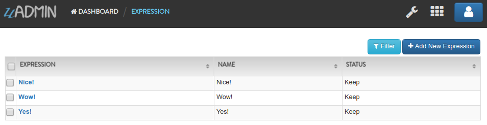

|

Now create another data, this time set the Status as "Delete Previous" and see what happens.

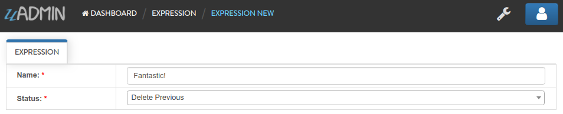

|

Result

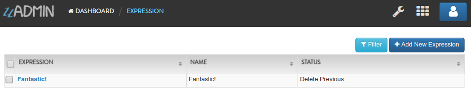

|

All previous records are deleted from the database.

**uadmin.DeleteList**
^^^^^^^^^^^^^^^^^^^^^
Delete the list of records from database.

Syntax:

.. code-block:: go

    DeleteList func(a interface{}, query interface{}, args ...interface{}) (err error)

Parameters:

    **a interface{}:** Is the variable where the model name was initialized.

    **query interface{}:** Is an action that you want to perform with in your data list.

    **args ...interface{}:** Is the variable or container that can be used in execution process.

Let's create a new file in the models folder named "expression.go" with the following codes below:

.. code-block:: go

    package models

    import "github.com/uadmin/uadmin"

    // ---------------- DROP DOWN LIST ----------------
    // Status ...
    type Status int

    // Keep ...
    func (s Status) Keep() Status {
        return 1
    }

    // Custom ...
    func (s Status) Custom() Status {
        return 2
    }

    // DeleteCustom ...
    func (s Status) DeleteCustom() Status {
        return 3
    }
    // -----------------------------------------------

    // Expression model ...
    type Expression struct {
        uadmin.Model
        Name   string `uadmin:"required"`
        Status Status `uadmin:"required"`
    }

    // Save ...
    func (t *Expression) Save() {
        // Initialized a stat variable set to 2 indicates that the value
        // is Custom.
        stat := 2

        // If Status is equal to DeleteCustom(), it will delete the
        // list of data that contains Custom as the status.
        if t.Status == t.Status.DeleteCustom() {
            uadmin.DeleteList(&t, "status = ?", stat)
        }

        uadmin.Save(t)
    }

Register your Expression model in the main function.

.. code-block:: go

    func main() {

        // Some codes contained in this part

        uadmin.Register(
            // Some registered models
            models.Expression{}, // <-- place it here
        )

        // Some codes contained in this part
    }

Run the application. Go to the Expressions model and add at least 3 interjections, one is set to "Keep" and the other two is set to "Custom".

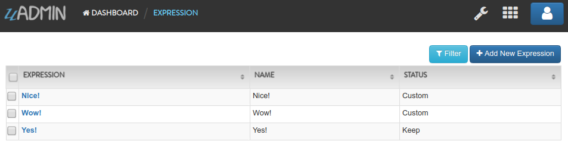

|

Now create another data, this time set the Status as "Delete Custom" and see what happens.

.. image:: assets/deletecustom.png

|

Result

.. image:: assets/deletecustomresult.png

|

All custom records are deleted from the database.

**uadmin.EmailFrom**
^^^^^^^^^^^^^^^^^^^^
EmailFrom identifies where the email is coming from.

Syntax:

.. code-block:: go

    EmailFrom string

.. code-block:: go

    func main(){
        uadmin.EmailFrom = "rmamisay@integritynet.biz"
        uadmin.EmailUsername = "rmamisay@integritynet.biz"
        uadmin.EmailPassword = "abc123"
        uadmin.EmailSMTPServer = "smtp.integritynet.biz"
        uadmin.EmailSMTPServerPort = 587
        // Some codes are contained in this line ... (ignore this part)
    }

Let's go back to the uAdmin dashboard, go to Users model, create your own user account and set the email address based on your assigned EmailFrom in the code above.

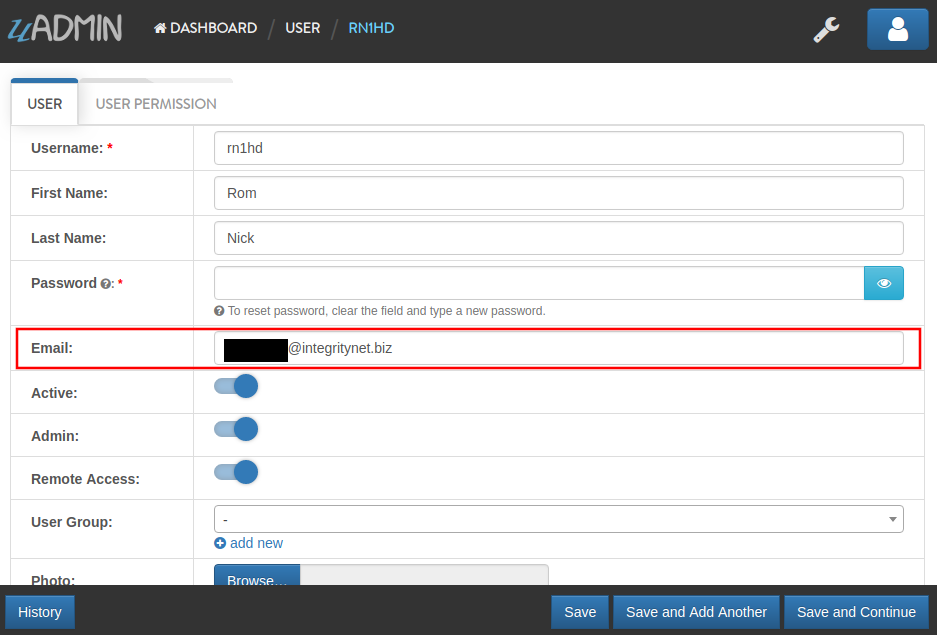

|

Log out your account. At the moment, you suddenly forgot your password. How can we retrieve our account? Click Forgot Password at the bottom of the login form.

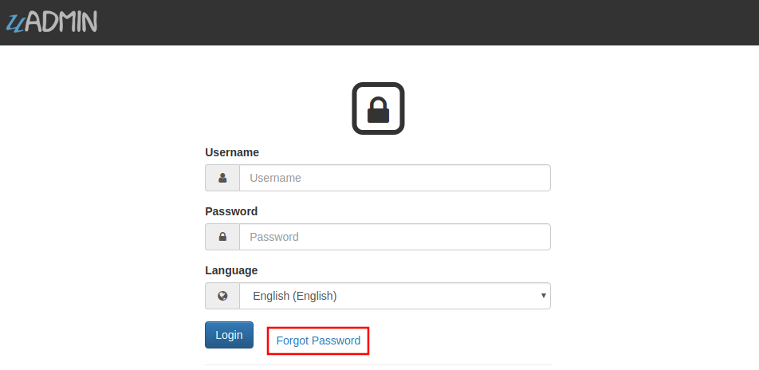

|

Input your email address based on the user account you wish to retrieve it back.

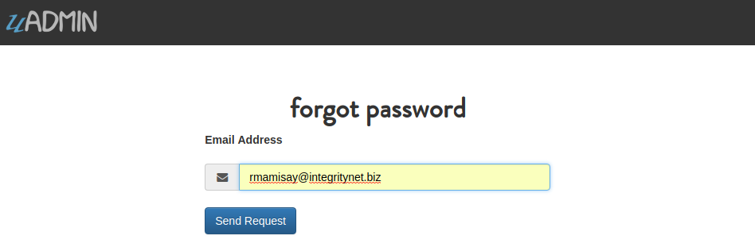

|

Once you are done, open your email account. You will receive a password reset notification from the Todo List support. To reset your password, click the link highlighted below.

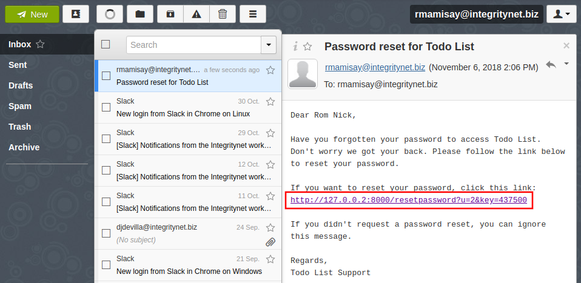

|

You will be greeted by the reset password form. Input the following information in order to create a new password for you.

.. image:: tutorial/assets/resetpasswordform.png

Once you are done, you can now access your account using your new password.

**uadmin.EmailPassword**
^^^^^^^^^^^^^^^^^^^^^^^^
EmailPassword sets the password of an email.

Syntax:

.. code-block:: go

    EmailPassword string

See `uadmin.EmailFrom`_ for the example.

**uadmin.EmailSMTPServer**
^^^^^^^^^^^^^^^^^^^^^^^^^^
EmailSMTPServer sets the name of the SMTP Server in an email.
Syntax:

.. code-block:: go

    EmailSMTPServer string

See `uadmin.EmailFrom`_ for the example.

**uadmin.EmailSMTPServerPort**
^^^^^^^^^^^^^^^^^^^^^^^^^^^^^^
EmailSMTPServerPort sets the port number of an SMTP Server in an email.

Syntax:

.. code-block:: go

    EmailSMTPServerPort int

See `uadmin.EmailFrom`_ for the example.

**uadmin.EmailUsername**
^^^^^^^^^^^^^^^^^^^^^^^^
EmailUsername sets the username of an email.

Syntax:

.. code-block:: go

    EmailUsername string

See `uadmin.EmailFrom`_ for the example.

**uadmin.ERROR**
^^^^^^^^^^^^^^^^
ERROR is a status to notify the user that there is a problem in an application.

Syntax:

.. code-block:: go

    const ERROR int = 5

See `uadmin.Trail`_ for the example.

**uadmin.F**
^^^^^^^^^^^^
F is a field.

Syntax:

.. code-block:: go

    type F struct {
        Name              string
        DisplayName       string
        Type              string
        Value             interface{}
        Help              string
        Max               interface{}
        Min               interface{}
        Format            string
        DefaultValue      string
        Required          bool
        Pattern           string
        PatternMsg        string
        Hidden            bool
        ReadOnly          string
        Searchable        bool
        Filter            bool
        ListDisplay       bool
        FormDisplay       bool
        CategoricalFilter bool
        Translations      []translation
        Choices           []Choice
        IsMethod          bool
        ErrMsg            string
        ProgressBar       map[float64]string
        LimitChoicesTo    func(interface{}, *User) []Choice
        UploadTo          string
    }

**uadmin.Filter**
^^^^^^^^^^^^^^^^^
Filter fetches records from the database.

Syntax:

.. code-block:: go

    Filter func(a interface{}, query interface{}, args ...interface{}) (err error)

Parameters:

    **a interface{}:** Is the variable where the model name was initialized.

    **query interface{}:** Is an action that you want to perform with in your data list.

    **args ...interface{}:** Is the variable or container that can be used in execution process.

Before we proceed to the example, read `Tutorial Part 7 - Introduction to API`_ to familiarize how API works in uAdmin.

.. _Tutorial Part 7 - Introduction to API: https://uadmin.readthedocs.io/en/latest/tutorial/part7.html

Create a file named filter_list.go inside the api folder with the following codes below:

.. code-block:: go

    package api

    import (
        "net/http"
        "strings"

        "github.com/username/todo/models"
        "github.com/uadmin/uadmin"
    )

    // FilterListHandler !
    func FilterListHandler(w http.ResponseWriter, r *http.Request) {
        r.URL.Path = strings.TrimPrefix(r.URL.Path, "/filter_list")

        res := map[string]interface{}{}

        filterList := []string{}
        valueList := []interface{}{}
        if r.URL.Query().Get("todo_id") != "" {
            filterList = append(filterList, "todo_id = ?")
            valueList = append(valueList, r.URL.Query().Get("todo_id"))
        }
        filter := strings.Join(filterList, " AND ")

        todo := []models.Todo{}
        results := []map[string]interface{}{}

        uadmin.Filter(&todo, filter, valueList) // <-- place it here

        // This loop returns only the name of your todo list.
        for i := range todo {
            results = append(results, map[string]interface{}{
                "Name": todo[i].Name,
            })
        }

        res["status"] = "ok"
        res["todo"] = results
        uadmin.ReturnJSON(w, r, res)
    }

Establish a connection in the main.go to the API by using http.HandleFunc. It should be placed after the uadmin.Register and before the StartServer.

.. code-block:: go

    func main() {
        // Some codes

        // FilterListHandler
        http.HandleFunc("/filter_list/", api.FilterListHandler) // <-- place it here
    }

api is the folder name while FilterListHandler is the name of the function inside api.go.

Run your application and see what happens.

.. image:: assets/filterlistapi.png
   :align: center

**uadmin.FilterBuilder**
^^^^^^^^^^^^^^^^^^^^^^^^
FilterBuilder changes a map filter into a query.

Syntax:

.. code-block:: go

    FilterBuilder func(params map[string]interface{}) (query string, args []interface{})

**uadmin.GenerateBase32**
^^^^^^^^^^^^^^^^^^^^^^^^^
GenerateBase32 generates a base32 string of length.

Syntax:

.. code-block:: go

    GenerateBase32 func(length int) string

Go to the friend.go and initialize the Base32 field inside the struct. Set the tag as "read_only".

.. code-block:: go

    // Friend model ...
    type Friend struct {
        uadmin.Model
        Name     string `uadmin:"required"`
        Email    string `uadmin:"email"`
        Password string `uadmin:"password;list_exclude"`
        Base32   string `uadmin:"read_only"` // <-- place it here
    }

Apply overriding save function. Use this function to the Base32 field and set the integer value as 40.

.. code-block:: go

    // Save !
    func (f *Friend) Save() {
        f.Base32 = uadmin.GenerateBase32(40) // <-- place it here
        uadmin.Save(f)
    }

Now run your application. Go to the Friend model and save any element to see the changes.

.. image:: assets/friendbase32.png

|

Result

.. image:: assets/friendbase32output.png

As you notice, the Base32 value changed automatically.

**uadmin.GenerateBase64**
^^^^^^^^^^^^^^^^^^^^^^^^^
GenerateBase64 generates a base64 string of length.

Syntax:

.. code-block:: go

    GenerateBase64 func(length int) string

Go to the friend.go and initialize the Base64 field inside the struct. Set the tag as "read_only".

.. code-block:: go

    // Friend model ...
    type Friend struct {
        uadmin.Model
        Name     string `uadmin:"required"`
        Email    string `uadmin:"email"`
        Password string `uadmin:"password;list_exclude"`
        Base64   string `uadmin:"read_only"` // <-- place it here
    }

Apply overriding save function. Use this function to the Base64 field and set the integer value as 75.

.. code-block:: go

    // Save !
    func (f *Friend) Save() {
        f.Base64 = uadmin.GenerateBase64(75) // <-- place it here
        uadmin.Save(f)
    }

Now run your application. Go to the Friend model and save any element to see the changes.

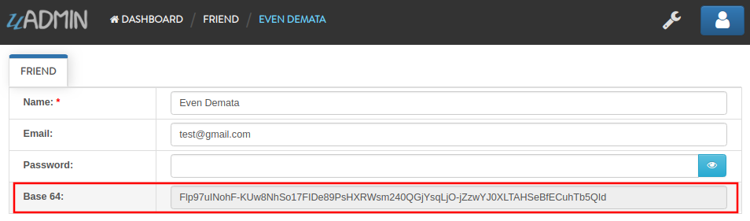

|

Result

.. image:: assets/friendbase64output.png

As you notice, the Base64 value changed automatically.

**uadmin.Get**
^^^^^^^^^^^^^^
Get fetches the first record from the database.

Syntax:

.. code-block:: go

    Get func(a interface{}, query interface{}, args ...interface{}) (err error)

Parameters:

    **a interface{}:** Is the variable where the model name was initialized.

    **query interface{}:** Is an action that you want to perform with in your data list.

    **args ...interface{}:** Is the variable or container that can be used in execution process.

Suppose you have ten records in your Todo model.

.. image:: assets/tendataintodomodel.png

|

Go to the main.go. Let's count how many todos do you have with a friend in your model.

.. code-block:: go

    func main(){
        // Some codes contained in this part

        // Initialized the Todo model in the todo variable
        todo := models.Todo{}

        // Initialized the Friend model in the todo variable
        friend := models.Friend{}

        // Fetches the first record from the database
        uadmin.Get(&friend, "id=?", todo.FriendID)

        // Returns the count of records in a table based on a Get function to  
        // be stored in the total variable
        total := uadmin.Count(&todo, "friend_id = ?", todo.FriendID)

        // Prints the result
        uadmin.Trail(uadmin.INFO, "You have %v todos with a friend in your list.", total)
    }

Check your terminal to see the result.

.. code-block:: bash

    [  INFO  ]   You have 5 todos with a friend in your list.

**uadmin.GetDB**
^^^^^^^^^^^^^^^^
GetDB returns a pointer to the DB.

Syntax:

.. code-block:: go

    GetDB func() *gorm.DB

**uadmin.GetID**
^^^^^^^^^^^^^^^^
GetID returns an ID number of a field.

Syntax:

.. code-block:: go

    GetID func(m.reflectValue) uint

**uadmin.GetString**
^^^^^^^^^^^^^^^^^^^^
GetString returns string representation on an instance of a model.

Syntax:

.. code-block:: go

    GetString func(a interface{}) string

Parameters:

    **a interface{}:** Is the variable where the model name was initialized.

**uadmin.GetUserFromRequest**
^^^^^^^^^^^^^^^^^^^^^^^^^^^^^
GetUserFromRequest returns a user from a request.

Syntax:

.. code-block:: go

    GetUserFromRequest func(r *http.Request) *User

**uadmin.GroupPermission**
^^^^^^^^^^^^^^^^^^^^^^^^^^
GroupPermission sets the permission of a user group handled by an administrator.

Syntax:

.. code-block:: go

    type GroupPermission struct {
        Model
        DashboardMenu   DashboardMenu `gorm:"ForeignKey:DashboardMenuID" required:"true" filter:"true"`
        DashboardMenuID uint          `fk:"true" displayName:"DashboardMenu"`
        UserGroup       UserGroup     `gorm:"ForeignKey:UserGroupID" required:"true" filter:"true"`
        UserGroupID     uint          `fk:"true" displayName:"UserGroup"`
        Read            bool
        Add             bool
        Edit            bool
        Delete          bool
    }

**uadmin.HideInDashboarder**
^^^^^^^^^^^^^^^^^^^^^^^^^^^^
HideInDashboarder is used to check if a model should be hidden in the dashboard.

Syntax:

.. code-block:: go

    type HideInDashboarder interface{
        HideInDashboard() bool
    }

**uadmin.INFO**
^^^^^^^^^^^^^^^
INFO is a data that is presented within a context that gives it meaning and relevance.

Syntax:

.. code-block:: go

    const INFO int = 2

See `uadmin.Trail`_ for the example.

**uadmin.IsAuthenticated**
^^^^^^^^^^^^^^^^^^^^^^^^^^
IsAuthenticated returns if the http.Request is authenticated or not.

Syntax:

.. code-block:: go

    IsAuthenticated func(r *http.Request) *Session

**uadmin.JSONMarshal**
^^^^^^^^^^^^^^^^^^^^^^
JSONMarshal returns the JSON encoding of v.

Syntax:

.. code-block:: go

    JSONMarshal func(v interface{}, safeEncoding bool) ([]byte, error)

**uadmin.Language**
^^^^^^^^^^^^^^^^^^^
Language is a system in uAdmin used to check and modify the settings of a language.

Syntax:

.. code-block:: go

    type Language struct {
        Model
        EnglishName    string `uadmin:"required;read_only;filter;search"`
        Name           string `uadmin:"required;read_only;filter;search"`
        Flag           string `uadmin:"image;list_exclude"`
        Code           string `uadmin:"filter;read_only;list_exclude"`
        RTL            bool   `uadmin:"list_exclude"`
        Default        bool   `uadmin:"help:Set as the default language;list_exclude"`
        Active         bool   `uadmin:"help:To show this in available languages;filter"`
        AvailableInGui bool   `uadmin:"help:The App is available in this language;read_only"`
    }

**uadmin.Log**
^^^^^^^^^^^^^^
Log is a system in uAdmin used to check the status of the user activities.

Syntax:

.. code-block:: go

    type Log struct {
        Model
        Username  string    `uadmin:"filter;read_only"`
        Action    Action    `uadmin:"filter;read_only"`
        TableName string    `uadmin:"filter;read_only"`
        TableID   int       `uadmin:"filter;read_only"`
        Activity  string    `uadmin:"code;read_only" gorm:"type:longtext"`
        RollBack  string    `uadmin:"link;"`
        CreatedAt time.Time `uadmin:"filter;read_only"`
    }

**uadmin.Login**
^^^^^^^^^^^^^^^^
Login returns the pointer of User and a bool for Is OTP Required.

Syntax:

.. code-block:: go

    Login func(r *http.Request, username string, password string) (*User, bool)

**uadmin.Login2FA**
^^^^^^^^^^^^^^^^^^^
Login2FA returns the pointer of User with a two-factor authentication.

Syntax:

.. code-block:: go

    Login2FA func(r *http.Request, username string, password string, otpPass string) *User

**uadmin.Logout**
^^^^^^^^^^^^^^^^^
Logout deactivates a session.

Syntax:

.. code-block:: go

    Logout func(r *http.Request)

**uadmin.MaxImageHeight**
^^^^^^^^^^^^^^^^^^^^^^^^^
MaxImageHeight sets the maximum height of an image.

Syntax:

.. code-block:: go

    MaxImageHeight int

See `uadmin.MaxImageWidth`_ for the example.

**uadmin.MaxImageWidth**
^^^^^^^^^^^^^^^^^^^^^^^^
MaxImageWidth sets the maximum width of an image.

Syntax:

.. code-block:: go

    MaxImageWidth int

Let's set the MaxImageWidth to 360 pixels and the MaxImageHeight to 240 pixels.

.. code-block:: go

    func main() {
        // Some codes are contained in this line ... (ignore this part)
        uadmin.MaxImageWidth = 360      // <--  place it here
        uadmin.MaxImageHeight = 240     // <--  place it here
    }

uAdmin has a feature that allows you to customize your own profile. In order to do that, click the profile icon on the top right corner then select admin as highlighted below.

.. image:: tutorial/assets/adminhighlighted.png

|

By default, there is no profile photo inserted on the top left corner. If you want to add it in your profile, click the Choose File button to browse the image on your computer.

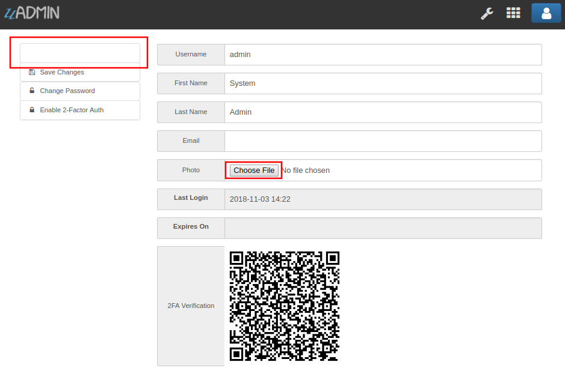

|

Let's pick a photo that surpasses the MaxImageWidth and MaxImageHeight values.

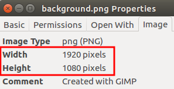

|

Once you are done, click Save Changes on the left corner and refresh the webpage to see the output.

.. image:: tutorial/assets/profilepicadded.png

As expected, the profile pic will be uploaded to the user profile that automatically resizes to 360x240 pixels.

**uadmin.MaxUploadFileSize**
^^^^^^^^^^^^^^^^^^^^^^^^^^^^
MaxUploadFileSize is the maximum upload file size in bytes.

Syntax:

.. code-block:: go

    MaxUploadFileSize int64

Go to the main.go. Let's set the MaxUploadFileSize value to 1024. 1024 is equivalent to 1 MB.

.. code-block:: go

    func main() {
        // Some codes are contained in this line ... (ignore this part)
        uadmin.MaxUploadFileSize = 1024     // <--  place it here
    }

Run the application, go to your profile and upload an image that exceeds the MaxUploadFileSize limit. If you click Save changes...

.. image:: tutorial/assets/noprofilepic.png

The profile picture has failed to upload in the user profile because the file size is larger than the limit.

**uadmin.Model**
^^^^^^^^^^^^^^^^
Model is the standard struct to be embedded in any other struct to make it a model for uAdmin.

Syntax:

.. code-block:: go

    type Model struct {
	    ID        uint       `gorm:"primary_key"`
	    DeletedAt *time.Time `sql:"index"`
    }

**uadmin.ModelSchema**
^^^^^^^^^^^^^^^^^^^^^^
ModelSchema is a representation of a plan or theory in the form of an outline or model.

Syntax:

.. code-block:: go

    type ModelSchema struct {
        Name          string // Name of the Model
        DisplayName   string // Display Name of the model
        ModelName     string // URL
        ModelID       uint
        Inlines       []*ModelSchema
        InlinesData   []listData
        Fields        []F
        IncludeFormJS []string
        IncludeListJS []string
    }

**uadmin.MongoDB**
^^^^^^^^^^^^^^^^^^
MongoDB is an open source database management system (DBMS) that uses a document-oriented database model which supports various forms of data. [#f1]_ It is the active Mongo settings.

Syntax:

.. code-block:: go

    MongoDB *MongoSettings

**uadmin.MongoModel**
^^^^^^^^^^^^^^^^^^^^^
MongoModel is a uAdmin function for interfacing with MongoDB databases.

Syntax:

.. code-block:: go

    type MongoModel struct {
	    ID bson.ObjectId `bson:"_id,omitempty"`
    }

**uadmin.MongoSettings**
^^^^^^^^^^^^^^^^^^^^^^^^
MongoSettings is a feature that allows a user to configure the settings of a Mongo.

Syntax:

.. code-block:: go

    type MongoSettings struct {
        Name  string
        IP    string
        Debug bool
    }

**uadmin.NewModel**
^^^^^^^^^^^^^^^^^^^
NewModel creates a new model from a model name.

Syntax:

.. code-block:: go

    NewModel func(modelName string, pointer bool) (reflect.Value, bool)

**uadmin.NewModelArray**
^^^^^^^^^^^^^^^^^^^^^^^^
NewModelArray creates a new model from a model name.

Syntax:

.. code-block:: go

    NewModelArray func(modelName string, pointer bool) (reflect.Value, bool)

**uadmin.OK**
^^^^^^^^^^^^^
OK is a status to show that the application is doing well.

Syntax:

.. code-block:: go

    const OK int = 3

See `uadmin.Trail`_ for the example.

**uadmin.OTPAlgorithm**
^^^^^^^^^^^^^^^^^^^^^^^
OTPAlgorithm is the hashing algorithm of OTP.

Syntax:

.. code-block:: go

    OTPAlgorithm string

There are 3 different algorithms:

* sha1 (default)
* sha256
* sha512

**uadmin.OTPDigits**
^^^^^^^^^^^^^^^^^^^^
OTPDigits is the number of digits for the OTP.

Syntax:

.. code-block:: go

    OTPDigits int

Go to the main.go and set the OTPDigits to 8.

.. code-block:: go

    func main() {
        // Some codes are contained in this line ... (ignore this part)
        uadmin.OTPDigits = 8 // <--  place it here
    }

Run your application, login your account, and check your terminal afterwards to see the OTP verification code assigned by your system.

.. code-block:: bash

    [  INFO  ]   User: admin OTP: 90401068

As shown above, it has 8 OTP digits.

**uadmin.OTPPeriod**
^^^^^^^^^^^^^^^^^^^^
OTPPeriod is the number of seconds for the OTP to change.

Syntax:

.. code-block:: go

    OTPPeriod uint

Go to the main.go and set the OTPPeriod to 10 seconds.

.. code-block:: go

    func main() {
        // Some codes are contained in this line ... (ignore this part)
        uadmin.OTPPeriod = uint(10) // <--  place it here
    }

Run your application, login your account, and check your terminal afterwards to see how the OTP code changes every 10 seconds by refreshing your browser.

.. code-block:: bash

    // Before refreshing your browser
    [  INFO  ]   User: admin OTP: 433452

    // After refreshing your browser in more than 10 seconds
    [  INFO  ]   User: admin OTP: 185157

**uadmin.OTPSkew**
^^^^^^^^^^^^^^^^^^
OTPSkew is the number of minutes to search around the OTP.

Syntax:

.. code-block:: go

    OTPSkew uint

Go to the main.go and set the OTPSkew to 2 minutes.

.. code-block:: go

    func main() {
        // Some codes are contained in this line ... (ignore this part)
        uadmin.OTPSkew = uint(2) // <--  place it here
    }

Run your application, login your account, and check your terminal afterwards to see the OTP verification code assigned by your system. Wait for more than two minutes and check if the OTP code is still valid.

After waiting for more than two minutes,

.. image:: assets/loginformwithotp.png

It redirects to the same webpage which means your OTP code is no longer valid.

**uadmin.PageLength**
^^^^^^^^^^^^^^^^^^^^^
PageLength is the list view max number of records.

Syntax:

.. code-block:: go

    PageLength int

Go to the main.go and apply the PageLength function.

.. code-block:: go

    func main() {
        // Some codes are contained in this line ... (ignore this part)
        uadmin.PageLength = 4  // <--  place it here
    }

Run your application, go to the Item model, inside it you have 6 total elements. The elements in the item model will display 4 elements per page.

.. image:: tutorial/assets/pagelength.png

**uadmin.Port**
^^^^^^^^^^^^^^^
Port is the port used for http or https server.

Syntax:

.. code-block:: go

    Port int

Go to the main.go in your Todo list project and apply **8000** as a port number.

.. code-block:: go

    func main() {
        // Some codes are contained in this line ... (ignore this part)
        uadmin.Port = 8000
    }

If you run your code,

.. code-block:: bash

    [   OK   ]   Initializing DB: [12/12]
    [   OK   ]   Server Started: http://0.0.0.0:8000
             ___       __          _
      __  __/   | ____/ /___ ___  (_)___
     / / / / /| |/ __  / __  __ \/ / __ \
    / /_/ / ___ / /_/ / / / / / / / / / /
    \__,_/_/  |_\__,_/_/ /_/ /_/_/_/ /_/

In the Server Started, it will redirect you to port number **8000**.

**uadmin.Preload**
^^^^^^^^^^^^^^^^^^
Preload accesses the information of the fields in another model.

Syntax:

.. code-block:: go

    func(a interface{}, preload ...string) (err error)

Go to the friend.go and add the Points field inside the struct.

.. code-block:: go

    // Friend model ...
    type Friend struct {
        uadmin.Model
        Name     string `uadmin:"required"`
        Email    string `uadmin:"email"`
        Password string `uadmin:"password;list_exclude"`
        TotalPoints int // <-- place it here
    }

Now go to the todo.go and apply some business logic that will get the total points of each friend in the todo list. Let's apply overriding save function and put it below the Todo struct.

.. code-block:: go

    // Save ...
    func (t *Todo) Save() {
        // Save the model to DB
        uadmin.Save(t)

        // Get a list of other todo items that share the same
        // FriendID. Notice that in the filter we use friend_id which
        // is the way this is created in the DB
        todoList := []Todo{}
        uadmin.Filter(&todoList, "friend_id = ?", t.FriendID)
        progressSum := 0

        // Sum up the progress of all todos
        for _, todo := range todoList {
            progressSum += todo.Progress
        }

        // Preload the todo model to get the related points
        uadmin.Preload(t) // <-- place it here

        // Calculate the total progress
        t.Friend.TotalPoints = progressSum

        // Finally save the Friend
        uadmin.Save(&t.Friend)
    }

Suppose you have ten records in your Todo model.

.. image:: assets/tendataintodomodel.png

|

Now go to the Friend model and see what happens.

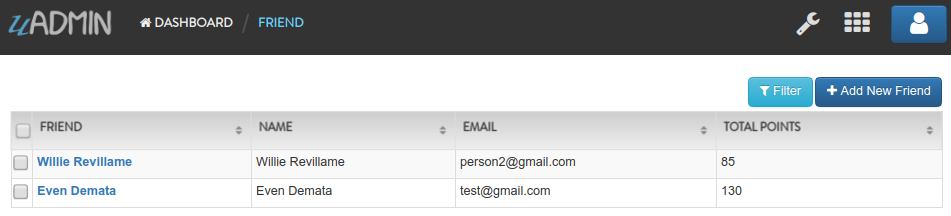

|

In my list, Willie Revillame wins 85 points and Even Demata wins 130 points.

**uadmin.PublicMedia**
^^^^^^^^^^^^^^^^^^^^^^
PublicMedia allows public access to media handler without authentication.

Syntax:

.. code-block:: go

    PublicMedia bool

**uadmin.Register**
^^^^^^^^^^^^^^^^^^^
Register is used to register models to uAdmin.

Syntax:

.. code-block:: go

    Register func(m ...interface{})

Create an internal Todo model inside the main.go. Afterwards, call the Todo{} inside the uadmin.Register so that the application will identify the Todo model to be added in the dashboard.

.. code-block:: go

    // Todo model ...
    type Todo struct {
	    uadmin.Model
	    Name        string
	    Description string `uadmin:"html"`
	    TargetDate  time.Time
	    Progress    int `uadmin:"progress_bar"`
    }

    func main() {
	    uadmin.Register(Todo{}) // <-- place it here
    }

Output

.. image:: assets/uadmindashboard.png

If you click the Todos model, it will display this result as shown below.

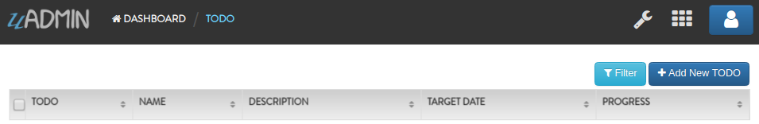

**uadmin.RegisterInlines**
^^^^^^^^^^^^^^^^^^^^^^^^^^
RegisterInlines is a function to register a model as an inline for another model

Syntax:

.. code-block:: go

    func RegisterInlines(model interface{}, fk map[string]string)

Parameters:

    **model (struct instance):** Is the model that you want to add inlines to.

    **fk (map[interface{}]string):** This is a map of the inlines to be added to the model. The map's key is the name of the model of the inline and the value of the map is the foreign key field's name.

Example:

.. code-block:: go

    type Person struct {
        uadmin.Model
        Name string
    }

    type Card struct {
        uadmin.Model
        PersonID uint
        Person   Person
    }

    func main() {
        // ...
        uadmin.RegisterInlines(Person{}, map[string]string{
            "Card": "PersonID",
        })
        // ...
    }

**uadmin.ReportingLevel**
^^^^^^^^^^^^^^^^^^^^^^^^^
ReportingLevel is the standard reporting level.

Syntax:

.. code-block:: go

    ReportingLevel int

There are 6 different levels:

* DEBUG   = 0
* WORKING = 1
* INFO    = 2
* OK      = 3
* WARNING = 4
* ERROR   = 5

Let's set the ReportingLevel to 1 to show that the debugging process is working.

.. code-block:: go

    func main() {
        // Some codes are contained in this line ... (ignore this part)
        uadmin.ReportingLevel = 1 // <--  place it here
    }

Result

.. code-block:: bash

    [   OK   ]   Initializing DB: [12/12]
    [   OK   ]   Server Started: http://0.0.0.0:8080
             ___       __          _
      __  __/   | ____/ /___ ___  (_)___
     / / / / /| |/ __  / __  __ \/ / __ \
    / /_/ / ___ / /_/ / / / / / / / / / /
    \__,_/_/  |_\__,_/_/ /_/ /_/_/_/ /_/

What if I set the value to 5?

.. code-block:: go

    func main() {
        // Some codes are contained in this line ... (ignore this part)
        uadmin.ReportingLevel = 5 // <--  place it here
    }

Result

.. code-block:: bash

    [   OK   ]   Initializing DB: [12/12]
             ___       __          _
      __  __/   | ____/ /___ ___  (_)___
     / / / / /| |/ __  / __  __ \/ / __ \
    / /_/ / ___ / /_/ / / / / / / / / / /
    \__,_/_/  |_\__,_/_/ /_/ /_/_/_/ /_/

The database was initialized. However, the server did not start because the status of the ReportingLevel is ERROR.

**uadmin.ReportTimeStamp**
^^^^^^^^^^^^^^^^^^^^^^^^^^
ReportTimeStamp set this to true to have a time stamp in your logs.

Syntax:

.. code-block:: go

    ReportTimeStamp bool

Go to the main.go and set the ReportTimeStamp value as true.

.. code-block:: go

    func main() {
        // Some codes are contained in this line ... (ignore this part)
        uadmin.ReportTimeStamp = true // <--  place it here
    }

If you run your code,

.. code-block:: bash

    [   OK   ]   Initializing DB: [12/12]
    2018/11/07 08:52:14 [   OK   ]   Server Started: http://0.0.0.0:8080
             ___       __          _
      __  __/   | ____/ /___ ___  (_)___
     / / / / /| |/ __  / __  __ \/ / __ \
    / /_/ / ___ / /_/ / / / / / / / / / /
    \__,_/_/  |_\__,_/_/ /_/ /_/_/_/ /_/

**uadmin.ReturnJSON**
^^^^^^^^^^^^^^^^^^^^^
ReturnJSON returns JSON to the client.

Syntax:

.. code-block:: go

    ReturnJSON func(w http.ResponseWriter, r *http.Request, v interface{})

See `Tutorial Part 7 - Introduction to API`_ for the example.

.. _Tutorial Part 7 - Introduction to API: https://uadmin.readthedocs.io/en/latest/tutorial/part7.html

**uadmin.RootURL**
^^^^^^^^^^^^^^^^^^
RootURL is where the listener is mapped to.

Syntax:

.. code-block:: go

    RootURL string

Go to the main.go and apply this function as "/admin/". Put it above the uadmin.Register.

.. code-block:: go

    func main() {
        uadmin.RootURL = "/admin/" // <-- place it here
        uadmin.Register(
            // Some codes
        )
    }

Result

.. image:: assets/rooturladmin.png

**uadmin.Salt**
^^^^^^^^^^^^^^^
Salt is extra salt added to password hashing.

Syntax:

.. code-block:: go

    Salt string

**uadmin.Save**
^^^^^^^^^^^^^^^
Save saves the object in the database.

Syntax:

.. code-block:: go

    Save func(a interface{}) (err error)

Parameters:

    **a interface{}:** Is the variable where the model name was initialized.

Let's add an Invite field in the friend.go that will direct you to his website. In order to do that, set the field name as "Invite" with the tag "link".

.. code-block:: go

    // Friend model ...
    type Friend struct {
        uadmin.Model
        Name        string 
        Email       string 
        Password    string 
        Nationality string
        Invite      string `uadmin:"link"`
    }

To make it functional, add the overriding save function after the Friend struct.

.. code-block:: go

    // Save !
    func (f *Friend) Save() {
        f.Invite = "https://uadmin.io/"
        uadmin.Save(f) // <-- place it here
    }

Run your application, go to the Friends model and update the elements inside. Afterwards, click the Invite button on the output structure and see what happens.

.. image:: tutorial/assets/invitebuttonhighlighted.png

|

Result

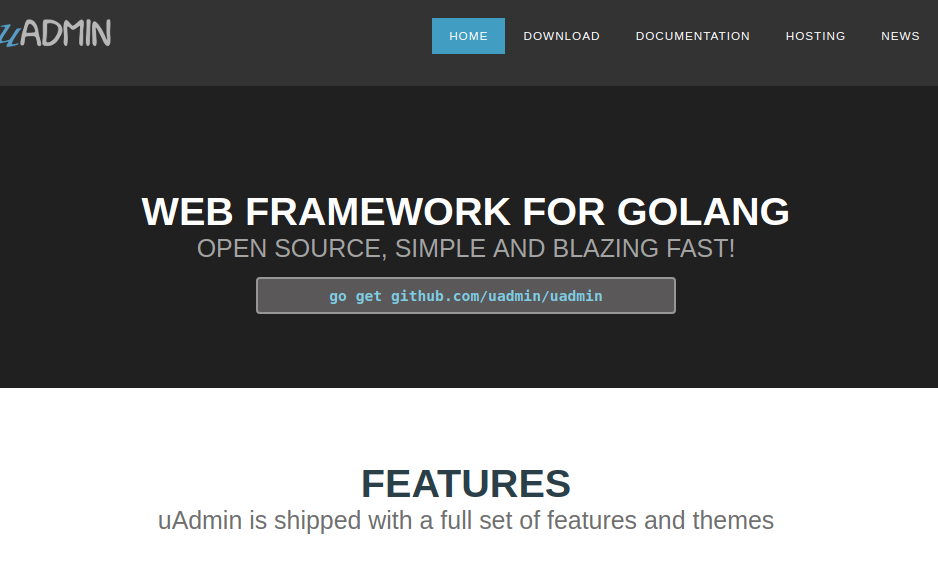

**uadmin.Schema**
^^^^^^^^^^^^^^^^^
Schema is the global schema of the system.

Syntax:

.. code-block:: go

    Schema map[string]ModelSchema

**uadmin.SendEmail**
^^^^^^^^^^^^^^^^^^^^
SendEmail sends email using system configured variables.

Syntax:

.. code-block:: go

    SendEmail func(to, cc, bcc []string, subject, body string) (err error)

**uadmin.Session**
^^^^^^^^^^^^^^^^^^
Session is an activity that a user with a unique IP address spends on a Web site during a specified period of time. [#f2]_

Syntax:

.. code-block:: go

    type Session struct {
        Model
        Key        string
        User       User `gorm:"ForeignKey:UserID" uadmin:"filter"`
        UserID     uint `fk:"true" displayName:"User"`
        LoginTime  time.Time
        LastLogin  time.Time
        Active     bool   `uadmin:"filter"`
        IP         string `uadmin:"filter"`
        PendingOTP bool   `uadmin:"filter"`
        ExpiresOn  *time.Time
    }

**uadmin.SiteName**
^^^^^^^^^^^^^^^^^^^
SiteName is the name of the website that shows on title and dashboard.

Syntax:

.. code-block:: go

    SiteName string

Go to the main.go and assign the SiteName value as **Todo List**.

.. code-block:: go

    func main() {
        // Some codes are contained in this line ... (ignore this part)
        uadmin.SiteName = "Todo List"
    }

Run your application and see the changes above the web browser.

.. image:: tutorial/assets/todolisttitle.png

**uadmin.StartSecureServer**
^^^^^^^^^^^^^^^^^^^^^^^^^^^^
StartSecureServer is the process of activating a uAdmin server using a localhost IP or an apache with SSL certificate and a private key.

Syntax:

.. code-block:: go

    StartSecureServer func(certFile, keyFile string)

**uadmin.StartServer**
^^^^^^^^^^^^^^^^^^^^^^
StartServer is the process of activating a uAdmin server using a localhost IP or an apache.

Syntax:

.. code-block:: go

    StartServer func()

Go to the main.go and put **uadmin.StartServer()** inside the main function.

.. code-block:: go

    func main() {
        // Some codes are contained in this line ... (ignore this part)
	    uadmin.StartServer() // <-- place it here
    }

Now to run your code:

.. code-block:: bash

    $ go build; ./todo
    [   OK   ]   Initializing DB: [9/9]
    [   OK   ]   Initializing Languages: [185/185]
    [  INFO  ]   Auto generated admin user. Username: admin, Password: admin.
    [   OK   ]   Server Started: http://0.0.0.0:8080
             ___       __          _
      __  __/   | ____/ /___ ___  (_)___
     / / / / /| |/ __  / __  __ \/ / __ \
    / /_/ / ___ / /_/ / / / / / / / / / /
    \__,_/_/  |_\__,_/_/ /_/ /_/_/_/ /_/

**uadmin.Tf**
^^^^^^^^^^^^^
Tf is a function for translating strings into any given language.

Syntax:

.. code-block:: go

    Tf func(path string, lang string, term string, args ...interface{}) string

Parameters:

    **path (string):** This is where to get the translation from. It is in the
    format of "GROUPNAME/FILENAME" for example: "uadmin/system"

    **lang (string):** Is the language code. If empty string is passed we will use
    the default language.

    **term (string):** The term to translate.

    **args (...interface{}):** Is a list of args to fill the term with place holders

**uadmin.Theme**
^^^^^^^^^^^^^^^^
Theme is the name of the theme used in uAdmin.

Syntax:

.. code-block:: go

    Theme string

**uadmin.Trail**
^^^^^^^^^^^^^^^^
Trail prints to the log.

Syntax:

.. code-block:: go

    Trail func(level int, msg interface{}, i ...interface{})

Parameters:

    **level int:** This is where we apply Trail tags.

    **msg interface{}:** Is the string of characters used for output.

    **i ...interface{}:** A variable or container that can be used to store a value in the msg interface{}.

Trail has 6 different tags:

* DEBUG
* WORKING
* INFO
* OK
* WARNING
* ERROR

Let's apply them in the overriding save function under the friend.go.

.. code-block:: go

    // Save !
    func (f *Friend) Save() {
        f.Invite = "https://uadmin.io/"
        temp := "saved"                                                  // declare temp variable
        uadmin.Trail(uadmin.DEBUG, "Your friend has been %s.", temp)     // used DEBUG tag
        uadmin.Trail(uadmin.WORKING, "Your friend has been %s.", temp)   // used WORKING tag
        uadmin.Trail(uadmin.INFO, "Your friend has been %s.", temp)      // used INFO tag
        uadmin.Trail(uadmin.OK, "Your friend has been %s.", temp)        // used OK tag
        uadmin.Trail(uadmin.WARNING, "Someone %s your friend.", temp)    // used WARNING tag
        uadmin.Trail(uadmin.ERROR, "Your friend has not been %s.", temp) // used ERROR tag
        uadmin.Save(f)
    }

Run your application, go to the Friend model and save any of the elements inside it. Check your terminal afterwards to see the result.

.. image:: tutorial/assets/trailtagsoutput.png
   :align: center

The output shows the different colors per tag.

**uadmin.Translate**
^^^^^^^^^^^^^^^^^^^^
Translate is used to get a translation from a multilingual fields.

Syntax:

.. code-block:: go

    Translate func(raw string, lang string, args ...bool) string

**uadmin.Update**
^^^^^^^^^^^^^^^^^
Update updates the field name and value of an interface.

Syntax:

.. code-block:: go

    Update func(a interface{}, fieldName string, value interface{}, query string, args ...interface{}) (err error)

**uadmin.UploadImageHandler**
^^^^^^^^^^^^^^^^^^^^^^^^^^^^^
UploadImageHandler handles the uploading process of an image.

Syntax:

.. code-block:: go

    UploadImageHandler func(w http.ResponseWriter, r *http.Request, session *Session)

**uadmin.User**
^^^^^^^^^^^^^^^
User is a system in uAdmin used to check and modify the settings of a user.

Syntax:

.. code-block:: go

    type User struct {
        Model
        Username     string    `uadmin:"required;filter"`
        FirstName    string    `uadmin:"filter"`
        LastName     string    `uadmin:"filter"`
        Password     string    `uadmin:"required;password;help:To reset password, clear the field and type a new password.;list_exclude"`
        Email        string    `uadmin:"email"`
        Active       bool      `uadmin:"filter"`
        Admin        bool      `uadmin:"filter"`
        RemoteAccess bool      `uadmin:"filter"`
        UserGroup    UserGroup `uadmin:"filter"`
        UserGroupID  uint
        Photo        string `uadmin:"image"`
        LastLogin   *time.Time `uadmin:"read_only"`
        ExpiresOn   *time.Time
        OTPRequired bool
        OTPSeed     string `uadmin:"list_exclude;hidden;read_only"`
    }

**uadmin.UserGroup**
^^^^^^^^^^^^^^^^^^^^
UserGroup is a system in uAdmin used to add, modify, and delete the group name. 

Syntax:

.. code-block:: go

    type UserGroup struct {
        Model
        GroupName string `uadmin:"filter"`
    }

**uadmin.UserPermission**
^^^^^^^^^^^^^^^^^^^^^^^^^
UserPermission sets the permission of a user handled by an administrator.

Syntax:

.. code-block:: go

    type UserPermission struct {
        Model
        DashboardMenu   DashboardMenu `gorm:"ForeignKey:DashboardMenuID" required:"true" filter:"true" uadmin:"filter"`
        DashboardMenuID uint          `fk:"true" displayName:"DashboardMenu"`
        User            User          `gorm:"ForeignKey:UserID" required:"true" filter:"true" uadmin:"filter"`
        UserID          uint          `fk:"true" displayName:"User"`
        Read            bool          `uadmin:"filter"`
        Add             bool          `uadmin:"filter"`
        Edit            bool          `uadmin:"filter"`
        Delete          bool          `uadmin:"filter"`
    }

**uadmin.Version**
^^^^^^^^^^^^^^^^^^
Version number as per Semantic Versioning 2.0.0 (semver.org)

Syntax:

.. code-block:: go

    const Version string = "0.1.0-beta.2"

Let's check what version of uAdmin are we using.

.. code-block:: go

    func main() {
        // Some codes are contained in this line ... (ignore this part)
        fmt.Println(uadmin.Version)
    }

Result

.. code-block:: bash

    [   OK   ]   Initializing DB: [12/12]
    0.1.0-beta.2
    [   OK   ]   Server Started: http://0.0.0.0:8080
             ___       __          _
      __  __/   | ____/ /___ ___  (_)___
     / / / / /| |/ __  / __  __ \/ / __ \
    / /_/ / ___ / /_/ / / / / / / / / / /
    \__,_/_/  |_\__,_/_/ /_/ /_/_/_/ /_/

**uadmin.WARNING**
^^^^^^^^^^^^^^^^^^
WARNING is a statement or event that indicates a possible problems occurring in an application.

Syntax:

.. code-block:: go

    const WARNING int = 4

See `uadmin.Trail`_ for the example.

**uadmin.WORKING**
^^^^^^^^^^^^^^^^^^
OK is a status to show that the application is working.

Syntax:

.. code-block:: go

    const WORKING int = 1

See `uadmin.Trail`_ for the example.

Reference
---------
.. [#f1] Rouse, Margaret (2018). MongoDB. Retrieved from https://searchdatamanagement.techtarget.com/definition/MongoDB
.. [#f2] QuinStreet Inc. (2018). User Session. Retrieved from https://www.webopedia.com/TERM/U/user_session.html