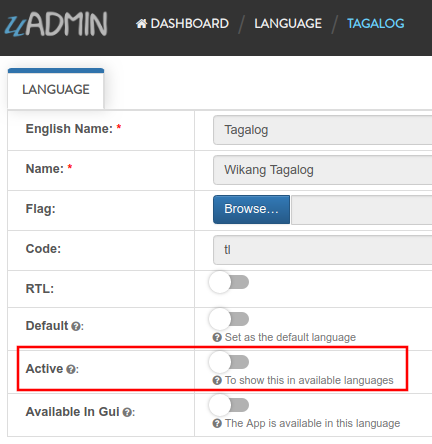
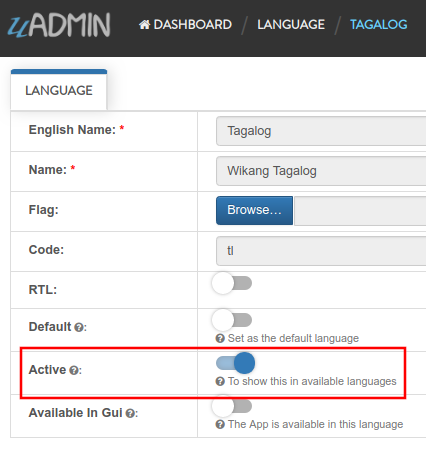
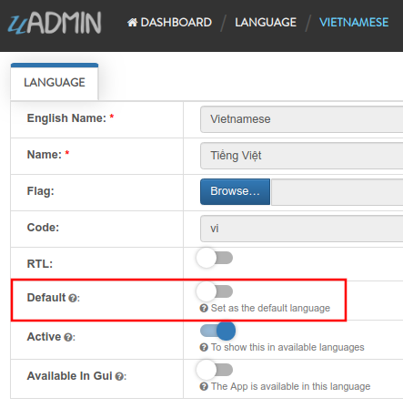
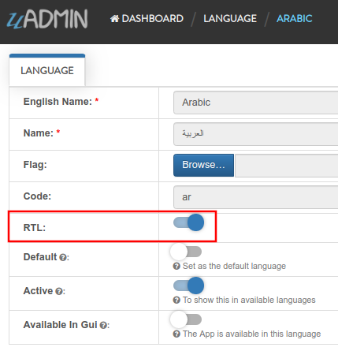

uadmin.Language
===============
Language is a system in uAdmin that is used to add, modify and delete the elements of a language.

Structure:

.. code-block:: go

    type Language struct {
        Model
        EnglishName    string `uadmin:"required;read_only;filter;search"`
        Name           string `uadmin:"required;read_only;filter;search"`
        Flag           string `uadmin:"image;list_exclude"`
        Code           string `uadmin:"filter;read_only;list_exclude"`
        RTL            bool   `uadmin:"list_exclude"`
        Default        bool   `uadmin:"help:Set as the default language;list_exclude"`
        Active         bool   `uadmin:"help:To show this in available languages;filter"`
        AvailableInGui bool   `uadmin:"help:The App is available in this language;read_only"`
    }

There are 2 functions that you can use in Language:

* **Save()** - Saves the object in the database
* **String()** - Returns the Code of the language

There are 2 ways you can do for initialization process using this function: one-by-one and by group.

One-by-one initialization:

.. code-block:: go

    func main(){
        // Some codes
        language := uadmin.Language{}
        language.EnglishName = "English Name"
        language.Name = "Name"
    }

By group initialization:

.. code-block:: go

    func main(){
        // Some codes
        language := uadmin.Language{
            EnglishName: "English Name",
            Name: "Name",
        }
    }

In the following examples, we will use “by group” initialization process.

Examples:

* `Example #1: Active`_
* `Example #2: Default`_
* `Example #3: RTL`_

**Example #1:** Active
^^^^^^^^^^^^^^^^^^^^^^
Suppose the Tagalog language is not active.

|

Exit your application for a while. Go to the main.go and apply the following codes below:

.. code-block:: go

    func main(){

        // Some codes

        // Language configurations
        language := uadmin.Language{
            EnglishName: "Tagalog",

            // Set this to true
            Active: true
        }

        // Checks the English name from the language. If it matches, it will
        // update the status of the Active field.
        uadmin.Update(&language, "Active", language.Active, "english_name = ?", language.EnglishName)

        // Returns the Code of the language
        uadmin.Trail(uadmin.INFO, "String() returns %s.", language.String())
    }

Now run your application, refresh your browser and see what happens.

**Terminal**

.. code-block:: bash

    [  INFO  ]   String() returns tl.

|

As expected, the Tagalog language is now set to active. Logout your account to see the result.

.. image:: assets/wikangtagalogactive.png
   :align: center

**Example #2:** Default
^^^^^^^^^^^^^^^^^^^^^^^
Suppose the Vietnamese language is not set to default.

|

Exit your application for a while. Go to the main.go and apply the following codes below:

.. code-block:: go

    func main(){

        // Some codes

        // Language configurations
        language := uadmin.Language{
            Code: "vi",

            // Set this to true
            Default: true,
        }

        // Checks the code from the language. If it matches, it will update the
        // status of the Default field.
        uadmin.Update(&language, "Default", language.Default, "code = ?", language.Code)
    }

Now run your application, refresh your browser and see what happens.

.. image:: assets/vietnamesedefault.png
   :align: center

|

As expected, the Vietnamese language is now set to default. Inside the Language model, search for English then click that record.

.. image:: assets/searchenglish.png

|

Disable the active status then click Save.

.. image:: assets/englishnotactive.png
   :align: center

|

On the top right corner, click the blue button then select Logout.

.. image:: assets/logouthighlighted.png
   :align: center

|

Log out your account and see what happens.

.. image:: assets/vietnameseassigned.png
   :align: center

It automatically sets the value of the Language field to **Tiếng Việt (Vietnamese)**.

**Example #3:** RTL
^^^^^^^^^^^^^^^^^^^
Suppose that Arabic language is not set to RTL (Right To Left).

.. image:: assets/arabicnotrtl.png
   :align: center

|

Exit your application for a while. Go to the main.go and apply the following codes below:

.. code-block:: go

    func main(){

        // Some codes

        // Language configurations
        language := uadmin.Language{
            Code: "ar",

            // Set this to true
            RTL: true,
        }

        // Checks the code from the language. If it matches, it will update the
        // status of the RTL field.
        uadmin.Update(&language, "RTL", language.RTL, "code = ?", language.Code)
    }

Now run your application, refresh your browser and see what happens.

|

As expected, the Arabic language is now set to RTL (Right To Left). Log out your account then login again. Set your language to **(Arabic) العربية** and let’s see what happens.

.. image:: assets/loginformarabic.png
   :align: center

|

The login page has aligned from right to left.

If you go to any models in the dashboard (example below is Dashboard Menus), it aligns the form automatically from right to left.

.. image:: assets/dashboardmenurighttoleft.png
