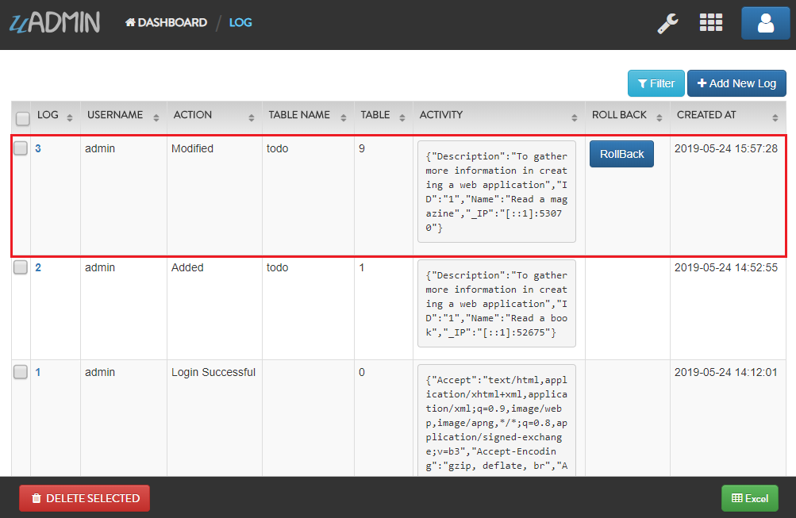
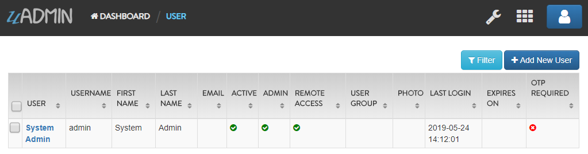
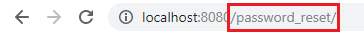

uadmin.Log
==========
Log is a system in uAdmin that is used to add, modify, and delete the status of the user activities.

Structure:

.. code-block:: go

    type Log struct {
        Model
        Username  string    `uadmin:"filter;read_only"`
        Action    Action    `uadmin:"filter;read_only"`
        TableName string    `uadmin:"filter;read_only"`
        TableID   int       `uadmin:"filter;read_only"`
        Activity  string    `uadmin:"code;read_only" gorm:"type:longtext"`
        RollBack  string    `uadmin:"link;"`
        CreatedAt time.Time `uadmin:"filter;read_only"`
    }

There are 11 types of actions:

* **Added** - Saved a new record
* **Custom** - For any other action that you would like to log
* **Deleted** - Deleted a record
* **LoginDenied** - User invalid login
* **LoginSuccessful** - User login
* **Logout** - User logout
* **Modified** - Save an existing record
* **PasswordResetDenied** - A password reset attempt was rejected
* **PasswordResetRequest** - A password reset was received
* **PasswordResetSuccessful** - A password was reset
* **Read** - Opened a record

There are 5 functions that you can use in Log:

**ParseRecord** - It means to analyze a record specifically. It uses this format as shown below:

.. code-block:: go

    func(a reflect.Value, modelName string, ID uint, user *User, action Action, r *http.Request) (err error)

Parameters:

* **a reflect.Value**: An interface initialized in NewModel function
* **modelName string**: The name of the model in lowercase letters
* **ID uint**: The ID of the model
* **user \*User**: What account is using in the session
* **action Action**: An activity status
* **r \*http.Request**: A data structure that represents the client HTTP request

Go to `Example #2: ParseRecord function`_ to see how ParseRecord works.

**PasswordReset** - It keeps track when the user resets his password. It uses this format as shown below:

.. code-block:: go

    func(user string, action Action, r *http.Request) (err error)

Parameters:

* **user string**: An account username
* **action Action**: An activity status
* **r \*http.Request**: A data structure that represents the client HTTP request

Go to `Example #3: PasswordReset function`_ to see how PasswordReset works.

**Save()** - Saves the object in the database

**SignIn** - It keeps track when the user signs in his account. It uses this format as shown below:

.. code-block:: go

    func(user string, action Action, r *http.Request) (err error)

Parameters:

* **user string**: An account username
* **action Action**: An activity status
* **r \*http.Request**: A data structure that represents the client HTTP request

Go to `Example #4: SignIn function`_ to see how SignIn works.

**String()** - Returns the Log ID

Examples:

* `Example #1: Assigning values in Log fields`_
* `Example #2: ParseRecord function`_
* `Example #3: PasswordReset function`_
* `Example #4: SignIn function`_

**Example #1:** Assigning values in Log fields
^^^^^^^^^^^^^^^^^^^^^^^^^^^^^^^^^^^^^^^^^^^^^^
Go to the main.go and apply the following codes below after the RegisterInlines section.

.. code-block:: go

    func main(){

        // Some codes

        log := uadmin.Log{
            Username:  "admin",
            Action:    uadmin.Action.Custom(0),
            TableName: "Todo",
            TableID:   1,
            Activity:  "Custom Add from the source code",
            RollBack:  "",
            CreatedAt: time.Now(),
        }

        // This will create a new log based on the information assigned in
        // the log variable.
        log.Save()

        // Returns the Log ID
        uadmin.Trail(uadmin.INFO, "String() returns %s.", log.String())
    }

Now run your application and see what happens.

**Terminal**

.. code-block:: bash

    [  INFO  ]   String() returns 1.

.. image:: assets/logcreated.png

**Example #2:** ParseRecord function
^^^^^^^^^^^^^^^^^^^^^^^^^^^^^^^^^^^^
Suppose you have this log record as shown below:

.. image:: assets/defaultlogrecord.png

|

And you have a record that has an ID of 1 in your Todo model that has an ID of 9.

.. image:: assets/todoreadabook.png

|

Create a file named parserecord.go in the API folder and apply the following codes below:

.. code-block:: go

    package api

    import (
        "net/http"
        "strings"

        "github.com/uadmin/uadmin"
    )

    // ParseRecordAPIHandler !
    func ParseRecordAPIHandler(w http.ResponseWriter, r *http.Request) {
        // r.URL.Path creates a new path called /parse_record
        r.URL.Path = strings.TrimPrefix(r.URL.Path, "/parse_record")

        // Get the session key
        session := uadmin.IsAuthenticated(r)

        // Initialize the log model from uAdmin
        log := uadmin.Log{}

        // Call the category model and set the pointer to true
        m, _ := uadmin.NewModel("todo", true)

        // Get the first record in todo model
        uadmin.Get(m.Interface(), "id = 1")

        // Change the name to "Read a magazine" in the first record
        uadmin.Update(m.Interface(), "Name", "Read a magazine", "id = 1")

        // m - An interface initialized in NewModel function
        // "todo" - Assigned model name
        // 9 - The ID of the Todo model
        // &session.User - Returns the full name of the user
        // log.Action.Modified() - An action status that says Modified
        // r - A data structure that represents the client HTTP request
        log.ParseRecord(m, "todo", 9, &session.User, log.Action.Modified(), r)

        // Save the parsed log record
        log.Save()
    }

Establish a connection in the main.go to the API by using http.HandleFunc. It should be placed after the uadmin.Register and before the StartServer.

.. code-block:: go

    func main() {
        // Some codes

        // ParseRecordAPIHandler
        http.HandleFunc("/parse_record/", api.ParseRecordAPIHandler)
    }

Now run your application and go to /parse_record/ path in the address bar after the host link (e.g. http://localhost:8080/parse_record/). This will not print anything but a white screen.

.. image:: assets/parserecordpath.png

|

Go to uAdmin dashboard and click on "LOGS" to see the result.

.. image:: assets/logshighlighted.png

|

As expected, the new record was saved in the logs.

**Example #3:** PasswordReset function
^^^^^^^^^^^^^^^^^^^^^^^^^^^^^^^^^^^^^^
Suppose you have this log record as shown below:

.. image:: assets/loginitialrecord.png

|

And you have the System Admin record that has an ID of 1.

|

Create a file named passwordreset.go in the API folder and apply the following codes below:

.. code-block:: go

    package api

    import (
        "net/http"
        "strings"

        "github.com/uadmin/uadmin"
    )

    // PasswordResetAPIHandler !
    func PasswordResetAPIHandler(w http.ResponseWriter, r *http.Request) {
        // r.URL.Path creates a new path called /password_reset
        r.URL.Path = strings.TrimPrefix(r.URL.Path, "/password_reset")

        // Initialize the log model from uAdmin
        log := uadmin.Log{}

        // Initialize the user model from uAdmin
        user := uadmin.User{}

        // Get the first record in todo model
        uadmin.Get(&user, "id = ?", 1)

        // user.Username - Gets the username value from the user model
        // log.Action.PasswordResetRequest() - An action status that says
        // PasswordResetRequest
        // r - A data structure that represents the client HTTP request
        log.PasswordReset(user.Username, log.Action.PasswordResetRequest(), r)

        // Save the log record
        log.Save()
    }

Establish a connection in the main.go to the API by using http.HandleFunc. It should be placed after the uadmin.Register and before the StartServer.

.. code-block:: go

    func main() {
        // Some codes

        // PasswordResetAPIHandler
        http.HandleFunc("/password_reset/", api.PasswordResetAPIHandler)
    }

Now run your application and go to /password_reset/ path in the address bar after the host link (e.g. http://localhost:8080/password_reset/). This will not print anything but a white screen.

|

Go to uAdmin dashboard and click on "LOGS" to see the result.

.. image:: assets/logshighlighted.png

|

As expected, the new record was saved in the logs.

.. image:: assets/logpasswordresetrequest.png

**Example #4:** SignIn function
^^^^^^^^^^^^^^^^^^^^^^^^^^^^^^^
Suppose you have this log record as shown below:

.. image:: assets/loginitialrecord.png

|

And you have the System Admin record that has an ID of 1.

|

Create a file named signin.go in the API folder and apply the following codes below:

.. code-block:: go

    package api

    import (
        "net/http"
        "strings"

        "github.com/uadmin/uadmin"
    )

    // SignInAPIHandler !
    func SignInAPIHandler(w http.ResponseWriter, r *http.Request) {
        // r.URL.Path creates a new path called /sign_in
        r.URL.Path = strings.TrimPrefix(r.URL.Path, "/sign_in")

        // Initialize the log model from uAdmin
        log := uadmin.Log{}

        // Initialize the user model from uAdmin
        user := uadmin.User{}

        // Get the first record in todo model
        uadmin.Get(&user, "id = ?", 1)

        // user.Username - Gets the username value from the user model
        // log.Action.LoginSuccessful() - An action status that says
        // LoginSuccessful
        // r - A data structure that represents the client HTTP request
        log.SignIn(user.Username, log.Action.LoginSuccessful(), r)

        // Save the log record
        log.Save()
    }

Establish a connection in the main.go to the API by using http.HandleFunc. It should be placed after the uadmin.Register and before the StartServer.

.. code-block:: go

    func main() {
        // Some codes

        // SignInAPIHandler
        http.HandleFunc("/sign_in/", api.SignInAPIHandler)
    }

Now run your application and go to /sign_in/ path in the address bar after the host link (e.g. http://localhost:8080/sign_in/). This will not print anything but a white screen.

.. image:: assets/signinpath.png

|

Go to uAdmin dashboard and click on "LOGS" to see the result.

.. image:: assets/logshighlighted.png

|

As expected, the new record was saved in the logs.

.. image:: assets/loginsuccessfulsignin.png