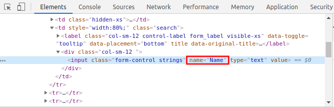
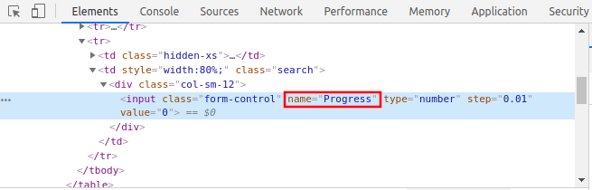
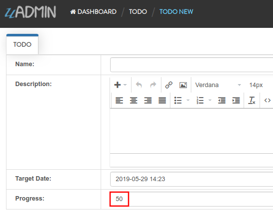
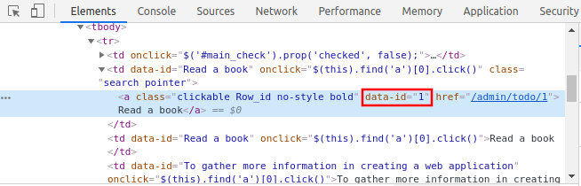
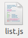
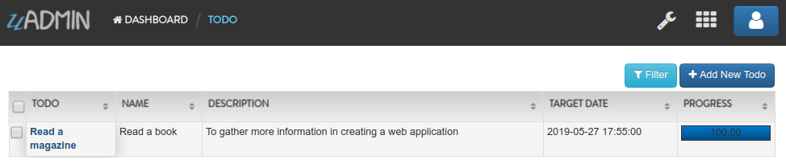
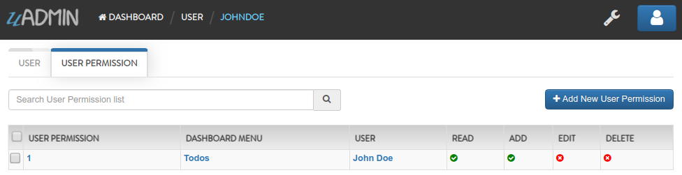
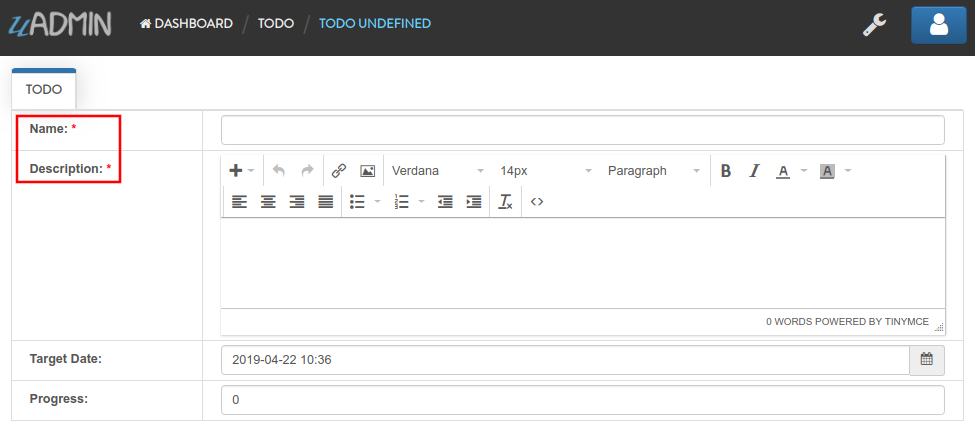
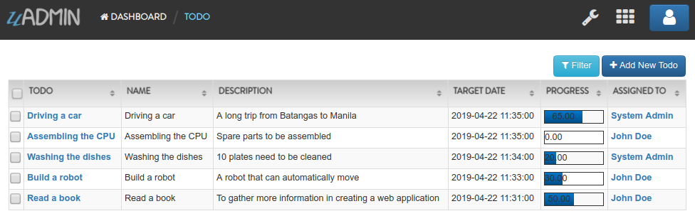
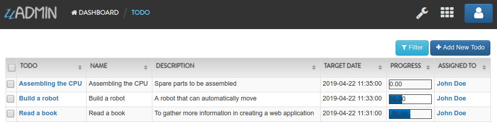

uadmin.ModelSchema
==================
ModelSchema is a representation of a plan or theory in the form of an outline or model.

Structure:

.. code-block:: go

    type ModelSchema struct {
        Name          string // Name of the Model
        DisplayName   string // Display Name of the model
        ModelName     string // URL
        ModelID       uint
        Inlines       []*ModelSchema
        InlinesData   []listData
        Fields        []F
        IncludeFormJS []string
        IncludeListJS []string
        FormModifier  func(*uadmin.ModelSchema, interface{}, *uadmin.User)
        ListModifier  func(*uadmin.ModelSchema, *uadmin.User) (string, []interface{})
    }

Here are the following fields and their definitions:

* **Name** - The name of the Model
* **DisplayName** - A human readable version of the name of the Model
* **ModelName** - The same as the Name but in small letters.
* **ModelID** - **(Data)** A place holder to store the primary key of a single row for form processing
* **Inlines** - A list of associated inlines to this model
* **InlinesData** - **(Data)** A place holder to store the data of the inlines
* **Fields** - A list of uadmin.F type representing the fields of the model
* **IncludeFormJS** - A list of string where you could add URLs to javascript files that uAdmin will run when a form view of this model is rendered
* **IncludeListJS** - A list of string where you could add URLs to javascript files that uAdmin will run when a list view of this model is rendered
* **FormModifier** - A function that you could pass that will allow you to modify the schema when rendering a form. It will pass to you the a pointer to the schema so you could modify it and a copy of the Model that is being rendered and the user access it to be able to customize per user (or per user group). Examples can be found in `FM1`_, `FM2`_.
* **ListModifier** - A function that you could pass that will allow you to modify the schema when rendering a list. It will pass to you the a pointer to the schema so you could modify it and the user access it to be able to customize per user (or per user group). Examples can be found in `LM1`_, `LM2`_.

.. _FM1: https://uadmin.readthedocs.io/en/latest/document_system/tutorial/part15.html
.. _FM2: https://uadmin.readthedocs.io/en/latest/api/modelschema.html#example-2-formmodifier-and-listmodifier

.. _LM1: https://uadmin.readthedocs.io/en/latest/document_system/tutorial/part16.html
.. _LM2: https://uadmin.readthedocs.io/en/latest/api/modelschema.html#example-2-formmodifier-and-listmodifier

There is a function that you can use in ModelSchema:

* **FieldByName** - Calls the name of the field inside the function. It uses this format as shown below:

.. code-block:: go

    func(a string) *uadmin.F

Structure:

.. code-block:: go

    modelschema.FieldByName("Name").XXXX = Value

XXXX has many things: See `uadmin.F`_ for the list. It is an alternative way of changing the feature of the field rather than using Tags. For more information, see `Tag Reference`_.

.. _uadmin.F: https://uadmin.readthedocs.io/en/latest/api/f.html
.. _Tag Reference: https://uadmin.readthedocs.io/en/latest/tags.html

There are 2 ways you can do for initialization process using this function: one-by-one and by group.

One-by-one initialization:

.. code-block:: go

    func main(){
        // Some codes
        modelschema := uadmin.ModelSchema{}
        modelschema.Name = "Name"
        modelschema.DisplayName = "Display Name"
    }

By group initialization:

.. code-block:: go

    func main(){
        // Some codes
        modelschema := uadmin.ModelSchema{
            Name: "Name",
            DisplayName: "Display Name",
        }
    }

In this example, we will use "by group" initialization process.

Examples:

* `Example #1: IncludeFormJS`_
* `Example #2: IncludeListJS`_
* `Example #3: Fields`_
* `Example #4: FormModifier and ListModifier`_

**Example #1:** IncludeFormJS
^^^^^^^^^^^^^^^^^^^^^^^^^^^^^
Type:

.. code-block:: go

    []string

Let's create an application that if the user clicks the input Name field in the form, the value of the Progress bar will change to 50.

First of all, run your application, go to the Todo model and click Add New Todo button on the top right corner of the screen. Right click the input Name field then select Inspect.

.. image:: assets/nameinspect.png

|

Based on the result, the value of the name attribute in the input tag is "Name". We will use that later in the Javascript code.

|

Now let's get the value of the name in the Progress field as well because this is where we print the result after the user clicks the Name field. Right click the input Progress field then select Inspect.

.. image:: assets/progressinspect.png

|

Based on the result, the value of the name is "Progress".

|

Now go to your project folder then select "static".

.. image:: assets/staticfolderhighlighted.png

|

Inside the static folder, create a new folder named "js".

.. image:: assets/staticjshighlighted.png

|

Inside js folder, create a new file named "form.js".

.. image:: assets/formjavascriptfile.png

|

Inside form.js file, apply the following codes below:

.. code-block:: javascript

    (function(win, doc, $){
        "using strict";

        $(doc).ready(function(){
            // Checks whether the user clicks the input Name field
            $("input[name='Name']").on("click", function(){
                // Set the value of the Progress field to 50.
                $("input[name='Progress']").val(50);
            });
        });
    })(window, document, $);

Now go to main.go and append the path of the form.js file to the IncludeFormJS field in ModelSchema structure then apply it in Todo model.

.. code-block:: go

    func main(){
        // Some codes

        // Model schema configurations
        modelschema := uadmin.ModelSchema{
            Name:          "Todo", // Model name
            ModelName:     "todo", // URL
            IncludeFormJS: []string{"/static/js/form.js"},
        }

        // Call the schema of "todo" model
        // modelschema.ModelName = "todo"
        todo := uadmin.Schema[modelschema.ModelName]

        // Include Javascript file for the form
        todo.IncludeFormJS = modelschema.IncludeFormJS
    }

Run your application, go to the Todo model and click Add New Todo button on the top right corner of the screen. Click the input Name field and see what happens.

.. image:: assets/clickinputnamefield.png
   :align: center

|

Result:

**Example #2:** IncludeListJS
^^^^^^^^^^^^^^^^^^^^^^^^^^^^^
Type:

.. code-block:: go

    []string

Let's create an application that if the user enters the mouse in the first record, the value of that record will change. Otherwise, the value of that record will go back to normal.

First of all, run your application and go to the Todo model. Suppose you have "Read a book" existing record inside that model. Right click the "Read a book" in the Todo column then select Inspect.

.. image:: assets/firstrecordinspect.png

|

Based on the result, the value of the data-id attribute in the a tag is "1". We will use that later in the Javascript code.

|

Now go to your project folder then select "static".

.. image:: assets/staticfolderhighlighted.png

|

Inside the static folder, create a new folder named "js".

.. image:: assets/staticjshighlighted.png

|

Inside js folder, create a new file named "list.js".

|

Inside list.js file, apply the following codes below:

.. code-block:: javascript

    (function(win, doc, $){
        "using strict";

        // Checks whether the mouse enters in the first record
        $("a[data-id='1']").on("mouseenter", function(){
            // Change the text to "Read a magazine".
            $("a[data-id='1']").text("Read a magazine");
        });
        // Checks whether the mouse leaves in the first record
        $("a[data-id='1']").on("mouseleave", function(){
            // Change the text to "Read a book".
            $("a[data-id='1']").text("Read a book");
        });
    })(window, document, $);

Now go to main.go and append the path of the list.js file to the IncludeListJS field in ModelSchema structure then apply it in Todo model.

.. code-block:: go

    func main(){
        // Some codes

        // Model schema configurations
        modelschema := uadmin.ModelSchema{
            Name:          "Todo", // Model name
            ModelName:     "todo", // URL
            IncludeListJS: []string{"/static/js/list.js"},
        }

        // Call the schema of "todo" model
        // modelschema.ModelName = "todo"
        todo := uadmin.Schema[modelschema.ModelName]

        // Include Javascript file for the list
        todo.IncludeListJS = modelschema.IncludeListJS
    }

Run your application and go to the Todo model. Hover your mouse to "Read a book" value in Todo column and see what happens.

.. image:: assets/readabookhighlighted.png

|

Result:

|

If you leave the cursor, the name of the first record will go back to normal.

.. image:: assets/readabookhighlighted.png

**Example #3:** Fields
^^^^^^^^^^^^^^^^^^^^^^
Type:

.. code-block:: go

    []uadmin.F

See `uadmin.F`_ for the examples.

**Example #4:** FormModifier and ListModifier
^^^^^^^^^^^^^^^^^^^^^^^^^^^^^^^^^^^^^^^^^^^^^
Functions:

.. code-block:: go

    // FormModifier
    func(*uadmin.ModelSchema, interface{}, *uadmin.User)

    // ListModifier
    func(*uadmin.ModelSchema, *uadmin.User) (string, []interface{})

uadmin.ModelSchema has the following fields and their definitions:

* **Name** - The name of the Model
* **DisplayName** - A human readable version of the name of the Model
* **ModelName** - The same as the Name but in small letters.
* **ModelID** - **(Data)** A place holder to store the primary key of a single row for form processing
* **Inlines** - A list of associated inlines to this model
* **InlinesData** - **(Data)** A place holder to store the data of the inlines
* **Fields** - A list of uadmin.F type representing the fields of the model
* **IncludeFormJS** - A list of string where you could add URLs to javascript files that uAdmin will run when a form view of this model is rendered
* **IncludeListJS** - A list of string where you could add URLs to javascript files that uAdmin will run when a list view of this model is rendered
* **FormModifier** - A function that you could pass that will allow you to modify the schema when rendering a form. It will pass to you the a pointer to the schema so you could modify it and a copy of the Model that is being rendered and the user access it to be able to customize per user (or per user group).
* **ListModifier** - A function that you could pass that will allow you to modify the schema when rendering a list. It will pass to you the a pointer to the schema so you could modify it and the user access it to be able to customize per user (or per user group).

**interface{}** is the parameter used to cast or access the model to modify the fields.

uadmin.User has the following fields and their definitions:

* **Username** - The username that you can use in login process and CreatedBy which is a reserved word in uAdmin
* **FirstName** - The given name of the user
* **LastName** - The surname of the user
* **Password** - A secret word or phrase that must be used to gain admission to something. This field is automatically hashed for security protection.
* **Email** - A method of exchanging messages between people using electronic devices.
* **Active** - Checks whether the user is logged in
* **Admin** - Checks whether the user is authorized to access all features in the system
* **RemoteAccess** - Checks whether the user has access to remote devices
* **UserGroup** - Returns the GroupName
* **UserGroupID** - An ID to access the UserGroup
* **Photo** - Profile picture of the user
* **LastLogin** - The date when the user last logged in his account
* **ExpiresOn** - The date when the user account expires
* **OTPRequired** - Checks whether the OTP is Active
* **OTPSeed** - Private field for OTP

.. image:: assets/userfields.png

First of all, make sure that your non-admin account has Read and Add access `user permission`_ to the Todo model.

.. _user permission: https://uadmin.readthedocs.io/en/latest/system_reference.html#user-permission

|

Go to the main.go. Inside the main function, create a Schema Form Modifier that calls the Todo model. Place it after the Register functions.

.. code-block:: go

    func main(){
        // Initialize docS variable that calls the Todo model in the schema
        docS := uadmin.Schema["todo"]

        // FormModifier makes Name and Description required if the user is not
        // an admin and the Name and Description fields are empty strings.
        docS.FormModifier = func(s *uadmin.ModelSchema, m interface{}, u *uadmin.User) {
            // Casts an interface to the Todo model
            t, _ := m.(*models.Todo)

            // Check whether the user is not an admin and the Name and
            // Description fields are empty strings
            if !u.Admin && t.Name == "" && t.Description == "" {
                // Set the Name and Description required fields
                s.FieldByName("Name").Required = true
                s.FieldByName("Description").Required = true
            }
        }

        // Pass back to the schema of Todo model
        uadmin.Schema["todo"] = docS
    }

Use any of your existing accounts that is not an admin. Here's the result if you are adding a new record:

|

Now let's apply the ListModifier in todo.go. As an admin, you want your non-admin user to limit the records that they can see in the Todo model. In order to do that, let's add another field called "AssignedTo" with the type uadmin.User.

.. code-block:: go

    // Todo model ...
    type Todo struct {
        uadmin.Model
        Name         string
        Description  string `uadmin:"html"`
        TargetDate   time.Time
        Progress     int `uadmin:"progress_bar"`
        AssignedTo   uadmin.User
        AssignedToID uint
    }

Go to the main.go. Inside the main function, create a Schema List Modifier that calls the Todo model. Place it after the docs.FormModifier declaration.

.. code-block:: go
    
    func main(){
        // Some codes

        // ListModifier is based on a function that assigns the user ID to the
        // query. If they match, the user can see the record assigned to him.
        docS.ListModifier = func(m *uadmin.ModelSchema, u *uadmin.User) (string, []interface{}) {
            // Check whether the user is not an admin
            if !u.Admin {
                // Returns the AssignedToID with the value of UserID
                return "assigned_to_id = ?", []interface{}{u.ID}
            }
            // Returns nothing
            return "", []interface{}{}
        }
    }

Login your admin account and create at least five records with the AssignedTo value.

|

Now login any of your non-admin account and see what happens.

