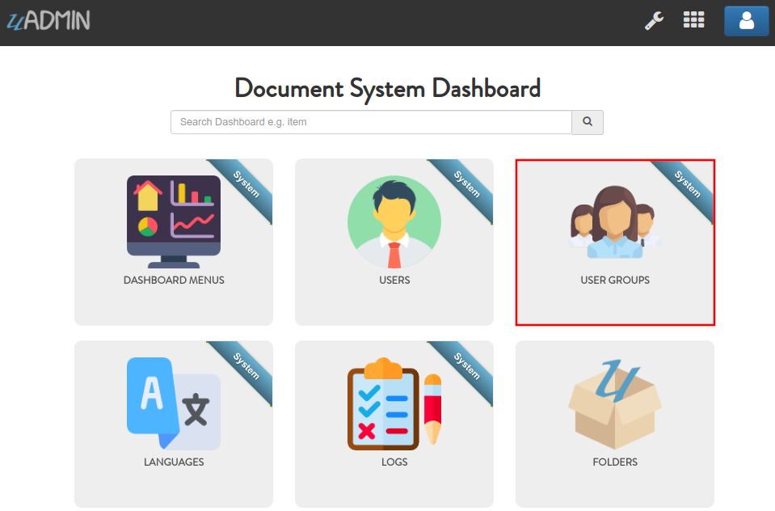
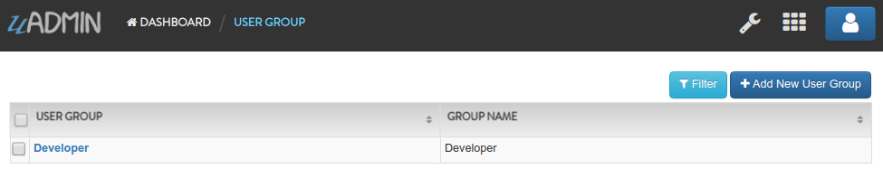
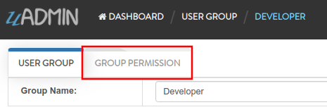
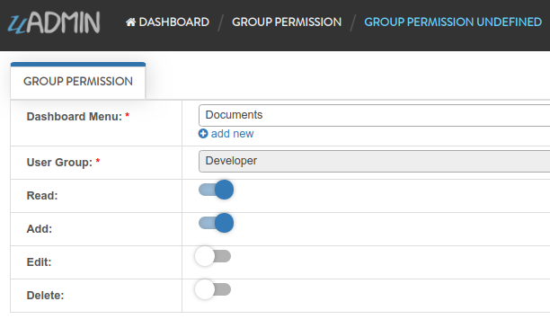
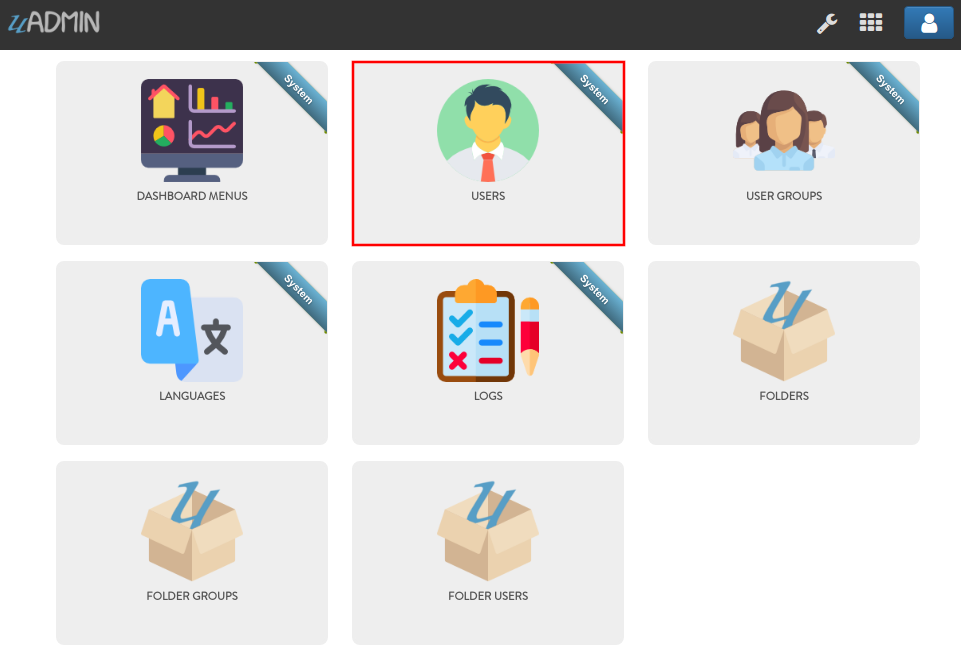
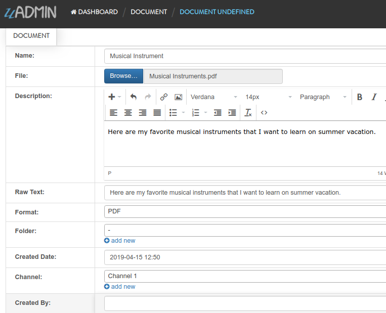
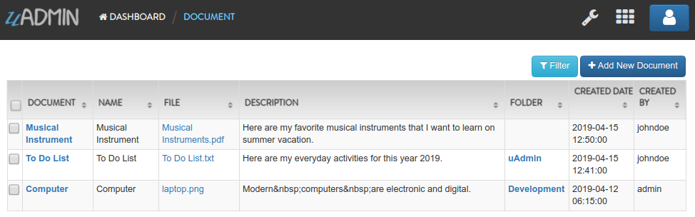

Document System Tutorial Part 10 - Group Permission
===================================================
In this part, we will discuss about creating a group permission for a specific model to the user group with some access levels.

First of all, run your application using an "admin" account. Let's create an access for Document model to the Developer group. In the Document System Dashboard, go to "USER GROUPS".

|

Click the existing record that you have.

|

Click "GROUP PERMISSION" inline.

|

Click "Add New Group Permission".

.. image:: assets/addnewgrouppermission.png

|

Set the Dashboard Menu value to Documents so the Developer user group can access into it. Let's give an access level to Read and Add Permissions for that user group.

|

Result

.. image:: assets/grouppermissionrecordresult.png

|

Go back to the Document System Dashboard then click "USERS".

|

As you notice, the username "johndoe" is a member of the user group "Developer". Click the profile icon on the top right corner then select "Logout".

.. image:: assets/adminlogout.png

|

Login your "johndoe" account.

.. image:: assets/johndoelogin.png
   :align: center

|

In the Document System Dashboard, only the Documents model is visible because "johndoe" user who is a part of Developer group is not an admin. The admin gives access only to the Documents model for this user. Now click on "DOCUMENTS".

.. image:: assets/documentsaccessdashboard.png

|

Let's add 2 records: one with the folder specified and the one without the folder specified. Click "Add New Document".

.. image:: assets/addnewdocumentjohndoe.png

|

First record (with folder specified)

.. image:: assets/documentfirstrecord.png
   :align: center

|

Second record (without folder specified)

|

Result

|

In the `next part`_, we will talk about setting and getting permissions for Document and Folder records.

.. _next part: https://uadmin.readthedocs.io/en/latest/document_system/tutorial/part11.html
