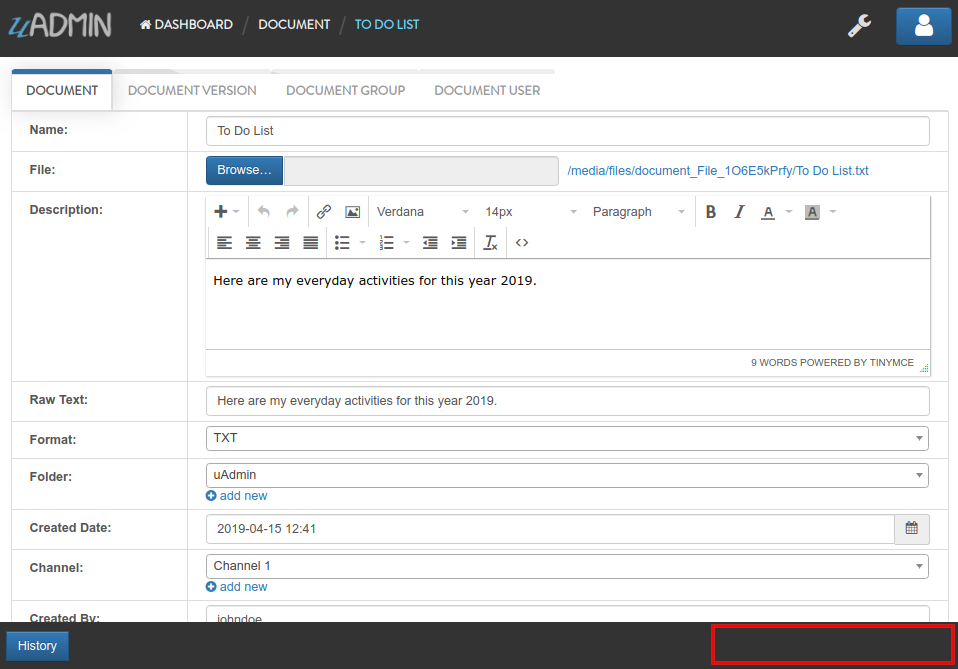

Document System Tutorial Part 16 - Schema List Modifier
=======================================================
In this part, we will discuss about schema list modifier based on the document list filter that checks the admin status of the user. If it is not an admin, what are the models that user can access to.

First of all, run your application using "admin" account. In the Document System Dashboard, click "DOCUMENT GROUPS".

.. image:: assets/documentgroupshighlighted.png

|

Click the existing record that you have.

.. image:: assets/documentgroupresult.png

|

Change the Document from Computer to To Do List.

.. image:: assets/documentgrouptodolist.png
   :align: center

|

Result

.. image:: assets/documentgrouptodolistresult.png

|

Logout your account then login "johndoe" account.

.. image:: assets/johndoelogin.png
   :align: center

|

Click "DOCUMENTS".

.. image:: assets/documentsaccessdashboard.png

|

If you notice, the document record created by admin is still visible even if we disabled all permission levels that we have discussed in Part 14 tutorial of this application.

.. image:: assets/documentthreerecords.png

|

There is one more step that we have to take to make it record wise and that is Schema List Modifier. List Modifier allows you to modify the schema when rendering a list. It will pass to you the a pointer to the schema so you could modify it and the user access it to be able to customize per user (or per user group).

.. code-block:: go

    func(*uadmin.ModelSchema, *uadmin.User) (string, []interface{})

uadmin.ModelSchema has the following fields and their definitions:

* **Name** - The name of the Model
* **DisplayName** - A human readable version of the name of the Model
* **ModelName** - The same as the Name but in small letters.
* **ModelID** - **(Data)** A place holder to store the primary key of a single row for form processing
* **Inlines** - A list of associated inlines to this model
* **InlinesData** - **(Data)** A place holder to store the data of the inlines
* **Fields** - A list of uadmin.F type representing the fields of the model
* **IncludeFormJS** - A list of string where you could add URLs to javascript files that uAdmin will run when a form view of this model is rendered
* **IncludeListJS** - A list of string where you could add URLs to javascript files that uAdmin will run when a list view of this model is rendered
* **FormModifier** - A function that you could pass that will allow you to modify the schema when rendering a form. It will pass to you the a pointer to the schema so you could modify it and a copy of the Model that is being rendered and the user access it to be able to customize per user (or per user group).
* **ListModifier** - A function that you could pass that will allow you to modify the schema when rendering a list. It will pass to you the a pointer to the schema so you could modify it and the user access it to be able to customize per user (or per user group).

uadmin.User has the following fields and their definitions:

* **Username** - The username that you can use in login process and CreatedBy which is a reserved word in uAdmin
* **FirstName** - The given name of the user
* **LastName** - The surname of the user
* **Password** - A secret word or phrase that must be used to gain admission to something. This field is automatically hashed for security protection.
* **Email** - A method of exchanging messages between people using electronic devices.
* **Active** - Checks whether the user is logged in
* **Admin** - Checks whether the user is authorized to access all features in the system
* **RemoteAccess** - Checks whether the user has access to remote devices
* **UserGroup** - Returns the GroupName
* **UserGroupID** - An ID to access the UserGroup
* **Photo** - Profile picture of the user
* **LastLogin** - The date when the user last logged in his account
* **ExpiresOn** - The date when the user account expires
* **OTPRequired** - Checks whether the OTP is Active
* **OTPSeed** - Private field for OTP

.. image:: assets/userfields.png

Exit your application. Go to the main.go. Below the main function, create a DocumentListFilter function that holds s as the pointer of uadmin.ModelSchema and u as the pointer of uadmin.User. It returns the string and an array of interface. This function implementation is the structure of a ListModifier in ModelSchema.

.. code-block:: go

    // DocumentListFilter !
    func DocumentListFilter(s *uadmin.ModelSchema, u *uadmin.User) (string, []interface{}) {
        // Checks whether the user is not an admin
        if !u.Admin {
            // Returns the user ID
            return "user_id = ?", []interface{}{u.ID}
        }
        // Returns nothing
        return "", []interface{}{}
    }

DocumentListFilter is based on the user ID where the admin status is active or not. If the user is not an admin, he has limited access to the models and its records.

Inside the main function, create a Schema List Modifier that calls the Document model. Place it after the docs.FormModifier declaration.

.. code-block:: go

    // Assign DocumentListFilter to the Schema List Modifier
    docS.ListModifier = DocumentListFilter

Now run your application using "johndoe" account.

.. image:: assets/johndoelogin.png
   :align: center

|

Click "DOCUMENTS".

.. image:: assets/documentsaccessdashboard.png

|

If you notice, the Computer record created by "admin" is no longer visible because "johndoe" is not an admin and has no permission to read that record.

.. image:: assets/documentrecordjohndoe.png

|

Click on "To Do List". If you notice, there is no save button on the bottom right corner of the screen because "johndoe" is part of a Developer group and has no Edit access into it.

|

In the `last part`_ of this tutorial, we will talk about customizing your dashboard and publishing your application for the world to see.

.. _last part: https://uadmin.readthedocs.io/en/latest/document_system/tutorial/part17.html
