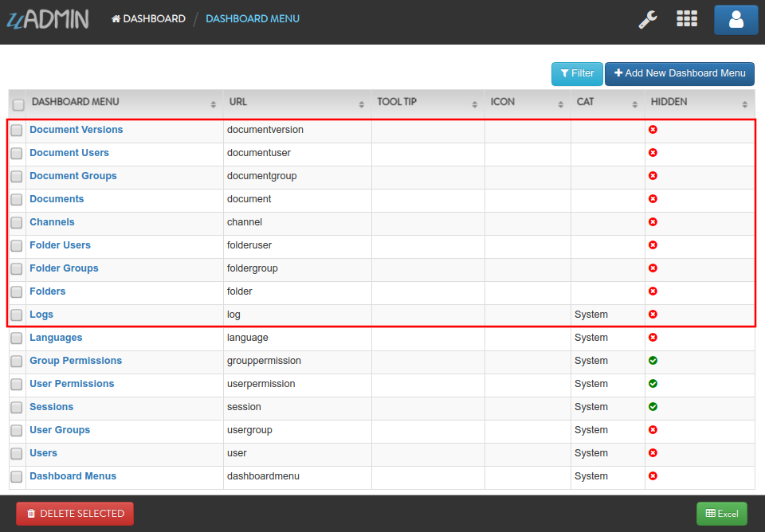
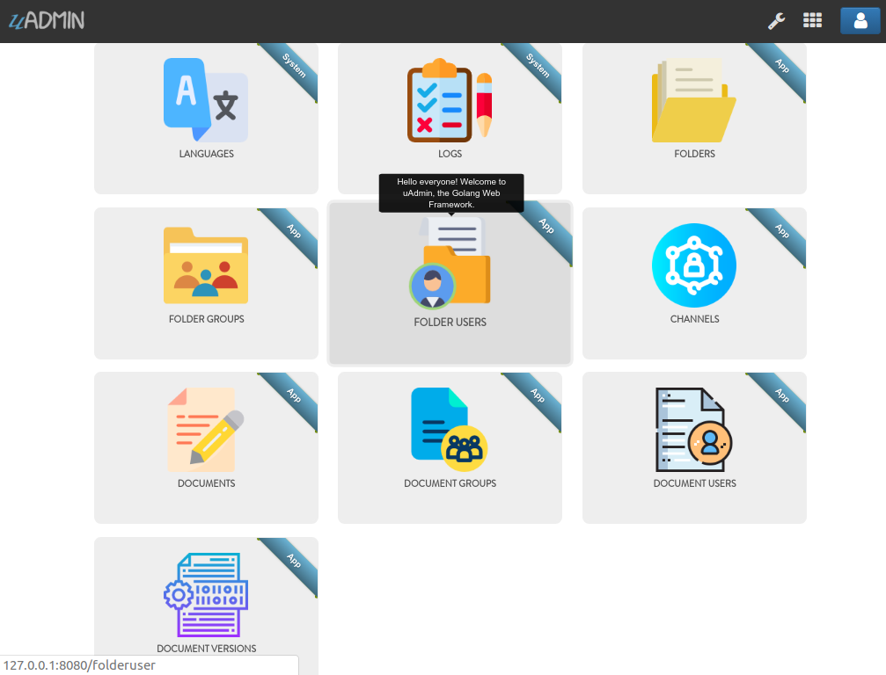
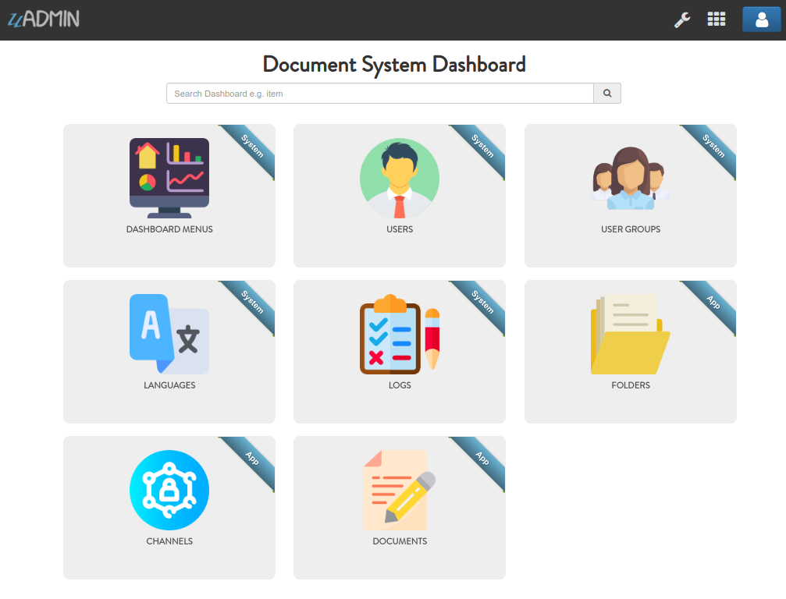
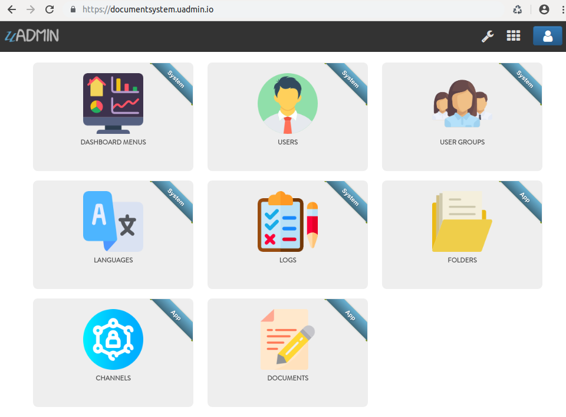

Document System Tutorial Part 16 - Wrapping Up Your Application
===============================================================
So far you have developed this really cool application that you want to show to your your customer or even to the world. Before you publish your application, let's customize your dashboard in a fashionable way. Making it look good and customizing it to meet your customers requirements is important to the success of your app.

First of all, open "DASHBOARD MENUS".

.. image:: assets/dashboardmenuhighlighted.png

|

Open the models that you have created and let's add the Tool Tip that means the information you want to show when you hover the mouse to the model, an icon that you like to represent in the dashboard, and Cat which is the highlight of your model.

|

By default any model that does not have an icon gets this icon:

.. image:: assets/defaulticon.png
   :align: center

If you don't have any pictures or icons in your computer, I would recommend you to go over `flaticon.com`_, but you can browse anywhere online. Once you search for an icon, download the PNG version and choose the size 128 pixels.

.. _flaticon.com: https://www.flaticon.com/

.. image:: assets/flaticon128px.png

|

Result of my dashboard setup

|

Let's hide the Document and Folder related models in the dashboard. In order to do that, create a HideInDashboard() function that returns a boolean value which is true.

**document_group.go**

.. code-block:: go

    // HideInDashboard !
    func (DocumentGroup) HideInDashboard() bool {
        return true
    }

**document_user.go**

.. code-block:: go

    // HideInDashboard !
    func (DocumentUser) HideInDashboard() bool {
        return true
    }

**document_version.go**

.. code-block:: go

    // HideInDashboard !
    func (DocumentVersion) HideInDashboard() bool {
        return true
    }

**folder_group.go**

.. code-block:: go

    // HideInDashboard !
    func (FolderGroup) HideInDashboard() bool {
        return true
    }

**folder_user.go**

.. code-block:: go

    // HideInDashboard !
    func (FolderUser) HideInDashboard() bool {
        return true
    }

Result:

|

The Document System Dashboard is now much cleaner than before.

Once you are done with the setup, it's about time to publish your application for the world to see. uAdmin offers FREE hosting for your app while you are developing. Before we start, you should take note the following:

* You have to make sure you application is using sqlite (which is the default DB in uAdmin).
* Don’t use uadmin.StartSecureServer(). You should only use uadmin.StartServer().
* Don’t use this for doing anything illegal or for spam, hacking, pen-testing, DDoS … etc.
* Your application + data should not exceed 1GB.
* Daily bandwidth 5GB
* Your application will expire in 24 hours if you didn’t publish anything new to it.
* **PLEASE** change your admin password after you publish your application or you will be putting your app and our servers at risk.

That’s it. Open your terminal, go to your app’s folder and type:

.. code-block:: bash

    uadmin publish

It will ask you for three fields:

* **Email:** Your email
* **Sub domain:** The name of the sub domain that you want your application to be published to e.g. documentsystem will publish it to https://documentsystem.uadmin.io. You can just press Enter and it will generate a random domain name for you.
* **Port:** If you changed your port using uadmin.Port = X then provide the port that you used.

This way you can publish your application in less than 1 minute and give access to your client or team to see your work and give you feedback.

Result of my setup

.. code-block:: bash

    Your project will be published to https://my-proj.uadmin.io
    Enter the name of your sub-domain (my-proj) [auto]: documentsystem
    Did you change the default port from 8080?
    This is the port you have in uadmin.Port = 8080
    Enter the port that your server run on [8080]: 8000
    [   OK   ]   Compressing [436/436]
    [   OK   ]   Your application has been uploaded
    [   OK   ]   Application installed succesfully
    [   OK   ]   Your Project has been published to https://documentsystem.uadmin.io/

You can also update your application by using the same command.

.. code-block:: bash

    uadmin publish

Result of my setup

.. code-block:: bash

    [   OK   ]   Compressing [436/436]
    [   OK   ]   Your application has been uploaded
    [   OK   ]   Application installed succesfully
    [   OK   ]   Your Project has been published to https://documentsystem.uadmin.io/

Notice that the second time you publish the same application it does that much faster. It only takes a few seconds the second time and it does not ask for any information about your app anymore. Every time you publish your app again, your app’s expiry is reset for 24 hours from your last publish.

Your application is now live, you can access it using the URL you have at the end of uadmin publish output. We made sure you have SSL to protect your traffic to your app.

You will now notice that you have a new file in your app’s folder .uproj which contains some information about your app.

.. code-block:: bash

    {"domain":"documentsystem","port":"8000","uid":"lwoD2q8REBoHXk_BYQ4tJ0GK"}

Congrats, now you know how to do the following in the entire series:

* Preparing uAdmin files in the project folder
* Build an application from scratch
* Change the dashboard title
* Creating external models
* Using Register Inlines
* Adding a drop down list to the field manually
* Updating the Document Version
* Group Permission
* Document and Folder Permissions
* Creating a custom AdminPage and Count functions based on the UserID
* Permissions Form that creates a field and permission values
* Using Schema List Modifier to limit user access in a specific record
* Customize your dashboard
* Hide models by using HideInDashboard() function
* Publish your application online

If you want to learn more and discover about the concepts of uAdmin, you may go to these references with examples:

* `API Reference`_
* `Quick Reference`_
* `System Reference`_
* `Tag Reference`_

.. _API Reference: https://uadmin.readthedocs.io/en/latest/api.html
.. _Quick Reference: https://uadmin.readthedocs.io/en/latest/quick_reference.html
.. _System Reference: https://uadmin.readthedocs.io/en/latest/system_reference.html
.. _Tag Reference: https://uadmin.readthedocs.io/en/latest/tags.html
