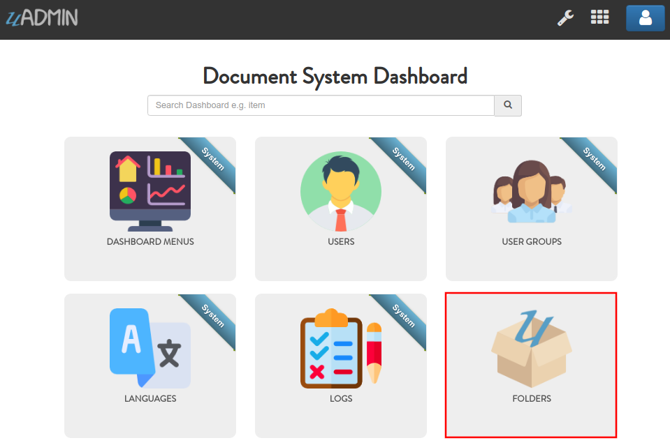
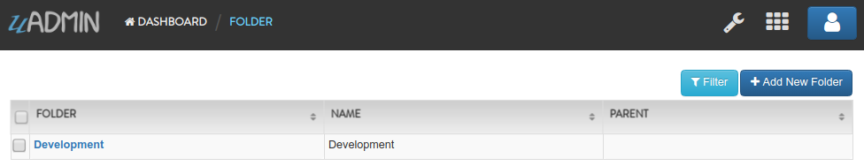

Document System Tutorial Part 2 - Creating and Registering a Model
==================================================================
In this part, we will discuss about creating and registering an external models in our application.

Before we start, let's list down what are the requirements needed in order to build a document system. In each models, what are the necessary fields to meet the user's goals.

In this tutorial, we will create the following models listed below:

* Channel
* DocumentGroup
* DocumentUser
* DocumentVersion
* Document
* FolderGroup
* FolderUser
* Folder

Let’s create a new file in the models folder named “folder.go” with the following codes below:

.. code-block:: go

    package models

    import (
        "github.com/uadmin/uadmin"
    )

    // Folder !
    type Folder struct {
        uadmin.Model
        Name     string
        Parent   *Folder
        ParentID uint
    }

    // Returns the Name field
    func (f Folder) String() string {
        return f.Name
    }

As you notice, the Parent field has a data type of a pointer of Folder and ParentID field of uint. This is a foreign key. It links the Parent field to the Folder model that returns the name.

Go to the main.go and register the Folder model inside by using **uadmin.Register**.

.. code-block:: go

    func main() {
        // Register models to uAdmin
        uadmin.Register(
            models.Folder{},
        )

        // Some codes
    }

It is written as **models.Folder{}** because models is the folder/package name while Folder{} is the name of the model struct.

Now run your application. As expected, the folder model is added in the Document System Dashboard. Click on "FOLDERS".

|

Click "Add New Folder".

.. image:: assets/addnewfolder.png

|

Let's add a record named "Development" as an example.

.. image:: assets/developmentrecord.png
   :align: center

|

Result

|

Let's add another record named "uAdmin" that has a parent of "Development". In short, the path will look like this: Development/uAdmin where Development is a parent folder and uAdmin is a subfolder.

.. image:: assets/uadminrecord.png
   :align: center

|

Result

.. image:: assets/uadminresult.png

|

In the `next part`_, we will talk about linking models using a foreign key for folders.

.. _next part: https://uadmin.readthedocs.io/en/latest/document_system/tutorial/part3.html
