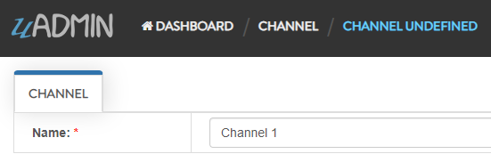
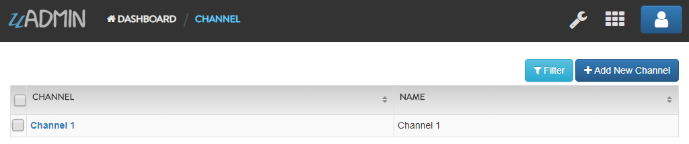
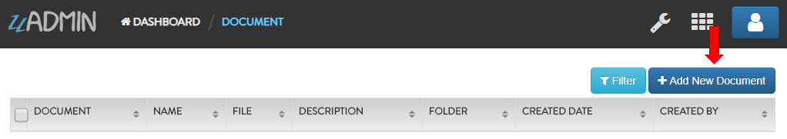
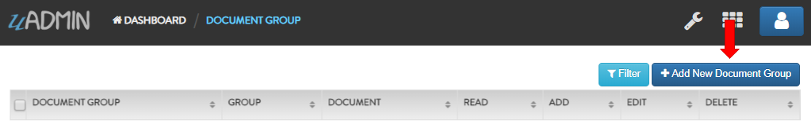
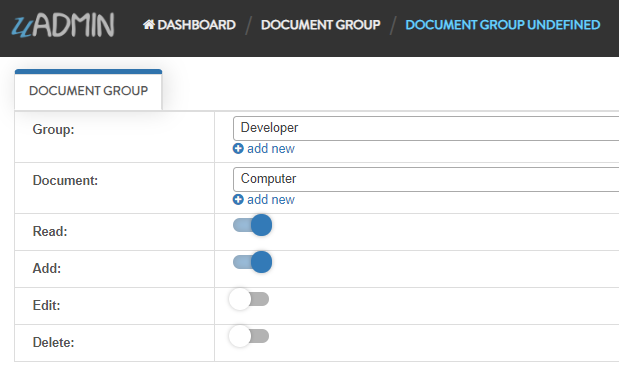
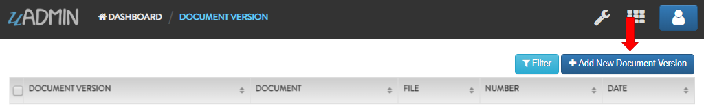
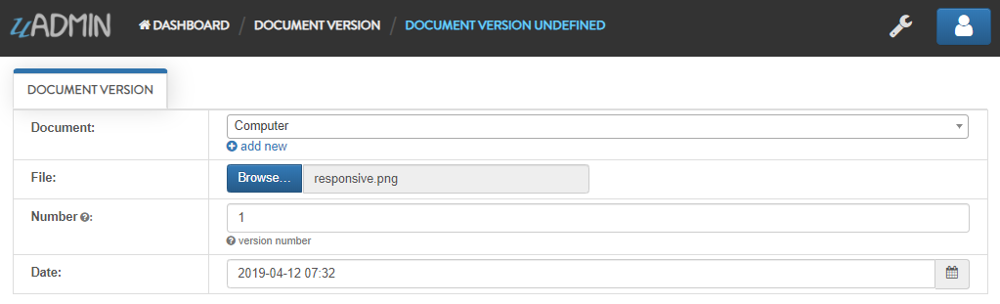

Document System Tutorial Part 6 - Creating Records in Documents
===============================================================
In this part, we will discuss about document concepts and how to create records in an application.

First of all, click "CHANNELS".

.. image:: assets/channelshighlighted.png

|

Click "Add New Channel".

.. image:: assets/addnewchannel.png

|

Input the channel name anything you want (e.g. Channel 1).

|

Result

|

Now go back to the Document System Dashboard then click "DOCUMENTS".

.. image:: assets/documentshighlighted.png

|

Click "Add New Document".

|

Input the following information except the CreatedBy field. This field will be automatically generated after you save the record that returns the full name of the logined user.

.. image:: assets/documentrecord.png

|

Result

.. image:: assets/documentrecordresult.png

|

Go back to the Document System Dashboard then click "DOCUMENT GROUPS".

.. image:: assets/documentgroupshighlighted.png

|

Click "Add New Document Group".

|

Fill up the following information to create a new document group. In this example, let's give access to read and add in the Developer group.

|

Result

.. image:: assets/documentgroupresult.png

|

Go back to the Document System Dashboard then click "DOCUMENT USERS".

.. image:: assets/documentusershighlighted.png

|

Click "Add New Document User".

.. image:: assets/addnewdocumentuser.png

|

Fill up the following information to create a new document user. In this example, let's give access to read and add in this document.

.. image:: assets/documentuserrecord.png
   :align: center

|

Result

.. image:: assets/documentuserrecordresult.png

|

Go back to the Document System Dashboard then click "DOCUMENT VERSIONS".

.. image:: assets/documentversionshighlighted.png

|

Click "Add New Document Version".

|

Fill up the following information to create a new document version.

|

Result

.. image:: assets/documentversionrecordresult.png

|

In the `next part`_, we will talk about register inlines that connects from a parent model to another model.

.. _next part: https://uadmin.readthedocs.io/en/latest/document_system/tutorial/part7.html