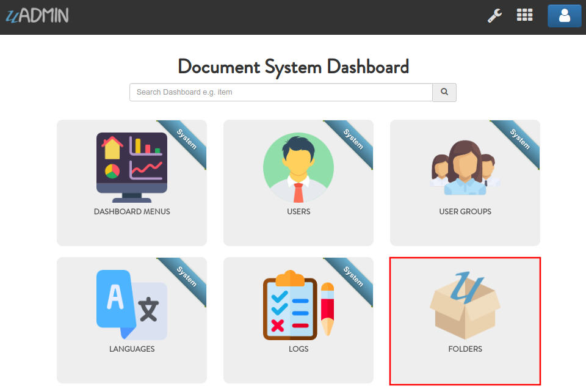
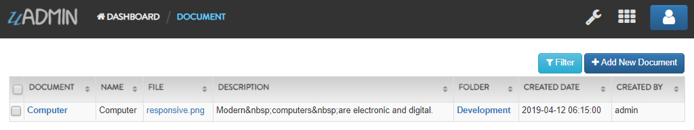
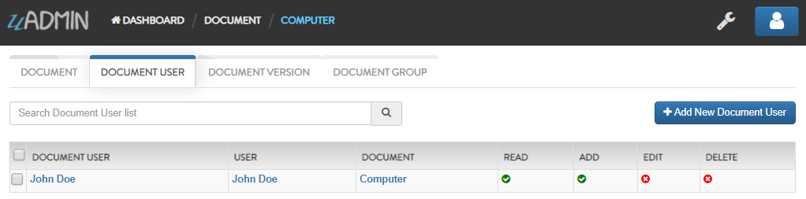
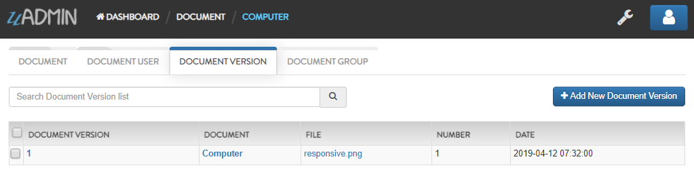

Document System Tutorial Part 7 - Register Inlines
==================================================
In this part, we will talk about register inlines that connects from a parent model to another model.

Inlines is where we keep all registered models' inlines. It allows you to merge a parent model to a submodel where the foreign key(s) are specified.

**Why do we use Register Inlines?** We use them to show that the field of a model is related to another model as long as there is a foreign key specified.

Format:

.. code-block:: go

    uadmin.RegisterInlines(
        /folder_name/./struct_name of a parent model/{},
        map[string]string{
            "/sub_model name/": "/parent_model name/ID",
        }
    )

Now let's apply it in the main.go. Copy the codes below and paste it after the uadmin.Register function.

.. code-block:: go

    // Register FolderGroup and FolderUser to Folder model
    uadmin.RegisterInlines(
        models.Folder{},
        map[string]string{
            "foldergroup": "FolderID",
            "folderuser":  "FolderID",
        },
    )

    // Register DocumentVersion, DocumentGroup, and DocumentUser to Document
    // model
    uadmin.RegisterInlines(
        models.Document{},
        map[string]string{
            "documentgroup":   "DocumentID",
            "documentuser":    "DocumentID",
            "documentversion": "DocumentID",
        },
    )

**models.Folder{}** is called because the FolderGroup and FolderUser models have foreign key to this model. **foldergroup** and **folderuser** are the URL of those models and they are initialized to the FolderID in order to create inlines to the Folder model.

The same thing goes with the Document model. It is called because the DocumentGroup, DocumentUser, and DocumentVersion models have foreign key to this model. **documentgroup**, **documentuser** and **documentversion** are the URL of those models and they are initialized to the DocumentID in order to create inlines to the Document model.

Now let's run an application. From the Document System Dashboard, click "FOLDERS".

|

Click any of the existing records that you have in this model (e.g. uAdmin).

.. image:: assets/folderexistingrecords.png

|

As you can see, there are two inlines which are "FOLDER GROUP" and "FOLDER USER".

.. image:: assets/folderusergroupinlines.png
   :align: center

|

Click on "FOLDER GROUP". Inside it, there is a record named "Developer" because this folder group links to the "uAdmin" folder.

.. image:: assets/uadminfoldergroup.png

|

Click on "FOLDER USER". Inside it, there is a record named "John Doe" because this folder user links to the "uAdmin" folder.

.. image:: assets/uadminfolderuser.png

|

Now go back to the Document System Dashboard then click "DOCUMENTS".

.. image:: assets/documentshighlighted.png

|

Click the Computer record.

|

As you can see, there are three inlines which are "DOCUMENT USER", "DOCUMENT VERSION" and "DOCUMENT GROUP".

.. image:: assets/documentinlines.png

|

Click on "DOCUMENT USER". Inside it, there is a record named "John Doe" because this document user links to the "Computer" document.

|

Click on "DOCUMENT VERSION". Inside it, there is a record named "1" because this document user links to the "Computer" document.

|

Click on "DOCUMENT GROUP". Inside it, there is a record named "Developer" because this document user links to the "Computer" document.

.. image:: assets/computerdocumentgroup.png

|

In the `next part`_, we will discuss about creating a separate library that contains a drop down list and schema list modifier based on the document list filter that checks the admin status of the user. If it is not an admin, what are the models that user can access to.

.. _next part: https://uadmin.readthedocs.io/en/latest/document_system/tutorial/part8.html
