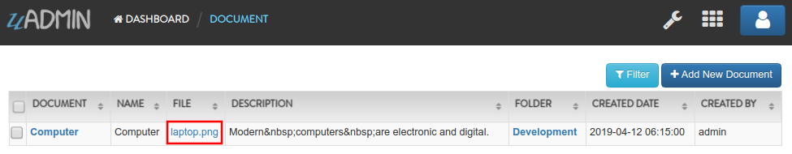

Document System Tutorial Part 9 - Updating the Document Version
===============================================================
In this part, we will talk about updating the document version automatically if the file has changed by the user after saving the specific document in the model.

First of all, go to document.go in the models folder. Create a Save function below the model struct. Inside it, create two variables named docChange and newDoc. Set both of them to false.

.. code-block:: go

    // Save !
    func (d *Document) Save() {
        // Initialized variables
        docChange := false
        newDoc := false
    }

Now let's create a validation that checks whether the document record is new or existing to be done by the user. If the document ID is not 0, the record is existing. Otherwise, the user is creating a new document. Put it below the newDoc variable.

.. code-block:: go

    // Checks whether the document record is new or existing
    if d.ID != 0 {
        // Initializes the Document model
        oldDoc := Document{}

        // Gets the ID of the old Document
        uadmin.Get(&oldDoc, "id = ?", d.ID)

        // Checks if the file is changed or updated
        if d.File != oldDoc.File {
            docChange = true
        }
    } else {
        // New document record
        docChange = true
        newDoc = true
    }

    // Save the Document
    uadmin.Save(d)

Create a validation that checks if the document is changed, the document version number will automatically get updated.

.. code-block:: go

    // Checks whether the document record has changed
    if docChange {
        // Sets the document value to the DocumentVersion fields
        ver := DocumentVersion{}
        ver.Date = time.Now()
        ver.DocumentID = d.ID
        ver.File = d.File
        ver.Format = d.Format

        // Counts the version number based on the DocumentID and increment it
        // by 1
        ver.Number = uadmin.Count([]DocumentVersion{}, "document_id = ?", d.ID) + 1

        // Save the document version
        uadmin.Save(&ver)
    }

Below the uadmin.Save(&ver) inside the docChange validation, create another validation that checks if the document is a new record, it will set the values to the DocumentVersion model fields.

.. code-block:: go

    // Sets values to the DocumentUser model fields
    creator := DocumentUser{
        UserID:     user.ID,
        DocumentID: d.ID,
        Read:       true,
        Edit:       true,
        Add:        true,
        Delete:     true,
    }

    // Save the document user
    uadmin.Save(&creator)

Now let's run your application. Go to Document System Dashboard then open "DOCUMENTS".

.. image:: assets/documentshighlighted.png

|

Click the existing record that you have.

.. image:: assets/documentrecordresult.png

|

Change the file in the document record.

.. image:: assets/documentupdatefile.png

|

Result

|

Go back to Document System Dashboard then open "DOCUMENT VERSIONS".

.. image:: assets/documentversionshighlighted.png

|

The document "Computer" is now version 2 because you changed the file.

.. image:: assets/documentversionupdatedrecord.png

|

In the `next part`_, we will discuss about creating a group permission for a specific model to the user group with some access levels.

Click `here`_ to view the full source code in this part.

.. _next part: https://uadmin.readthedocs.io/en/latest/document_system/tutorial/part10.html

.. _here: https://uadmin.readthedocs.io/en/latest/document_system/tutorial/full_code/part9.html

.. toctree::
   :maxdepth: 1

   full_code/part9
