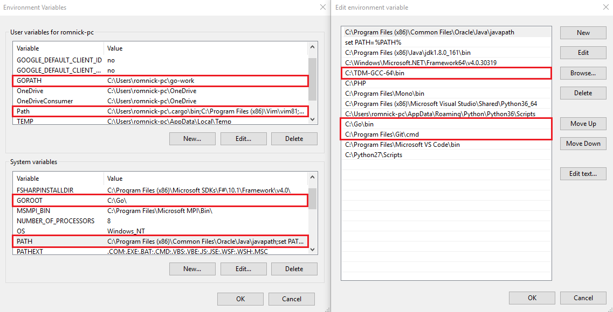

Getting Started
===============

Before you start, make sure you have Golang 1.10.3 or later installed on your machine and configured.
To install Golang, follow instructions for your OS on `Golang Downloads`_.

If you are not familiar with Golang, we advise you to go over `Golang Tour`_.

.. _Golang Downloads: https://golang.org/dl/

.. _Golang Tour: https://tour.golang.org/

Linux
^^^^^

.. code-block:: bash

    $ nano .profile

Add the following codes inside it.

.. code-block:: bash

    # set PATH so it includes user's private bin directories

    PATH="$HOME/bin:$HOME/.local/bin:$PATH"
    export PATH=$PATH:/usr/local/go/bin
    export GOPATH=$HOME/go
    export PATH=$PATH:$GOPATH/bin

Windows
^^^^^^^
You have to set your ENVIRONMENT VARIABLES. Click `here`_ for the detailed instructions.

.. _here: https://uadmin.readthedocs.io/en/latest/_static/install/Windows%20Installation.pdf

|

If you have encountered a problem that are looking for gcc, please install `this`_ to aid the problem.

.. _this: http://tdm-gcc.tdragon.net/download

.. image:: assets/gccerror.png

Tutorial
^^^^^^^^

This is a `15`_ part tutorial that will guide you through building upon your Todo list application.

Before you start the tutorial, make sure you finish this part from `Your First Application`_.

.. _15: https://uadmin.readthedocs.io/en/latest/coverage.html
.. _Your First Application: https://uadmin.readthedocs.io/en/latest/index.html
