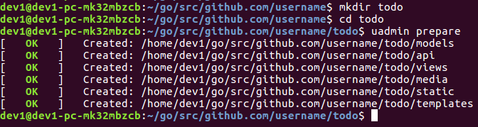

Simple Web Framework for Golang
===============================

uAdmin is a simple yet powerful web framework for building web applications.

Installation
^^^^^^^^^^^^

Install uAdmin:

.. code-block:: bash

    $ go get github.com/uadmin/uadmin/...

To check whether the installation is successful, use the keyword "uadmin" on your command prompt then press Enter.

.. code-block:: bash

    $ uadmin

Expected output

.. image:: assets/uadmin.png

Your First Project
^^^^^^^^^^^^^^^^^^

Once you have uAdmin installed, let's start a project.

.. code-block:: bash

    $ mkdir -p ~/go/src/github.com/your_name/todo
    $ cd ~/go/src/github.com/your_name/todo
    $ uadmin prepare

Expected output

Use your favorite editor to create `main.go` inside that path. Put the
following code in `main.go`:

.. code-block:: go

    package main

    import (
      "github.com/uadmin/uadmin/"
    )

    type Todo struct {
      uadmin.Model
      Task       string `uadmin:"html"`
      TargetDate time.Time
    }

    func main() {
      uadmin.Register(Todo{})
      uadmin.StartServer(8000)
    }

To run your code:

.. code-block:: bash

    $ cd ~/go/src/github.com/your_name/todo
    $ go build; ./todo
    [   OK   ]   Initializing DB: [9/9]
    [   OK   ]   Server Started: http://127.0.0.1/9000

.. toctree::
   :maxdepth: 1

   getting_started
   tutorial/part1
   api
   about
   roadmap
   license
   tags
