System Reference
================
In this section, we will cover the features of each following systems in-depth listed below:

* `Builder`_
* `Builder Field`_
* `Dashboard Menu`_
* `Export to Excel`_
* `Group Permission`_
* `Language`_
* `Log`_
* `Profile`_
* `Session`_
* `Setting`_
* `Setting Category`_
* `User`_
* `User Group`_
* `User Permission`_

Builder
-------
Builder is a system in uAdmin that is used to generate an external model in your project folder. It has only one field: **Name**. It is useful if you want to make something quick instead of creating a new model, reinitializing the package name and importing the library manually.

First of all, go to uAdmin dashboard and click on "BUILDERS".

.. image:: assets/buildershighlighted.png

|

Click "Add New Builder".

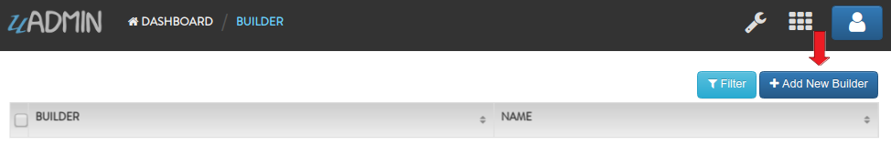

|

Assign the name you want to generate in the models folder (e.g. Todo).

.. image:: assets/buildertodo.png
   :align: center

|

Result

.. image:: assets/buildertodoresult.png

|

Now go to your project folder. Inside the models, you will see that the Todo file is automatically generated containing the basic code setup. Then you can now start working on business logic.

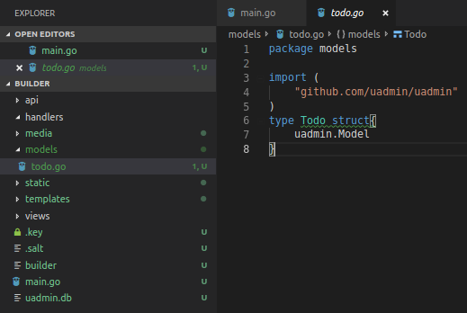

|

Congrats! Now you know how to use a builder system by adding the name in your application and analyzing the results by checking if the file is automatically generated in the models folder and the contents inside the file.

Builder Field
-------------
Builder Field is a system in uAdmin that is used to generate the field name and data type in the specified model.

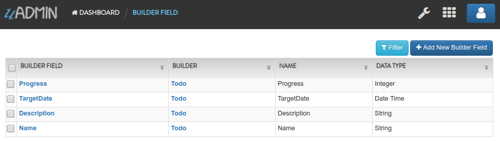

Here are the following fields in this system:

* **Builder** - The model where to build the fields
* **Name** - The name of the field
* **Data Type** - The data type that you want to select in the drop down list

Data Type has 7 values:

* **Boolean** - A data type that has one of two possible values (usually denoted true and false), intended to represent the two truth values of logic and Boolean algebra
* **DateTime** - Provides functionality for measuring and displaying time
* **File** - A data type used in order to upload a file in the database
* **Float** - Used in various programming languages to define a variable with a fractional value
* **Image** - Used to upload and crop an image in the database
* **Integer** - Used to represent a whole number that ranges from -2147483647 to 2147483647 for 9 or 10 digits of precision
* **String** - Used to represent text rather than numbers

First of all, go to uAdmin dashboard and click on "BUILDER FIELDS".

.. image:: assets/builderfieldshighlighted.png

|

Click "Add New Builder Field".

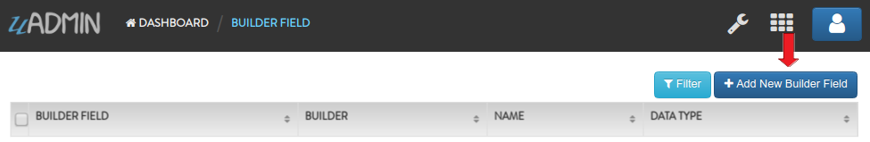

|

Let's create four fields which are the following:

* Name as String
* Description as String
* TargetDate as Date Time
* Progress as Integer

.. image:: assets/builderfielddata1.png

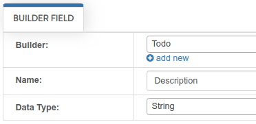

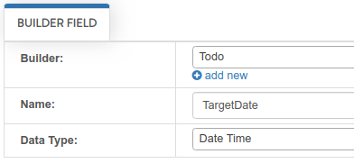

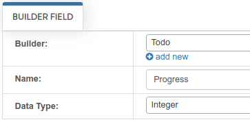

|

Result

Congrats! Now you know how to use a builder field system by adding the name and data type and analyzing the results by checking if the fields are automatically generated in the specified model.

Dashboard Menu
--------------
Dashboard Menu is a system in uAdmin that is used to add, modify, and delete the elements of a model. Making it look good and customizing it to meet your customers requirements is important to the success of your app.

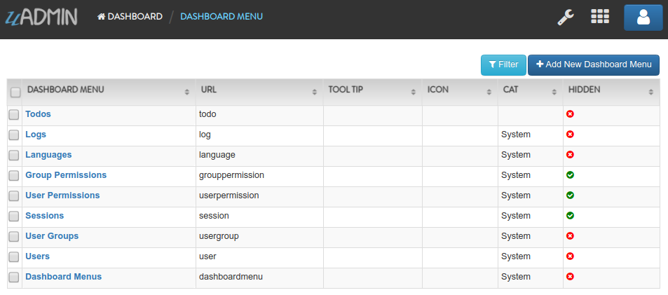

Here are the following fields in this system:

* **Dashboard Menu** - The name of the model
* **URL** - The path where the model can be accessed
* **Tool Tip** - A message that appears when a cursor is positioned over an icon, image, hyperlink, or other element in a graphical user interface
* **Icon** - A picture, image, or other representation to display in the dashboard
* **Cat** - Used to set a highlight label for a model
* **Hidden** - A feature to make the model invisible in the dashboard

Let's create a new dashboard menu called "Expressions" with a URL of "expression".

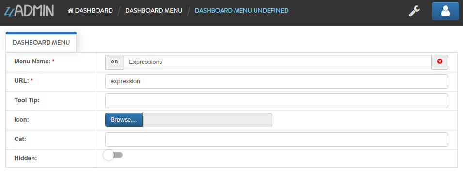

|

Once you are done, go back to your dashboard to see if the Expression model was created.

.. image:: assets/expressionaddsystemoutput.png

|

Nice! Now let's go back to the dashboard menu. Upload the image file in the Icon field. If you don't have any pictures or icons in your computer, I would recommend you to go over `flaticon.com`_, but you can browse anywhere online. Once you search for an icon, download the PNG version and choose the size 128 pixels.

.. _flaticon.com: https://www.flaticon.com/

.. image:: assets/expressionicon.png

|

Once you are done, go back to your dashboard to see if your image file was uploaded.

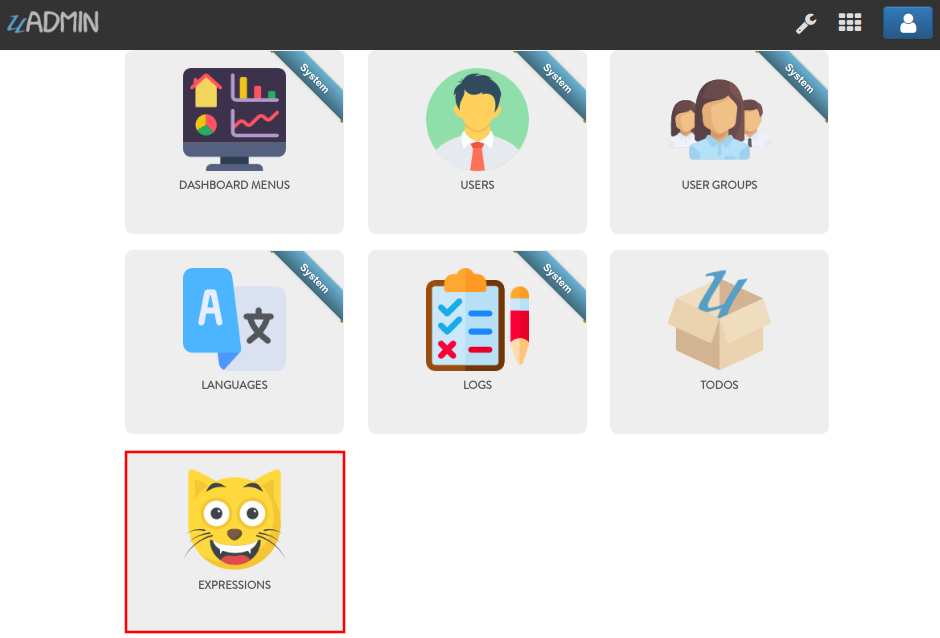

|

That's cool man! Now let's make it more realistic. Go back to the dashboard menu again. This time let's input the value of the Tool Tip to "Hello everyone! Welcome to uAdmin, the Golang Web Framework.".

.. image:: assets/expressiontooltip.png

|

Once you are done, go back to your dashboard to see if the Tool Tip is functional.

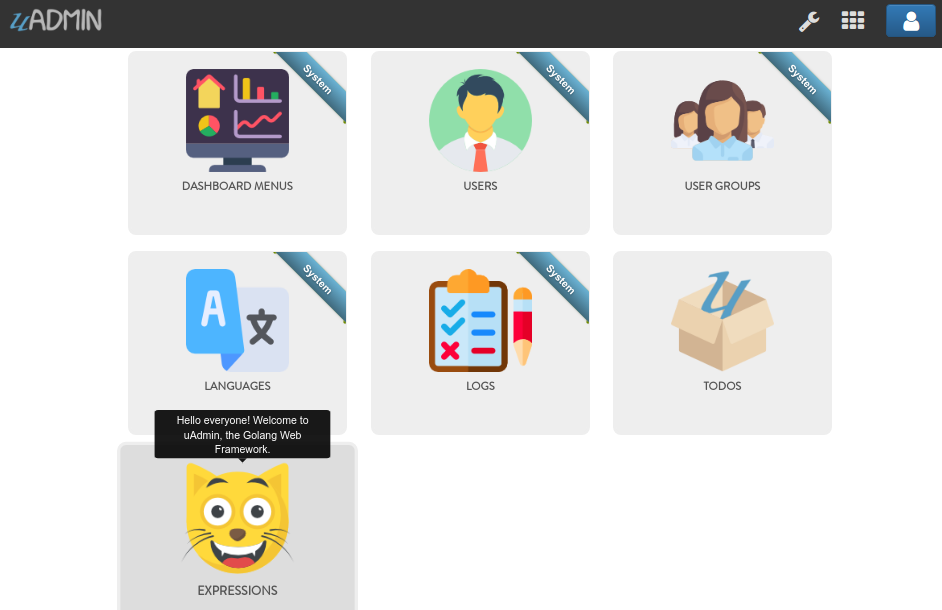

|

Great! Now let's go back to the dashboard menu again and set the value of the Cat to "Meow!".

.. image:: assets/expressioncat.png

|

Once you are done, go back to your dashboard to see if the Cat is functional.

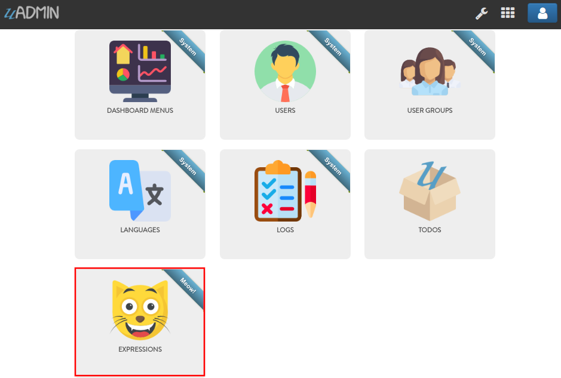

|

Well done! Okay let's go back to the dashboard menu. This time toggle the Hidden field of the Expression model to **true**.

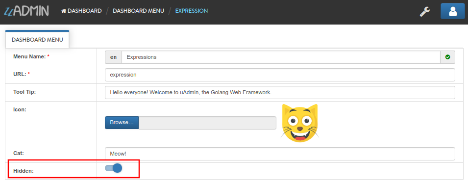

|

Once you are done, go back to your dashboard to see if the Expression model is hidden.

.. image:: tutorial/assets/uadmindashboard.png

|

And it's gone. Now go to the dashboard menu. Finally, delete the Expression model in the list.

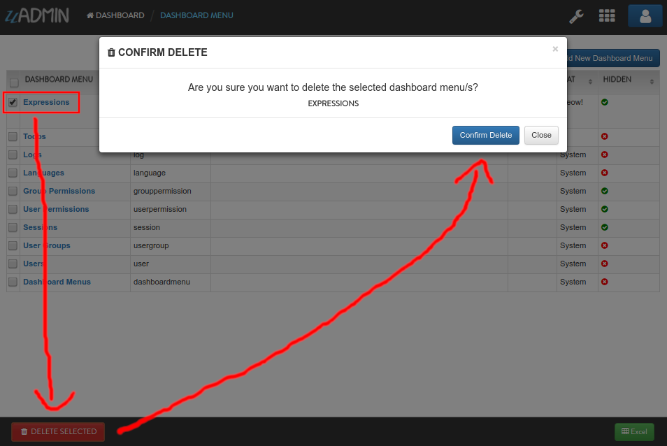

Well done! Now you know how to configure your dashboard menu by adding, updating, customizing and deleting a model.

Group Permission
----------------
Group Permission sets the permission of a user group handled by an administrator.

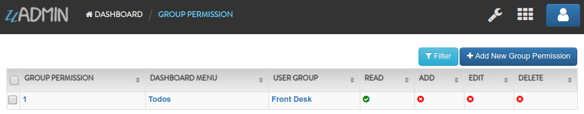

Here are the following fields in this system:

* **Group Permission** - Returns the ID number of itself
* **Dashboard Menu** - Fetches the name of the model
* **User Group** - Fetches the name of the group
* **Read** - Sets the Read access to the user
* **Add** - Sets the Add access to the user
* **Edit** - Sets the Edit access to the user
* **Delete** - Sets the Delete access to the user

First of all, make it sure that your existing account is not an Admin (example below is Even Demata) and it is part of the User Group (example below is Front Desk).

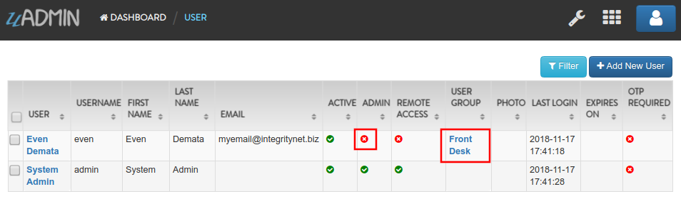

Click the Front Desk highlighted below.

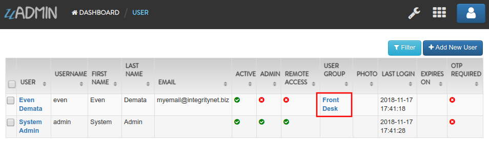

|

Go to the Group Permission tab. Afterwards, click Add New Group Permission button at the right side.

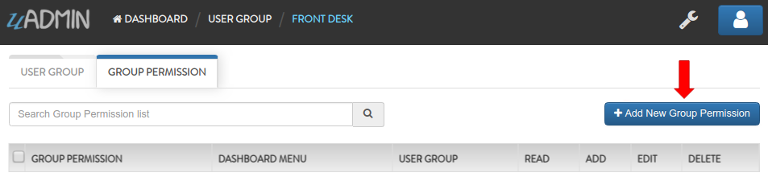

|

Set the Dashboard Menu to "Todos" model, User linked to "Even Demata", and activate the "Read" only. It means Front Desk User Group has restricted access to adding, editing and deleting a record in the Todos model.

.. image:: assets/grouppermissionadd.png

|

Result

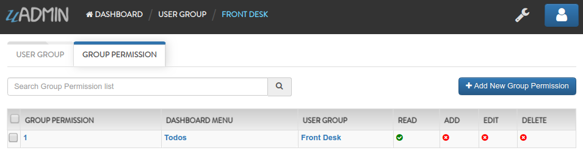

|

Log out your System Admin account. This time login your username and password using the user account that has group permission. Now click on TODOS model.

.. image:: assets/userpermissiondashboard.png

|

As you will see, your user account is restricted to add, edit, or delete a record in the Todo model. You can only read what is inside this model.

.. image:: assets/useraddeditdeleterestricted.png

|

To remove these restrictions, login your System Admin account, go to Group Permission and activate "Add", "Edit", and "Delete" access to Front Desk group.

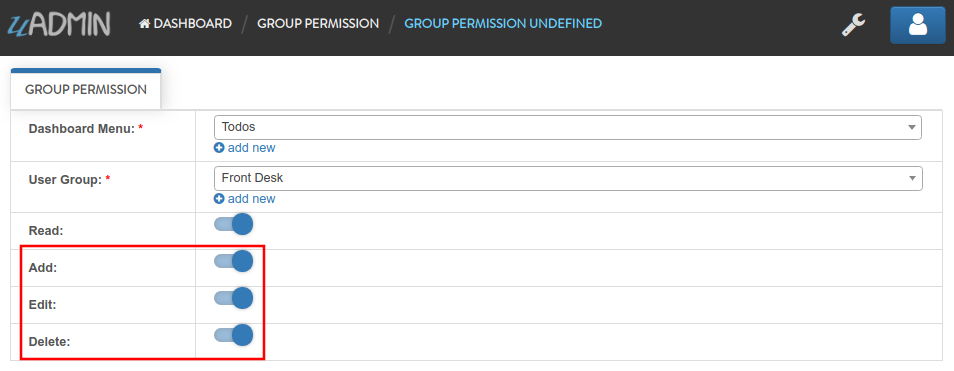

|

Login your Even Demata account and see what happens.

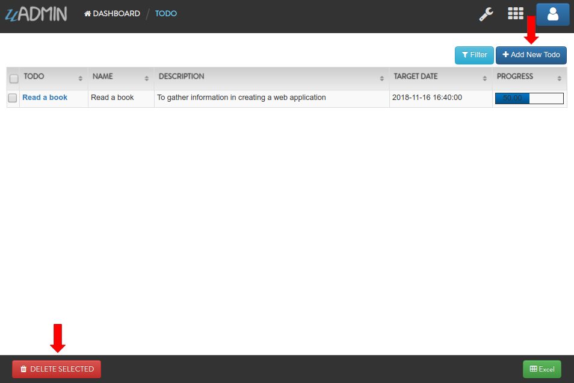

|

Let's open the "Read a book" record to see if the user can have access to edit.

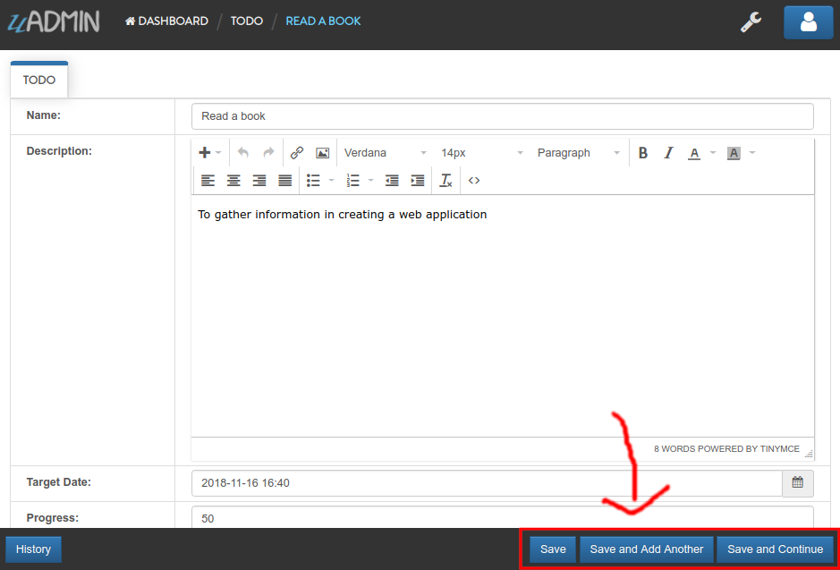

|

Nice! You have full access to everything in the TODOS model. What if the user group has no access to "Read" but can add, edit, or delete a record? Login your System account and remove "Read" access to Front Desk.

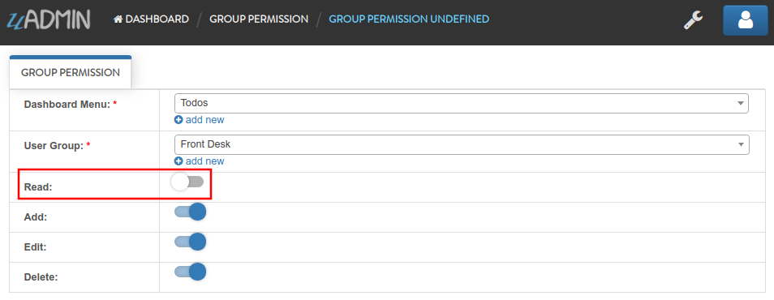

|

Login your Even Demata account and see what happens.

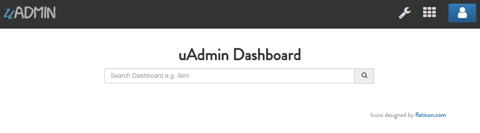

TODOS model does not show up in the dashboard. Even if you remove access to "Add", "Edit" and "Delete" to Front Desk group, it will display the same output.

Login your System Admin account. Finally, delete the Group Permission in the Front Desk User Group.

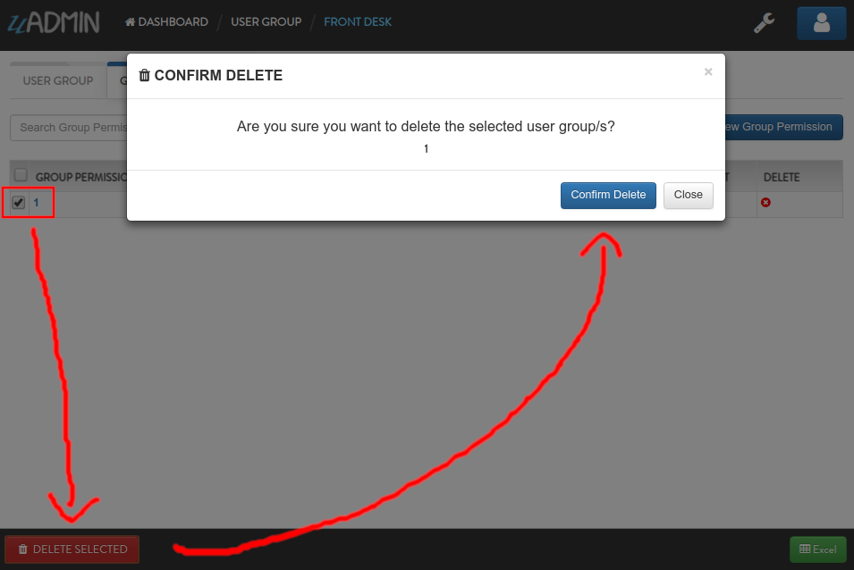

Well done! Now you know how to set the group permission to the user group, changing the access in the model and deleting the group permission.

Export to Excel
---------------
Export is one of the features of uAdmin that can replicate the data inside the model to the Excel file.

First of all, open any models in the dashboard (e.g. TODOS).

.. image:: assets/todoshighlightedlog.png

|

In this example, create at least 10 records in the Todo model. Once you are done, click Export button located at the bottom right corner of the screen.

.. image:: assets/exporttoexcel.png

|

You will get the encrypted filename in the Excel file for security purposes.

.. image:: assets/encryptedfilenameexcel.png
   :align: center

|

Open that file. The data that you have created in the uAdmin model will be replicated to the Excel file.

.. image:: assets/todosexceldata.png

Well done! Now you know how to export a model to Excel file in uAdmin.

Language
--------
Language is a system in uAdmin that is used to add, modify, and delete the elements of a language. There are a total of 184 languages.

.. list-table:: **LIST OF AVAILABLE LANGUAGES**
   :widths: 20 7 36 7 10
   :header-rows: 1
   :align: center

   * - English Name
     -
     - Name
     -
     - Tag
   * - Abkhaz
     -
     - аҧсуа бызшәа, аҧсшәа
     -
     - ab
   * - Afar
     -
     - Afaraf
     -
     - aa
   * - Afrikaans
     -
     - Afrikaans
     -
     - af
   * - Akan
     -
     - Akan
     -
     - ak
   * - Albanian
     -
     - Shqip
     -
     - sq
   * - Arabic
     -
     - العربية
     -
     - ar
   * - Aragonese
     -
     - aragonés
     -
     - an
   * - Armenian
     -
     - Հայերեն
     -
     - hy
   * - Assamese
     -
     - অসমীয়া
     -
     - as
   * - Avaric
     -
     - авар мацӀ, магӀарул мацӀ
     -
     - av
   * - Avestan
     -
     - avesta
     -
     - ae
   * - Aymara
     -
     - aymar aru
     -
     - ay
   * - Azerbaijani
     -
     - azərbaycan dili
     -
     - az
   * - Bambara
     -
     - bamanankan
     -
     - bm
   * - Bashkir
     -
     - башҡорт теле
     -
     - ba
   * - Basque
     -
     - euskara, euskera
     -
     - eu
   * - Belarusian
     -
     - беларуская мова
     -
     - be
   * - Bengali, Bangla
     -
     - বাংলা
     -
     - bn
   * - Bihari
     -
     - भोजपुरी
     -
     - bh
   * - Bislama
     -
     - Bislama
     -
     - bi
   * - Bosnian
     -
     - bosanski jezik
     -
     - bs
   * - Breton
     -
     - brezhoneg
     -
     - br
   * - Bulgarian
     -
     - български език
     -
     - bg
   * - Burmese
     -
     - ဗမာစာ
     -
     - my
   * - Catalan
     -
     - català
     -
     - ca
   * - Chamorro
     -
     - Chamoru
     -
     - ch
   * - Chechen
     -
     - нохчийн мотт
     -
     - ce
   * - Chichewa, Chewa, Nyanja
     -
     - chiCheŵa, chinyanja
     -
     - ny
   * - Chinese
     -
     - 中文 (Zhōngwén), 汉语, 漢語
     -
     - zh
   * - Chuvash
     -
     - чӑваш чӗлхи
     -
     - cv
   * - Cornish
     -
     - Kernewek
     -
     - kw
   * - Corsican
     -
     - corsu, lingua corsa
     -
     - co
   * - Cree
     -
     - ᓀᐦᐃᔭᐍᐏᐣ
     -
     - cr
   * - Croatian
     -
     - hrvatski jezik
     -
     - hr
   * - Czech
     -
     - čeština, český jazyk
     -
     - cs
   * - Danish
     -
     - dansk
     -
     - da
   * - Divehi, Dhivehi, Maldivian
     -
     - ދިވެހި
     -
     - dv
   * - Dutch
     -
     - Nederlands, Vlaams
     -
     - nl
   * - Dzongkha
     -
     - རྫོང་ཁ
     -
     - dz
   * - English
     -
     - English
     -
     - en
   * - Esperanto
     -
     - Esperanto
     -
     - eo
   * - Estonian
     -
     - eesti, eesti keel
     -
     - et
   * - Ewe
     -
     - Eʋegbe
     -
     - ee
   * - Faroese
     -
     - føroyskt
     -
     - fo
   * - Fijian
     -
     - vosa Vakaviti
     -
     - fj
   * - Filipino
     -
     - Filipino
     -
     - fl
   * - Finnish
     -
     - suomi, suomen kieli
     -
     - fi
   * - French
     -
     - français, langue française
     -
     - fr
   * - Fula, Fulah, Pulaar, Pular
     -
     - Fulfulde, Pulaar, Pular
     -
     - ff
   * - Galician
     -
     - galego
     -
     - gl
   * - Ganda
     -
     - Luganda
     -
     - lg
   * - Georgian
     -
     - ქართული
     -
     - ka
   * - German
     -
     - Deutsch
     -
     - de
   * - Greek (modern)
     -
     - ελληνικά
     -
     - el
   * - Guaraní
     -
     - Avañe'ẽ
     -
     - gn
   * - Gujarati
     -
     - ગુજરાતી
     -
     - gu
   * - Haitian, Haitian Creole
     -
     - Kreyòl ayisyen
     -
     - ht
   * - Hausa
     -
     - (Hausa) هَوُسَ
     -
     - ha
   * - Hebrew (modern)
     -
     - עברית
     -
     - he
   * - Herero
     -
     - Otjiherero
     -
     - hz
   * - Hindi
     -
     - हिन्दी, हिंदी
     -
     - hi
   * - Hiri Motu
     -
     - Hiri Motu
     -
     - ho
   * - Hungarian
     -
     - magyar
     -
     - hu
   * - Icelandic
     -
     - Íslenska
     -
     - is
   * - Ido
     -
     - Ido
     -
     - io
   * - Igbo
     -
     - Asụsụ Igbo
     -
     - ig
   * - Indonesian
     -
     - Bahasa Indonesia
     -
     - id
   * - Interlingua
     -
     - Interlingua
     -
     - ia
   * - Interlingue
     -
     - Originally called Occidental; then Interlingue after WWII
     -
     - ie
   * - Inuktitut
     -
     - ᐃᓄᒃᑎᑐᑦ
     -
     - iu
   * - Inupiaq
     -
     - Iñupiaq, Iñupiatun
     -
     - ik
   * - Irish
     -
     - Gaeilge
     -
     - ga
   * - Italian
     -
     - Italiano
     -
     - it
   * - Japanese
     -
     - 日本語 (にほんご)
     -
     - ja
   * - Javanese
     -
     - ꦧꦱꦗꦮ, Basa Jawa
     -
     - jv
   * - Kalaallisut, Greenlandic
     -
     - kalaallisut, kalaallit oqaasii
     -
     - kl
   * - Kannada
     -
     - ಕನ್ನಡ
     -
     - kn
   * - Kanuri
     -
     - Kanuri
     -
     - kr
   * - Kashmiri
     -
     - कश्मीरी, كشميري‎
     -
     - ks
   * - Kazakh
     -
     - қазақ тілі
     -
     - kk
   * - Khmer
     -
     - ខ្មែរ, ខេមរភាសា, ភាសាខ្មែរ
     -
     - km
   * - Kikuyu, Gikuyu
     -
     - Gĩkũyũ
     -
     - ki
   * - Kinyarwanda
     -
     - Ikinyarwanda
     -
     - rw
   * - Kirundi
     -
     - Ikirundi
     -
     - rn
   * - Komi
     -
     - коми кыв
     -
     - kv
   * - Kongo
     -
     - Kikongo
     -
     - kg
   * - Korean
     -
     - 한국어
     -
     - ko
   * - Kurdish
     -
     - Kurdî, كوردی‎
     -
     - ku
   * - Kwanyama, Kuanyama
     -
     - Kuanyama
     -
     - kj
   * - Kyrgyz
     -
     - Кыргызча, Кыргыз тили
     -
     - ky
   * - Lao
     -
     - ພາສາລາວ
     -
     - lo
   * - Latin
     -
     - latine, lingua latina
     -
     - la
   * - Latvian
     -
     - latviešu valoda
     -
     - lv
   * - Limburgish, Limburgan, Limburger
     -
     - Limburgs
     -
     - li
   * - Lingala
     -
     - Lingála
     -
     - ln
   * - Lithuanian
     -
     - lietuvių kalba
     -
     - lt
   * - Luba-Katanga
     -
     - Tshiluba
     -
     - lu
   * - Luxembourgish, Letzeburgesch
     -
     - Lëtzebuergesch
     -
     - lb
   * - Macedonian
     -
     - македонски јазик
     -
     - mk
   * - Malagasy
     -
     - fiteny malagasy
     -
     - mg
   * - Malay
     -
     - bahasa Melayu, بهاس ملايو‎"
     -
     - ms
   * - Malayalam
     -
     - മലയാളം
     -
     - ml
   * - Maltese
     -
     - Malti
     -
     - mt
   * - Manx
     -
     - Gaelg, Gailck
     -
     - gv
   * - Māori
     -
     - te reo Māori
     -
     - mi
   * - Marathi (Marāṭhī)
     -
     - मराठी
     -
     - mr
   * - Marshallese
     -
     - Kajin M̧ajeļ
     -
     - mh
   * - Mongolian
     -
     - Монгол хэл
     -
     - mn
   * - Nauruan
     -
     - Dorerin Naoero
     -
     - na
   * - Navajo, Navaho
     -
     - Diné bizaad
     -
     - nv
   * - Ndonga
     -
     - Owambo
     -
     - ng
   * - Nepali
     -
     - नेपाली
     -
     - ne
   * - Northern Ndebele
     -
     - isiNdebele
     -
     - nd
   * - Northern Sami
     -
     - Davvisámegiella
     -
     - se
   * - Norwegian
     -
     - Norsk
     -
     - no
   * - Norwegian Bokmål
     -
     - Norsk bokmål
     -
     - nb
   * - Norwegian Nynorsk
     -
     - Norsk nynorsk
     -
     - nn
   * - Nuosu
     -
     - ꆈꌠ꒿ Nuosuhxop
     -
     - ii
   * - Occitan
     -
     - occitan, lenga d'òc
     -
     - oc
   * - Ojibwe, Ojibwa
     -
     - ᐊᓂᔑᓈᐯᒧᐎᓐ
     -
     - oj
   * - Old Church Slavonic, Church Slavonic, Old Bulgarian
     -
     - ѩзыкъ словѣньскъ
     -
     - cu
   * - Oriya
     -
     - ଓଡ଼ିଆ
     -
     - or
   * - Oromo
     -
     - Afaan Oromoo
     -
     - om
   * - Ossetian, Ossetic
     -
     - ирон æвзаг
     -
     - os
   * - (Eastern) Punjabi
     -
     - ਪੰਜਾਬੀ
     -
     - pa
   * - Pāli
     -
     - पाऴि
     -
     - pi
   * - Pashto, Pushto
     -
     - پښتو
     -
     - ps
   * - Persian (Farsi)
     -
     - فارسی
     -
     - fa
   * - Polish
     -
     - język polski, polszczyzna
     -
     - pl
   * - Portuguese
     -
     - Português
     -
     - pt
   * - Quechua
     -
     - Runa Simi, Kichwa
     -
     - qu
   * - Romanian
     -
     - Română
     -
     - ro
   * - Romansh
     -
     - rumantsch grischun
     -
     - rm
   * - Russian
     -
     - Русский
     -
     - ru
   * - Samoan
     -
     - gagana fa'a Samoa
     -
     - sm
   * - Sango
     -
     - yângâ tî sängö
     -
     - sg
   * - Sanskrit (Saṁskṛta)
     -
     - संस्कृतम्
     -
     - sa
   * - Sardinian
     -
     - sardu
     -
     - sc
   * - Scottish Gaelic, Gaelic
     -
     - Gàidhlig
     -
     - gd
   * - Serbian
     -
     - српски језик
     -
     - sr
   * - Shona
     -
     - chiShona
     -
     - sn
   * - Sindhi
     -
     - सिन्धी, سنڌي، سندھی‎
     -
     - sd
   * - Sinhalese, Sinhala
     -
     - සිංහල
     -
     - si
   * - Slovak
     -
     - slovenčina, slovenský jazyk
     -
     - sk
   * - Slovene
     -
     - slovenski jezik, slovenščina
     -
     - sl
   * - Somali
     -
     - Soomaaliga, af Soomaali
     -
     - so
   * - Southern Ndebele
     -
     - isiNdebele
     -
     - nr
   * - Southern Sotho
     -
     - Sesotho
     -
     - st
   * - Spanish
     -
     - Español
     -
     - es
   * - Sundanese
     -
     - Basa Sunda
     -
     - su
   * - Swahili
     -
     - Kiswahili
     -
     - sw
   * - Swati
     -
     - SiSwati
     -
     - ss
   * - Swedish
     -
     - svenska
     -
     - sv
   * - Tagalog
     -
     - Wikang Tagalog
     -
     - tl
   * - Tahitian
     -
     - Reo Tahiti
     -
     - ty
   * - Tajik
     -
     - тоҷикӣ, toçikī, تاجیکی‎
     -
     - tg
   * - Tamil
     -
     - தமிழ்
     -
     - ta
   * - Tatar
     -
     - татар теле, tatar tele
     -
     - tt
   * - Telugu
     -
     - తెలుగు
     -
     - te
   * - Thai
     -
     - ไทย
     -
     - th
   * - Tibetan Standard, Tibetan, Central
     -
     - བོད་ཡིག
     -
     - bo
   * - Tigrinya
     -
     - ትግርኛ
     -
     - ti
   * - Tonga (Tonga Islands)
     -
     - faka Tonga
     -
     - to
   * - Tsonga
     -
     - Xitsonga
     -
     - ts
   * - Tswana
     -
     - Setswana
     -
     - tn
   * - Turkish
     -
     - Türkçe
     -
     - tr
   * - Turkmen
     -
     - Türkmen, Түркмен
     -
     - tk
   * - Twi
     -
     - Twi
     -
     - tw
   * - Uyghur
     -
     - ئۇيغۇرچە‎, Uyghurche
     -
     - ug
   * - Ukrainian
     -
     - Українська
     -
     - uk
   * - Urdu
     -
     - اردو
     -
     - ur
   * - Uzbek
     -
     - Oʻzbek, Ўзбек, أۇزبېك‎
     -
     - uz
   * - Venda
     -
     - Tshivenḓa
     -
     - ve
   * - Vietnamese
     -
     - Tiếng Việt
     -
     - vi
   * - Volapük
     -
     - Volapük
     -
     - vo
   * - Walloon
     -
     - walon
     -
     - wa
   * - Welsh
     -
     - Cymraeg
     -
     - cy
   * - Western Frisian
     -
     - Frysk
     -
     - fy
   * - Wolof
     -
     - Wollof
     -
     - wo
   * - Xhosa
     -
     - isiXhosa
     -
     - xh
   * - Yiddish
     -
     - ייִדיש
     -
     - yi
   * - Yoruba
     -
     - Yorùbá
     -
     - yo
   * - Zhuang, Chuang
     -
     - Saɯ cueŋƅ, Saw cuengh
     -
     - za
   * - Zulu
     -
     - isiZulu
     -
     - zu

|

.. image:: assets/language.png

|

Here are the following fields in this system:

* **Language** - Tag for a specific language
* **English Name** - International name
* **Name** - Local name
* **Active** - If you want to activate the language in your application
* **Available in GUI** - If you want to make the language available in the GUI

First of all, go to the Dashboard Menus.

.. image:: tutorial/assets/dashboardmenuhighlighted.png

|

Select Todos model in the list.

.. image:: assets/todoshighlighted.png

|

As you notice, English (en) is the only language available in the field.

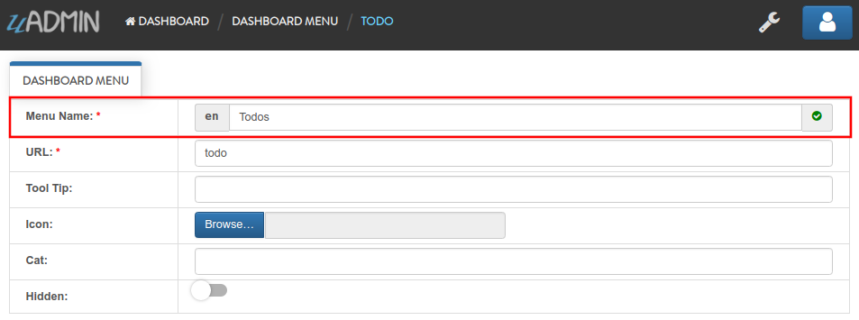

|

If you want to add more languages to show in the Dashboard Menu, go to the Languages in the uAdmin dashboard.

.. image:: tutorial/assets/languageshighlighted.png

|

Let's say I want to add Chinese and Tagalog in the menu name of the Todo model. In order to do that, set the Active as enabled.

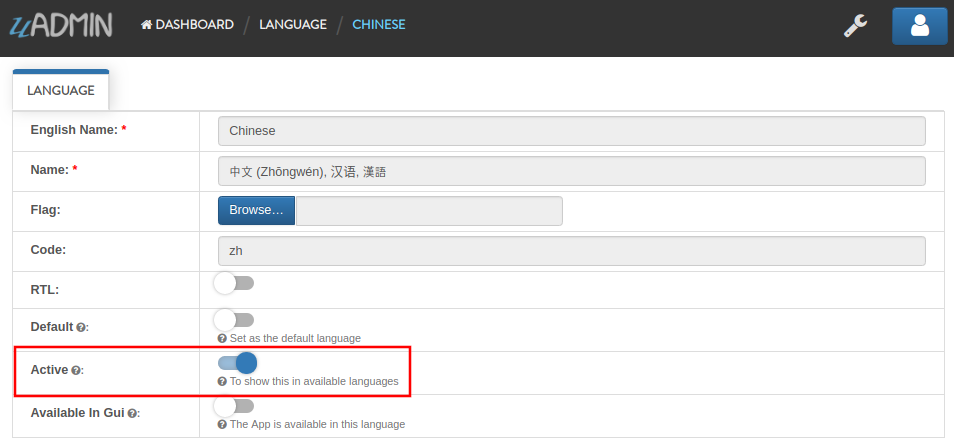

|

Now go back to the Dashboard Menus, select Todos model in the list and you will notice that Chinese (zh) and Tagalog (tl) are added in the Menu Name field. Put your translated text into the related language manually.

.. image:: assets/chinesetagalogdashboardmenu.png

|

Once you are done, log out your account then login. Set your language to **中文 (Zhōngwén), 汉语, 漢語 (Chinese)**.

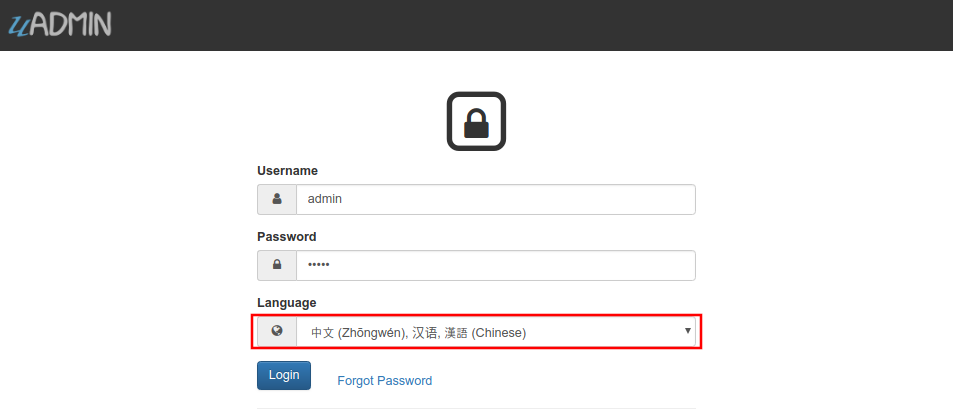

|

When you notice, the Todos model is now translated to Chinese. That's cool!

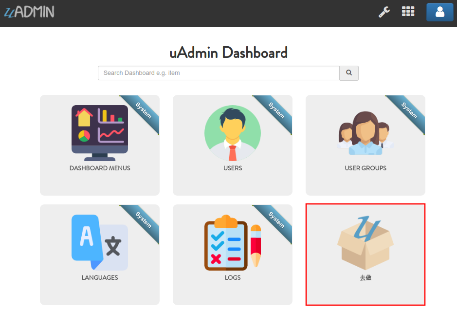

|

Now log out your account then login again. This time set your language to **Wikang Tagalog (Tagalog)** and let's see what happens.

.. image:: assets/loginformtagalog.png

|

Result

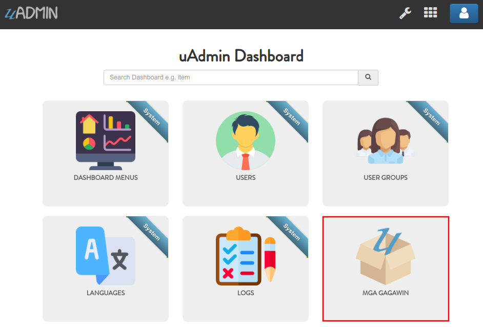

|

Nice! The Todos model is successfully translated to Tagalog.

Now let's try something more. Go to the Languages, search for Vietnamese, and set it as Default and Active.

.. image:: assets/vietnamesedefaultactive.png

|

Inside the Language model, search for English then click that record.

.. image:: api/assets/searchenglish.png

|

Disable the active status then click Save.

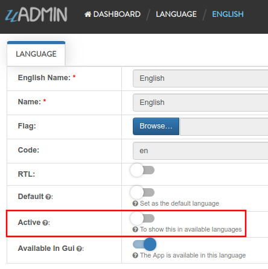

|

On the top right corner, click the blue button then select Logout.

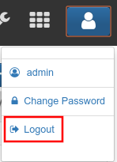

|

Log out your account and see what happens.

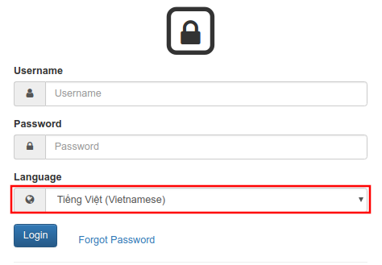

It automatically sets the value of the Language field to **Tiếng Việt (Vietnamese)**.

Login your account again, go to the Languages, search for Arabic, and activate RTL (Right-to-left) and Active.

.. image:: assets/arabicrtl.png

|

Log out your account then login again. Set your language to **(Arabic) 	العربية** and let's see what happens.

.. image:: api/assets/loginformarabic.png
   :align: center

|

The login page has aligned from right to left.

If you go to any models in the dashboard (example below is Dashboard Menus), it aligns the form automatically from right to left.

.. image:: api/assets/dashboardmenurighttoleft.png

Well done! Now you know how to activate your languages, set it to default, and using RTL (Right-to-left).

Log
---
Log is a system in uAdmin that is used to add, modify, and delete the status of the user activities. It keeps track of many things by default.

.. image:: assets/log.png

|

Here are the following fields in this system:

* **Log** - Returns the ID number of itself
* **Username** - An identification used by a person
* **Action** - See `uadmin.Action`_ for more details.
* **Table Name** - The name of the model
* **Table** - ID number of the table
* **Activity** - This shows you what are the fields that you put in your record. It also adds one field for the IP "_IP" the user was using for security.
* **Roll Back** - Undo the changes for edit and delete logs
* **Created At** - Displays the date where the log was created

.. _uadmin.Action: https://uadmin.readthedocs.io/en/latest/api.html#uadmin-action

Let’s open our app to see how these things work. Login your account using “admin” as username and password.

.. image:: assets/loginformadmin.png

|

Go to “LOGS” model in your dashboard.

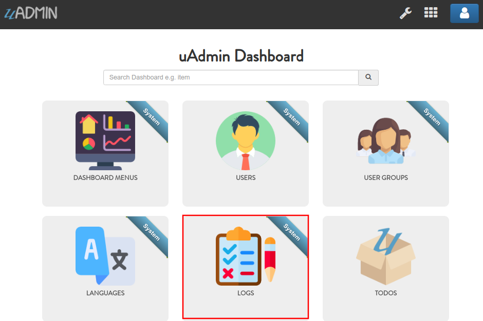

|

You will notice that you have logs for the action "Login Successful" that you have taken in your app which is what we have done a while ago. Log is served as the history of all your activities in your app.

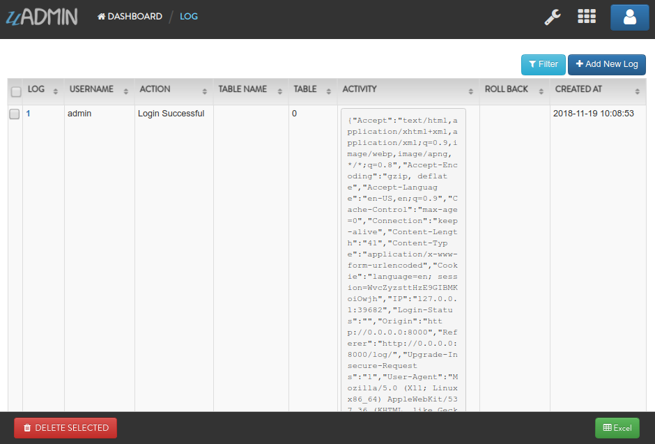

|

If you open any of these logs, you will see all the details of that log:

.. image:: assets/logdetails.png

|

The activity is the main part of your log. This shows you what are the fields that you put in your record. It also adds one field for the IP "IP" the user was using for security.

Let's go back to the previous page, refresh your browser and see what happens.

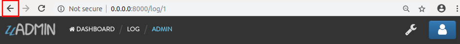

|

Result

|

You will notice that there is another type of action called "Read" using the admin account because we opened a record in the log table.

Go back to the uAdmin Dashboard and open "TODOS" model.

.. image:: assets/todoshighlightedlog.png

|

Click Add New TODO.

.. image:: assets/todomodel.png

|

Fill up the fields like in the example below:

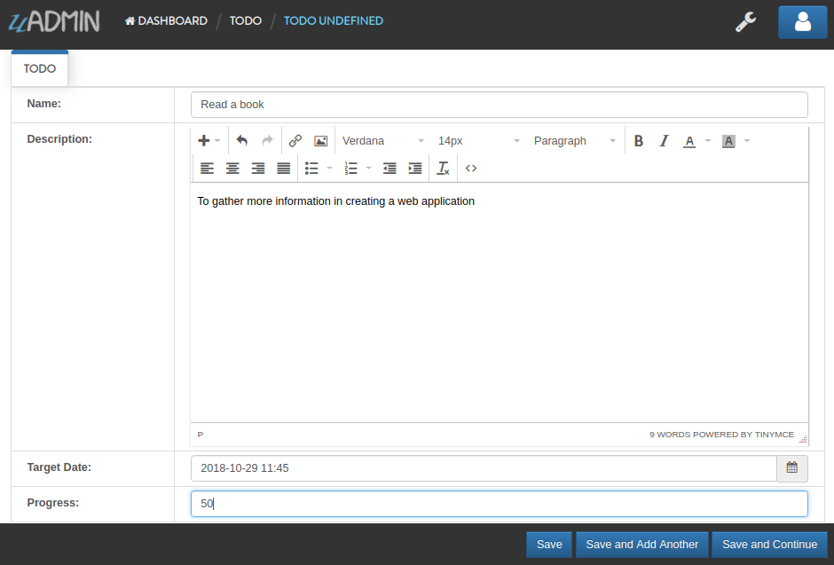

|

Save it and new data will be added to your model.

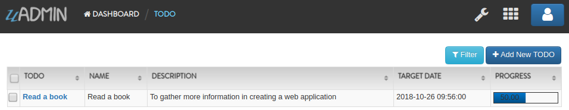

|

Open your created record in Todo model. Notice that you have a “History” button when you open any record:

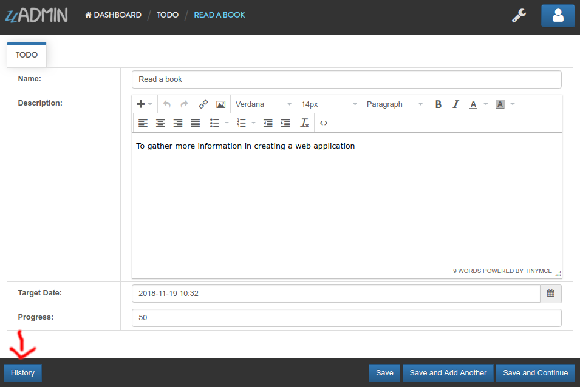

|

This “History” button will give you logs related to this record:

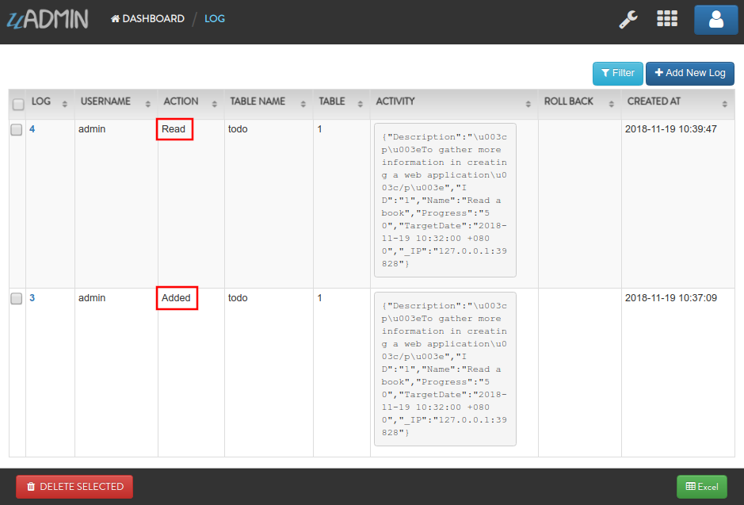

|

As you notice, the logs keep track of what we have added in the Todo model as well as we have opened a while ago.

Open "TODOS" model and let's change the record from "Read a book" to "Read a magazine".

.. image:: assets/readamagazine.png

|

Now if I go to "LOGS", you will notice that the action says we "Modified" a record in the todo table. There's also a Rollback button which means we can undo any changes. 

.. image:: assets/modifiedrollback.png

|

Click on "Roll Back" and see what happens.

.. image:: assets/reverthandler.png

|

You will not see anything in the screen except the white background. To fix this, type **0.0.0.0:8000** in the address bar. Once you are done, you will see the uAdmin dashboard again. Open "TODOS" model.

.. image:: assets/todoshighlightedlog.png

|

You will notice that the name field has reverted from "Read a magazine" to "Read a book".

|

Let's delete a record in the Todo model.

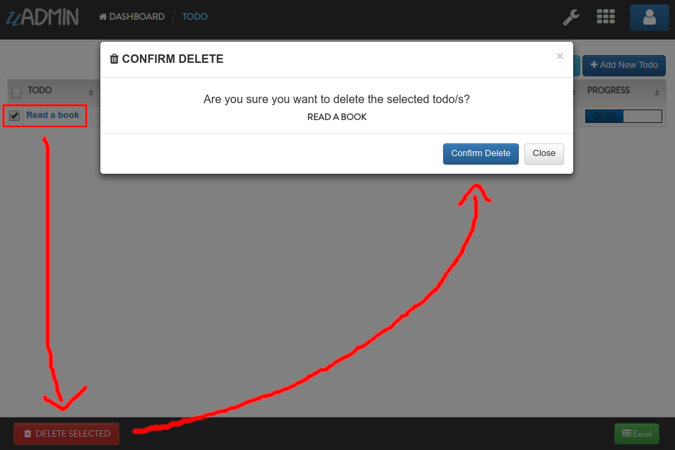

|

Now if I go to "LOGS", you will notice that the action says we "Deleted" a record in the todo table. There's also a Rollback button which means we can undo any changes. This is a good feature for the user who accidentally delete their records in the model.

.. image:: assets/logdeleted.png

|

Click on "Roll Back" and see what happens.

.. image:: assets/reverthandlerlog7.png

|

You will not see anything in the screen except the white background. To fix this, type **0.0.0.0:8000** in the address bar. Once you are done, you will see the uAdmin dashboard again. Open "TODOS" model.

.. image:: assets/todoshighlightedlog.png

|

As expected, we recovered a record in the Todo model.

|

Now click the profile icon on the top right corner then choose "Logout".

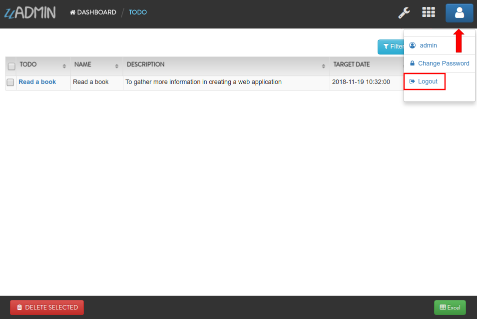

|

Input your username and password that is not existing in the User System Model then click Login.

.. image:: assets/loginformnonexistent.png

|

You will see an error that says "Invalid Username". Now login using "admin as username and password.

.. image:: assets/loginforminvaliduser.png

|

Now go to "LOGS" again. If you scroll it down, you will notice that your logout and login denied actions were recorded in the list.

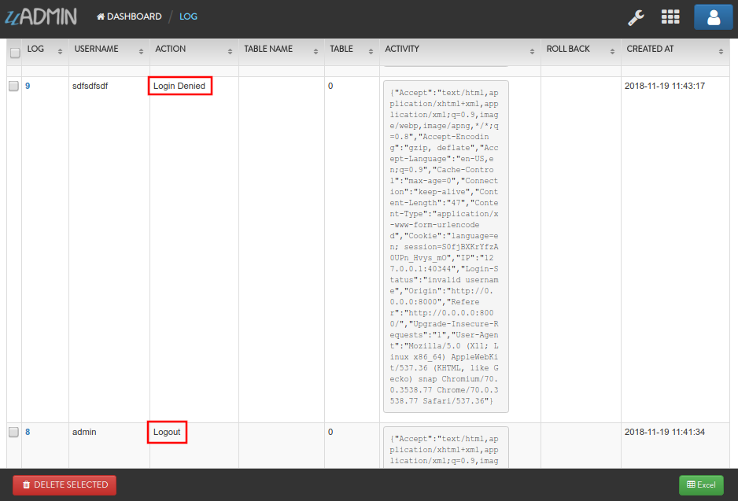

|

Go back to the uAdmin Dashboard then select "USERS".

.. image:: tutorial/assets/usershighlighted.png

|

Choose System Admin account then input your email. Email is necessary for exchanging messages between people or for password recovery.

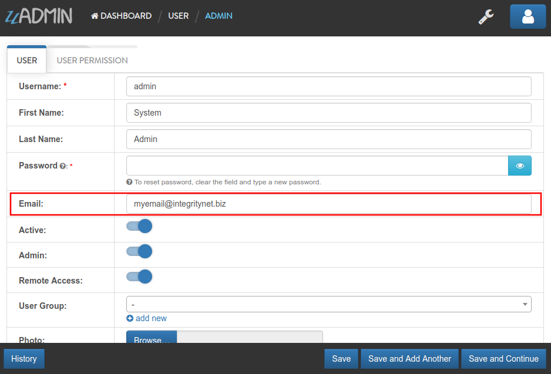

|

Make it sure that you have a ready-made email configurations in main.go.

.. code-block:: go

    func main(){
        uadmin.EmailFrom = "myemail@integritynet.biz"
        uadmin.EmailUsername = "myemail@integritynet.biz"
        uadmin.EmailPassword = "abc123"
        uadmin.EmailSMTPServer = "smtp.integritynet.biz"
        uadmin.EmailSMTPServerPort = 587
        // Some codes
    }

Once you are done, rebuild your application first (if you haven't set the email configurations yet) before you log out your account. At the moment, you suddenly forgot your password. How can we retrieve our account? Click Forgot Password at the bottom of the login form.

.. image:: tutorial/assets/forgotpasswordhighlighted.png

|

Input your email address based on the user account you wish to retrieve it back.

.. image:: tutorial/assets/forgotpasswordinputemail.png

|

Once you are done, open your email account. You will receive a password reset notification from the Todo List support. To reset your password, click the link highlighted below.

.. image:: tutorial/assets/passwordresetnotification.png

|

You will be greeted by the reset password form. For now, try not to match the new and confirm reset password and see what happens.

.. image:: assets/newconfirmresetnotmatch.png

|

Result

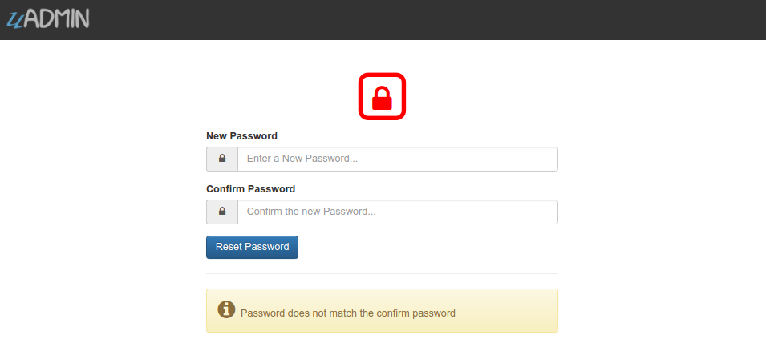

|

In uAdmin, you can only use one reset password per key. In this case, go back to the login form, select Forget Password, type your email to resend the request. This time input the following information that does match in order to create a new password for you.

Once you are done, you can now access your account using your new password.

Go to "LOGS" again, scroll it down and you will see that our password reset is denied on the first attempt then we reset the password successfully on our last attempt. That's how powerful the uAdmin log is, the way it keeps track of many things.

.. image:: assets/passwordresetactions.png

|

Logs can accumulate so fast and it will get harder to find specific actions when you need to like when conducting an audit and investigating something in your system. Use “Filter” to narrow down what you are looking for:

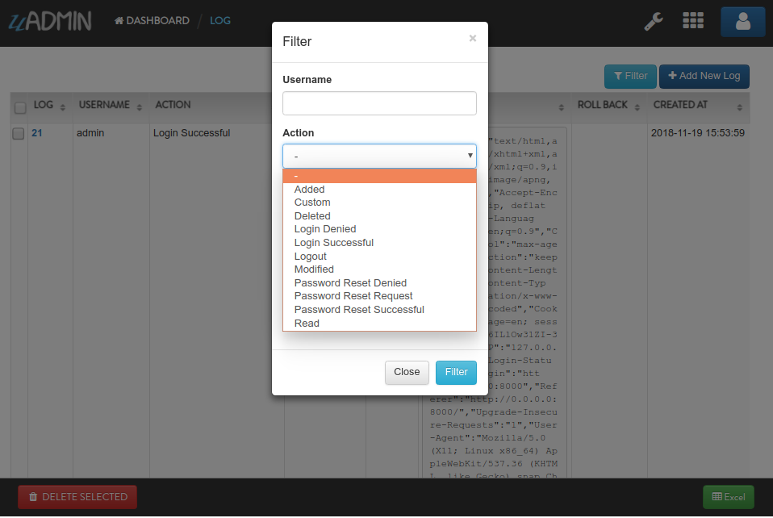

Congrats, now you know how to understand records you have in your app and how to audit them and revert back actions when you need to.

Profile
-------
uAdmin has a feature that allows you to customize your own profile. In order to do that, click the profile icon on the top right corner then select admin highlighted below.

.. image:: tutorial/assets/adminhighlighted.png

|

By default, there is no profile photo inserted on the top left corner. If you want to add it in your profile, click the Choose File button to browse the image on your computer.

.. image:: tutorial/assets/choosefilephotohighlighted.png

|

Once you are done, click Save Changes on the left corner and refresh the webpage to see the output.

.. image:: assets/profilepicadded.png

No matter what small or large the pixels you upload in your profile, it will automatically resize the photo to static format.

You can also enable two factor authentication in your profile. In uAdmin, it uses QR code which is typically used for storing URLs or other information for reading by the camera on a smartphone. In order to do that, you can use Google Authenticator (`Android`_, `iOS`_). It is a software-based authenticator that implements two-step verification services using the Time-based One-time Password Algorithm and HMAC-based One-time Password algorithm, for authenticating users of mobile applications by Google. [#f2]_

.. image:: assets/enable2fa.png

.. _Android: https://play.google.com/store/apps/details?id=com.google.android.apps.authenticator2&hl=en
.. _iOS: https://itunes.apple.com/ph/app/google-authenticator/id388497605?mt=8

If there is a problem, you may go to your terminal and check the OTP verification code for login.

Session
-------
Session is an activity that a user with a unique IP address spends on a Web site during a specified period of time. [#f1]_

.. image:: assets/sessioninterface.png

|

Here are the following fields in this system:

* **Key** - Displays a random string
* **User** - Returns the first and last name
* **Login Time** - This is when the user logins to the dashboard.
* **Last Login** - This is when the user has last access to the account.
* **Active** - If it is not checked, you will not be able to login with that user.
* **IP** - Numerical label assigned to the session from the address bar that user connects to
* **Pending OTP** - If the user has not verifying the OTP in the login
* **Expires On** -  This is when the cookie will expire.

Let’s open our app to see how these things work. Login your account using “admin” as username and password.

.. image:: assets/loginformadmin.png

|

The Session model is hidden in the uAdmin Dashboard by default. In order to show it, go to "DASHBOARD MENUS" first.

.. image:: tutorial/assets/dashboardmenuhighlighted.png

|

Select Sessions model in the list.

.. image:: assets/sessionshighlighted.png

|

Turn off the Hidden field so that the Session model will become visible in the uAdmin Dashboard.

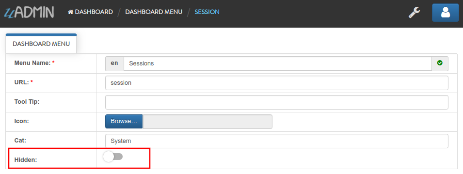

|

Go back to the uAdmin Dashboard and open "SESSIONS".

.. image:: assets/sessionshighlighteddashboard.png

|

If this is your first time to run an application, you will see only one session in the list as shown below. 

.. image:: assets/sessionlist.png

|

If you open the record, you will see all the details of that session. Let's turn off the Active, save it and see what happens.

.. image:: assets/activeturnoff.png

|

It will automatically redirect you to the login page which means your session has been deactivated. Login your account again using “admin” as username and password.

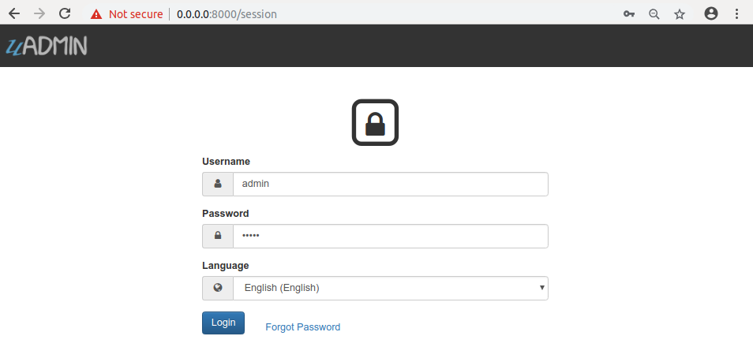

|

Your session automatically generates a new key for you.

.. image:: assets/sessionautomaticcreate.png

|

Before we proceed to Pending OTP, go to the uAdmin Dashboard and select "USERS".

.. image:: tutorial/assets/usershighlighted.png

|

Choose System Admin and activate the OTP required.

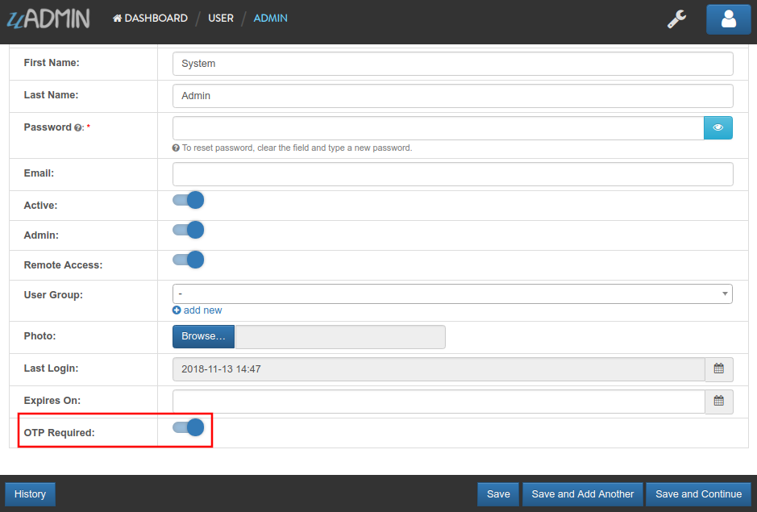

|

Now go back to Sessions model then click the previous record.

.. image:: assets/firstsession.png

|

Enable the "Active" and "Pending OTP" then click Save.

.. image:: assets/activepending.png

|

Now log out your account. Login again using "admin" as username and password then see what happens.

You will be asked to input a verification code in the login form. Check your terminal to see the OTP code.

.. code-block:: bash

    [  INFO  ]   User: admin OTP: 245421

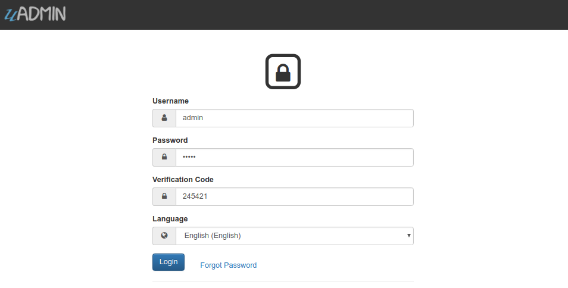

|

Open "SESSIONS" model. You will notice that the second session is no longer active after you logout. The last login has changed because you reuse that session. It was reused because you set that session as Active before you logout. Lastly, the Pending OTP is no longer checked because you already verified OTP code given by your terminal.

.. image:: assets/sessionchanges.png

|

Finally, set the Expires On value to now.

.. WARNING::
   Use it at your own risk. Once the session expires, your account will be permanently deactivated. In this case, you must have an extra user account in the User database.

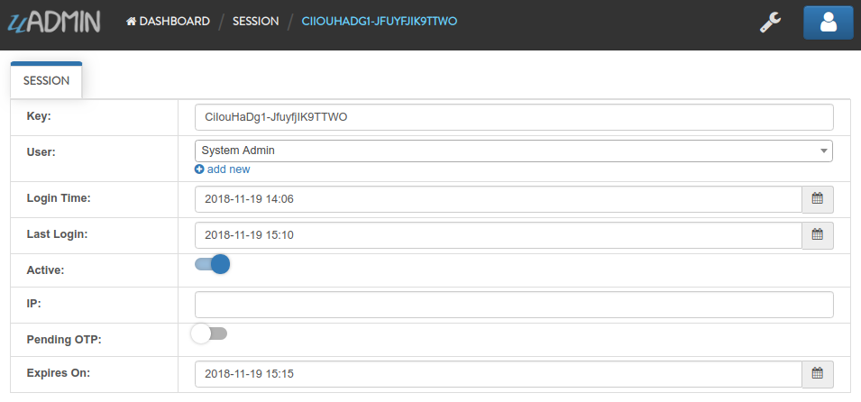

|

Save it and see what happens.

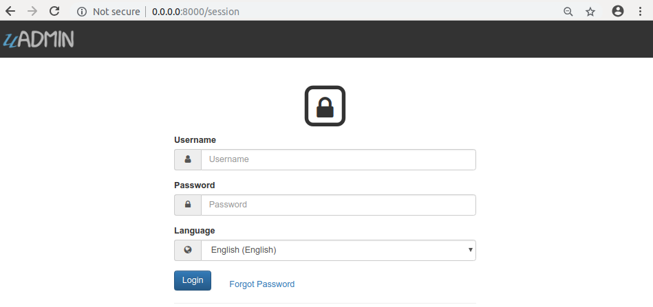

|

It will automatically redirect you to the login page which means your session has expired. In this case, you must login using another account that has no expiry date in the session.

Well done! Now you know how to configure your sessions by using Active, Pending OTP, and Expires On.

Setting
-------
Setting is a system in uAdmin that is used to display information for an application as a whole.

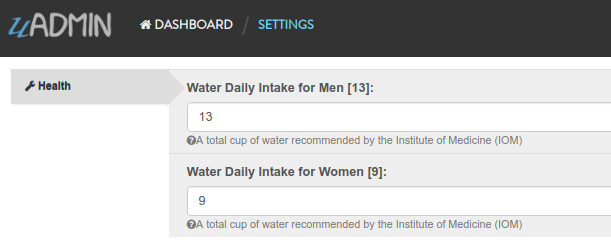

Here are the following fields in this system:

* **Name** - The name of the setting that you want to assign
* **Default Value** - The value that will be assigned in the header inside the square brackets
* **Data Type** - The data type that you want to select in the drop down list
* **Value** - The value that will be assigned in the text box
* **Help** - A feature that gives solution(s) to solve advanced tasks
* **Category** - Used for classifying settings
* **Code** - A read only field that is used to get a setting

Data Type has 7 values:

* **Boolean** - A data type that has one of two possible values (usually denoted true and false), intended to represent the two truth values of logic and Boolean algebra
* **DateTime** - Provides functionality for measuring and displaying time
* **File** - A data type used in order to upload a file in the database
* **Float** - Used in various programming languages to define a variable with a fractional value
* **Image** - Used to upload and crop an image in the database
* **Integer** - Used to represent a whole number that ranges from -2147483647 to 2147483647 for 9 or 10 digits of precision
* **String** - Used to represent text rather than numbers

First of all, go to uAdmin dashboard and click on "SETTINGS".

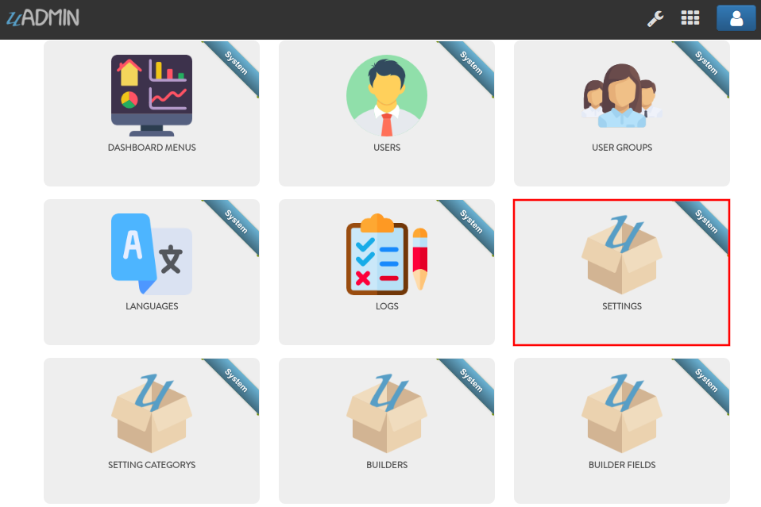

|

Click "Add New Setting".

.. image:: assets/addnewsetting.png

|

Let's input two records: A Water Daily Intake for Men and Women.

**First record**

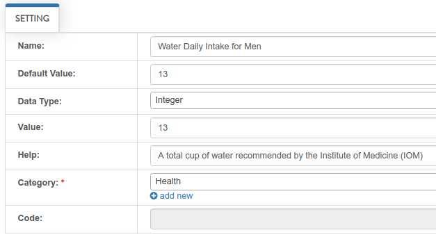

|

**Second record**

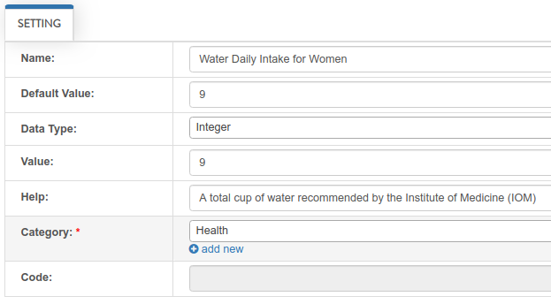

|

Result

.. image:: assets/settingdataresult.png

|

Now go to Settings page by clicking on the wrench icon on the top right part to see the result.

.. image:: assets/wrenchiconfromsetting.png

|

Result

|

Congrats! Now you know how to create a setting by assigning the name, default value, data type, value, help, category, and displaying the results in the Settings page.

Setting Category
----------------
Setting Category is a system in uAdmin that is used for classifying settings and its records.

Here are the following fields in this system:

* **Name** - The name of the setting category that you want to assign
* **Icon** - A small picture or symbol for setting category

First of all, go to uAdmin dashboard and click on "SETTING CATEGORYS".

.. image:: assets/settingcategoryshighlighted.png

|

Click "Add New Setting Category".

.. image:: assets/addnewsettingcategory.png

|

Fill up the following data to create a new setting category (e.g. Health).

.. image:: assets/settingcategoryhealth.png

|

Result

.. image:: assets/settingcategoryhealthresult.png

|

Now go to Settings page by clicking on the wrench icon on the top right part to see the result.

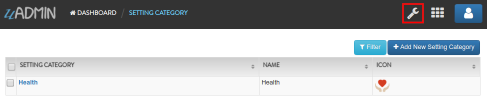

|

Result

.. image:: assets/settingcategoryresult.png

|

Congrats! Now you know how to create a setting category by assigning the name and icon, and displaying the result in the Settings page.

User
----
User is a system in uAdmin that is used to add, modify and delete the elements of the user. By default, the system creates one user which is the admin user who has full permission to read, add edit and delete data from every model.

.. image:: assets/user.png

Here are the following fields in this system:

* **User** - Returns the first and last name
* **Username** - An identification used by a person
* **First Name** - Given name
* **Last Name** - Surname
* **Email** - An electronic mail address used for exchanging messages between people or for password recovery
* **Active** - If it is not checked, you will not be able to login with that user.
* **Admin** - Allows full access to everything where you can set permissions to the user
* **Remote Access** - If it is not checked, you will only be able to login if you are connected to the server using a private IP e.g. (10.x.x.x,192.168.x.x, 127.x.x.x or ::1).
* **User Group** - To belong a specific user to the group. If the user group has permissions, the user can access to something with some restrictions.
* **Photo** - This is where you can upload your profile picture in your account.
* **Last Login** - This is when the user has last access to the account.
* **Expires On** -  This is when the cookie will expire.
* **OTP Required** - Adds an extra layer of security by sending the verification code

Let's create a new user account called "even" with the First Name "Even" and the Last Name "Demata". Set the Active, Admin, and Remote Access fields to **true**.

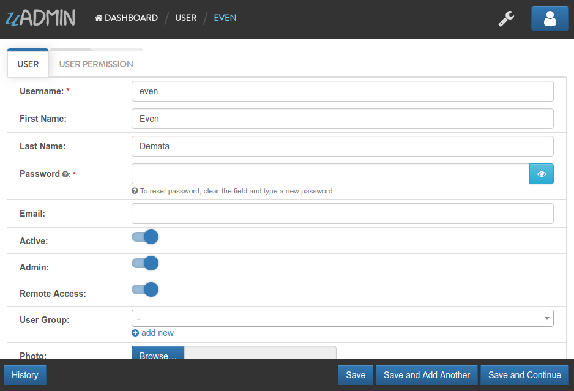

|

Result

.. image:: assets/useraddsystemoutput.png

|

Now log out your account and login again using the name "even".

.. image:: assets/loginformeven.png

|

As expected, you will see the same dashboard like using your System Admin account. It's because you are an admin and has full permissions to everything. For now, let's set an email address to "myemail@integritynet.biz".

.. image:: tutorial/assets/useremailhighlighted.png

|

Make it sure that you have set an email configurations in main.go.

.. code-block:: go

    func main(){
        uadmin.EmailFrom = "myemail@integritynet.biz"
        uadmin.EmailUsername = "myemail@integritynet.biz"
        uadmin.EmailPassword = "abc123"
        uadmin.EmailSMTPServer = "smtp.integritynet.biz"
        uadmin.EmailSMTPServerPort = 587
        // Some codes
    }

Log out your account. At the moment, you suddenly forgot your password. How can we retrieve our account? Click Forgot Password at the bottom of the login form.

.. image:: tutorial/assets/forgotpasswordhighlighted.png

|

Input your email address based on the user account you wish to retrieve it back.

.. image:: tutorial/assets/forgotpasswordinputemail.png

|

Once you are done, open your email account. You will receive a password reset notification from the Todo List support. To reset your password, click the link highlighted below.

.. image:: tutorial/assets/passwordresetnotification.png

|

You will be greeted by the reset password form. Input the following information in order to create a new password for you.

.. image:: tutorial/assets/resetpasswordform.png

Once you are done, you can now access your account using your new password.

Login your System Admin account. Turn off the Admin and Remote Access fields in Even Demata account.

.. image:: assets/adminremoteturnedoff.png

|

Logout your System Admin account and login the Even Demata account. Let's see what happens.

|

The dashboard menu is empty. How can we get access to it at least some of them? We need to set the user permission to Even Demata account so login your System account, go to Users model, select Even Demata account then go to the User Permission tab. Afterwards, click Add New User Permission button at the right side.

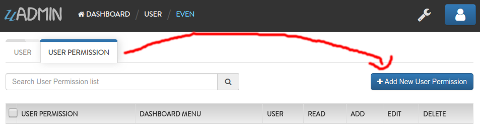

|

Set the Dashboard Menu to "Todos" model, User linked to "Even Demata", and activate the "Read" only. It means Even Demata user account has restricted access to adding, editing and deleting a record in the Todos model.

.. image:: assets/userpermissionevendemata.png

|

Result

|

Log out your System Admin account. This time login your username and password using the user account that has user permission. Afterwards, you will see that only the Todos model is shown in the dashboard because your user account is not an admin and has no remote access to it. Now click on TODOS model.

.. image:: assets/userpermissiondashboard.png

|

As you will see, your user account is restricted to add, edit, or delete a record in the Todo model. You can only read what is inside this model.

.. image:: assets/useraddeditdeleterestricted.png

|

Login your System Admin account again, go to the User Group and create a group named "Front Desk".

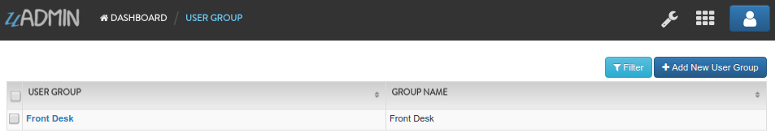

|

Link your created user group to Even Demata account.

.. image:: assets/useraccountfrontdesklinked.png

|

Afterwards, click the Front Desk highlighted below.

|

Go to the Group Permission tab. Afterwards, click Add New Group Permission button at the right side.

|

Set the Dashboard Menu to "Todos" model, User linked to "Even Demata", and activate the "Add" only. It means Even Demata user account has restricted access to reading, editing and deleting a record in the Todos model.

.. image:: assets/grouppermissionevendemata.png

|

Result

|

Log out your System Admin account. This time login your username and password using the user account that has group permission. Now click on TODOS model.

.. image:: assets/userpermissiondashboard.png

|

As you will see, your user account is still restricted to add, edit, or delete a record in the Todo model even if your group permission has access to "Read" only. It's because the user permission has no access to "Read" even if Even Demata is part of the Front Desk group. In other words, user permission prioritizes more than group permission.

.. image:: assets/useraddeditdeleterestricted.png

|

Login your System Admin account again. Go back to the Users model, select Even Demata account, and let's upload a profile picture. If you don't have any pictures or icons in your computer, I would recommend you to go over `flaticon.com`_, but you can browse anywhere online. Once you search for an icon, download the PNG version and choose the size 128 pixels.

.. _flaticon.com: https://www.flaticon.com/

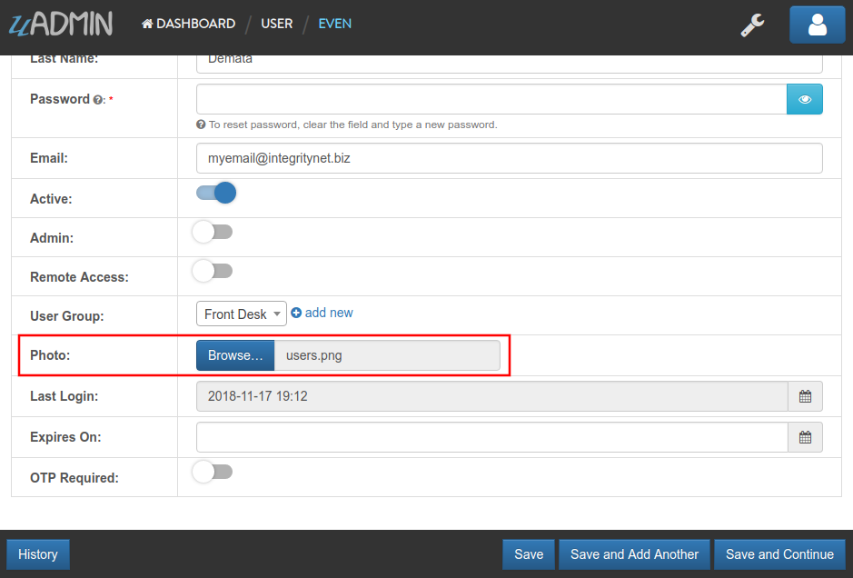

|

Logout your System Admin account. Login your Even Demata account, click on profile icon then select "even" highlighted below.

.. image:: assets/evenhighlighted.png

|

You will notice that your profile picture has been uploaded in your user account.

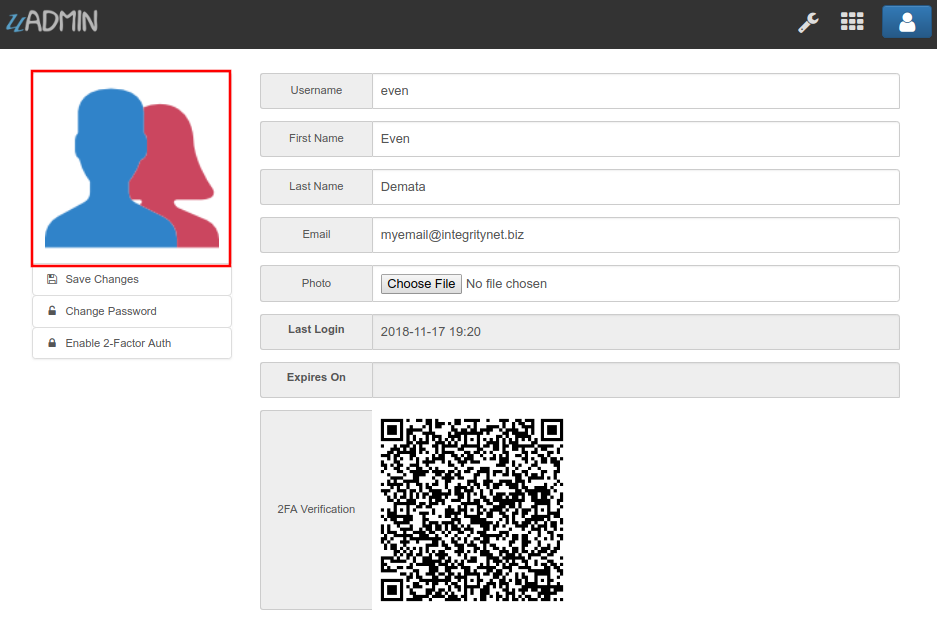

|

Login your System Admin account again. Go back to the Users model, select Even Demata account, and activate the OTP Required.

.. image:: assets/otprequiredeven.png

|

Logout your System Admin account then Login Even Demata account. Afterwards, you will see the second form as shown below. It requires you to input a Verification Code given by your terminal.

**Terminal**

.. code-block:: bash

  [  INFO  ]   User: even OTP: 812567

.. image:: assets/loginformwithotp.png

|

Once you are done, it will redirect you to the uAdmin dashboard. Login your System Admin account again, go back to the Users model, select Even Demata account, and set the Expires On to now.

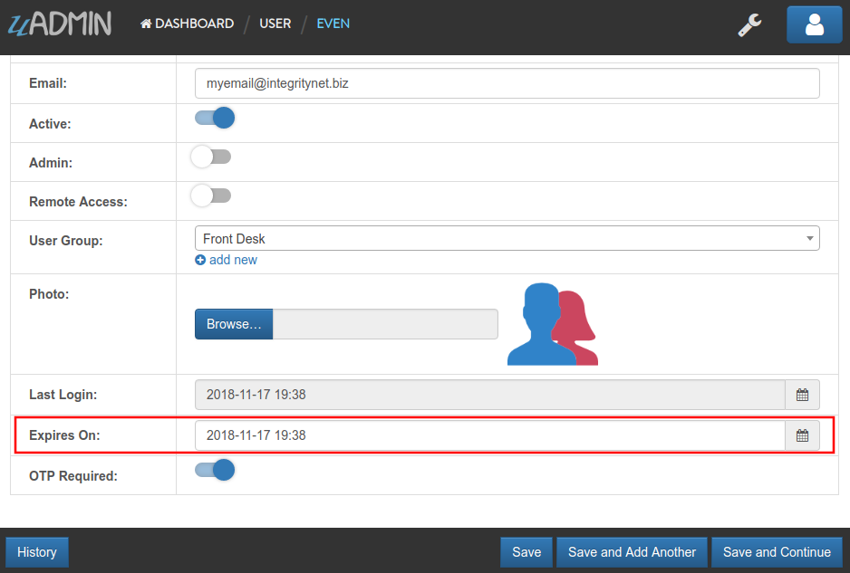

|

Log out your System Admin account, login Even Demata account and see what happens.

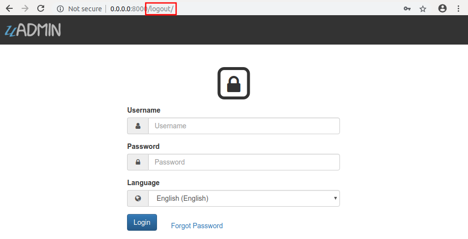

|

It will log you out automatically because Even Demata account has already expired.

Login your System Admin account. Go to Users model and finally, delete the Even Demata account.

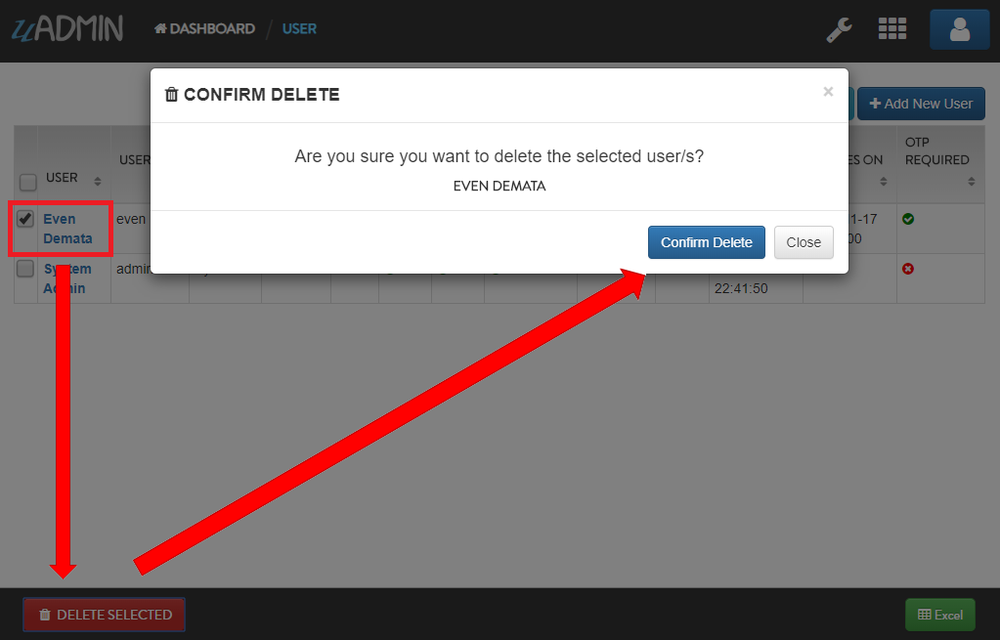

Well done! Now you know how to configure your user by adding, updating, customizing and deleting a user account.

User Group
----------
User Group is a system in uAdmin used to add, modify, and delete the group name, the only field in this system. It has only one field: **Group Name**. It is useful if you want to belong a specific user to the group. If the user group has permissions, the user can access to something with some restrictions.

Let's create a new user group named "Front Desk".

|

Afterwards, link it to any of your existing user accounts.

.. image:: assets/useraccountfrontdesklinked.png

|

Result

|

Finally, delete the Front Desk User Group.

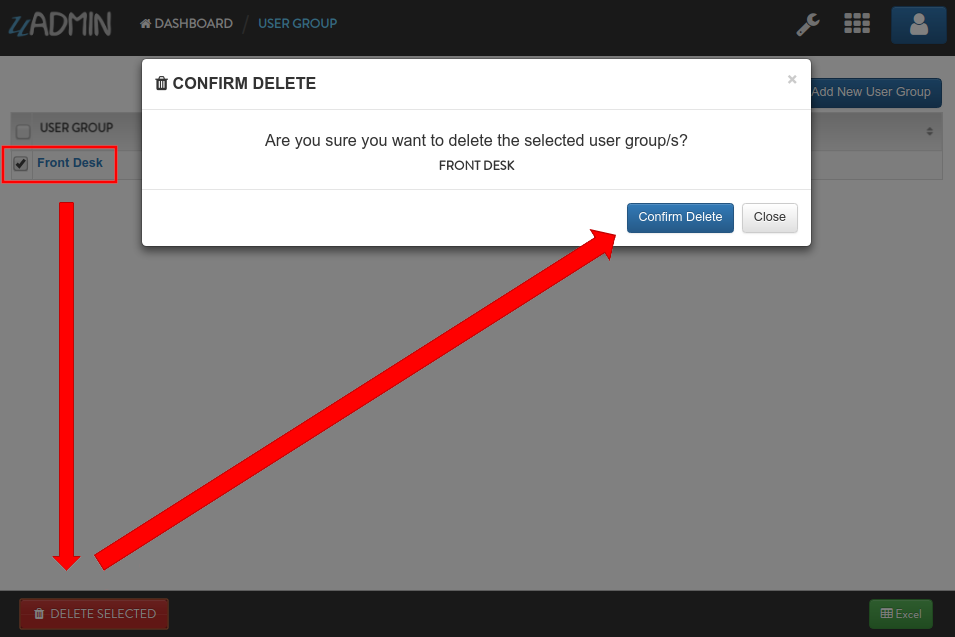

Well done! Now you know how to add a user group, link it to your existing user accounts, and deleting the user group.

User Permission
---------------
User Permission sets the permission of a user handled by an administrator.

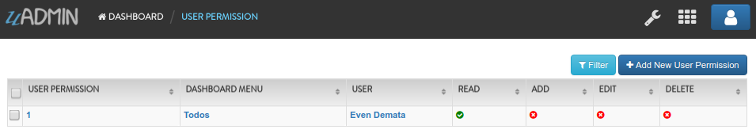

Here are the following fields in this system:

* **User Permission** - Returns the ID number of itself
* **Dashboard Menu** - Fetches the name of the model
* **User** - Fetches the first and last name of the user
* **Read** - Sets the Read access to the user
* **Add** - Sets the Add access to the user
* **Edit** - Sets the Edit access to the user
* **Delete** - Sets the Delete access to the user

First of all, make it sure that your existing account is not an Admin (example below is Even Demata).

.. image:: assets/adminhighlighted.png

Set the Dashboard Menu to any of your existing models (example below is Todos), link it to any of your existing accounts, and activate the "Read" only. It means Even Demata account has restricted access to adding, editing and deleting a record in the Todos model.

.. image:: assets/userpermissionevendemata.png

|

Result

|

Log out your System Admin account. This time login your username and password using the user account that has user permission. Afterwards, you will see that only the Todos model is shown in the dashboard because your user account is not an admin and has no remote access to it. Now click on TODOS model.

.. image:: assets/userpermissiondashboard.png

|

As you will see, your user account is restricted to add, edit, or delete a record in the Todo model. You can only read what is inside this model.

.. image:: assets/useraddeditdeleterestricted.png

|

To remove those restrictions, login your System Admin account, go to User Permission and activate "Add", "Edit", and "Delete" access to Even Demata account.

.. image:: assets/useraddeditdelete.png

|

Login your Even Demata account and see what happens.

|

Let's open the "Read a book" record to see if the user can have access to edit.

|

Nice! You have full access to everything in the TODOS model. What if the user has no access to "Read" but can add, edit, or delete a record? Login your System account and remove "Read" access to Even Demata.

.. image:: assets/usernoaccessread.png

|

Login your Even Demata account and see what happens.

TODOS model does not show up in the dashboard. Even if you remove access to "Add", "Edit" and "Delete" to Even Demata account, it will display the same output.

Login your System Admin account. Finally, delete the User Permission in Even Demata account.

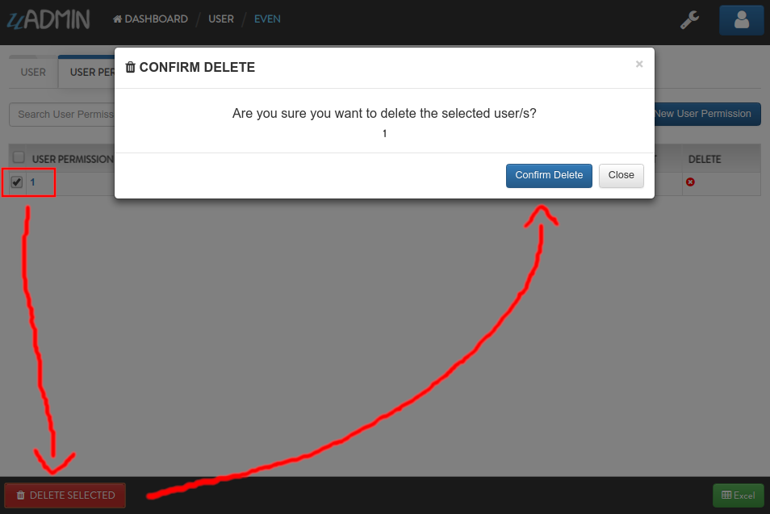

Well done! Now you know how to set the user permission to the user account, changing the access in the model and deleting the user permission.

Reference
---------
.. [#f1] QuinStreet Inc. (2018). User Session. Retrieved from https://www.webopedia.com/TERM/U/user_session.html
.. [#f2] No author (28 May 2019). Google Authenticator. Retrieved from https://en.wikipedia.org/wiki/Google_Authenticator
