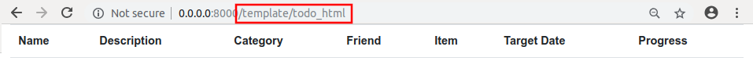

uAdmin Tutorial Part 11 - Accessing an HTML file
================================================
In this part, we will talk about establishing a connection to the HTTP Handler, setting the URL path name, and executing an HTML file.

Go to handler.go inside the handlers folder with the following codes below:

.. code-block:: go

    package handlers

    import (
        "net/http"
        "strings"
    )

    // HTTPHandler !
    func HTTPHandler(w http.ResponseWriter, r *http.Request) {
        // r.URL.Path creates a new path called /http_handler
        r.URL.Path = strings.TrimPrefix(r.URL.Path, "/http_handler")
    }

Establish a connection in the main.go to the http_handler by using http.HandleFunc. It should be placed after the uadmin.Register and before the StartServer.

.. code-block:: go

    import (
        "net/http"

        // Specify the username that you used inside github.com folder
        "github.com/username/todo/api"
        "github.com/username/todo/models"

        // Import this library
        "github.com/username/todo/handlers"

        "github.com/uadmin/uadmin"
    )

    func main() {
        // Some codes

        // HTTP UI Handler
        http.HandleFunc("/http_handler/", handlers.HTTPHandler)
    }

Create a file named todo_handler.go inside the handlers folder with the following codes below:

.. code-block:: go

    package handlers

    import (
        "html/template"
        "net/http"
        "strings"

        "github.com/uadmin/uadmin"
    )

    // TodoHandler !
    func TodoHandler(w http.ResponseWriter, r *http.Request) {
        // r.URL.Path creates a new path called /todo_html
        r.URL.Path = strings.TrimPrefix(r.URL.Path, "/todo")

        // TodoList field inside the Context that will be used in Golang
        // HTML template
        type Context struct {
            TodoList []map[string]interface{}
        }

        // Assigns Context struct to the c variable
        c := Context{}

        // Creates a new template and parses the template definitions
        // from todo.html
        t, _ := template.New("").ParseFiles("./views/todo.html")

        // Applies the template associated with t that has todo.html to
        // the specified object and writes the output to w variable that
        // is the http.ResponseWriter
        _ = t.ExecuteTemplate(w, "todo.html", c)
    }

Finally, add this piece of code in the handler.go shown below. This will establish a communication between the HTTPHandler and the TodoHandler.

.. code-block:: go

    // HTTPHandler !
    func HTTPHandler(w http.ResponseWriter, r *http.Request) {
        // r.URL.Path creates a new path called /http_handler
        r.URL.Path = strings.TrimPrefix(r.URL.Path, "/http_handler")

        if strings.HasPrefix(r.URL.Path, "/todo") {
            TodoHandler(w, r)
            return
        }
    }

Now run your application, go to http_handler/todo path and see what happens.

|

In the `next part`_, we will discuss about fetching the records in the API and migrating the data from API to HTML that will display the records using Go template.

.. _next part: https://uadmin.readthedocs.io/en/latest/tutorial/part12.html
