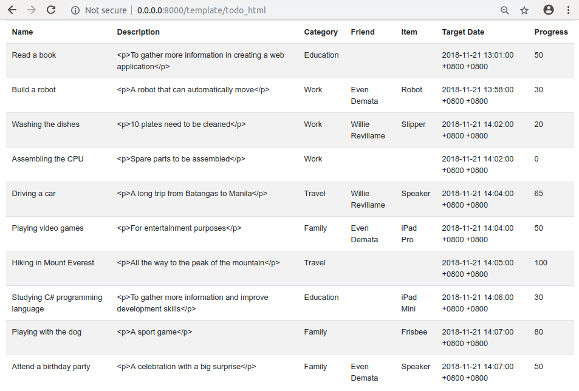

uAdmin Tutorial Part 12 - Storing the data to HTML
==================================================
In this part, we will discuss about fetching the records in the API and migrating the data from API to HTML that will display the records using Go template.

Go to todo_template.go inside the templates/custom path with the following codes below:

.. code-block:: go

    package templates

    import (
        "html/template"
        "net/http"
        "strings"

        // Specify the username that you used inside github.com folder and
        // import this library
        "github.com/username/todo/models"
        "github.com/uadmin/uadmin"
    )

    // TodoTemplateHandler !
    func TodoTemplateHandler(w http.ResponseWriter, r *http.Request) {
        r.URL.Path = strings.TrimPrefix(r.URL.Path, "/todo_html")

        type Context struct {
            TodoList []map[string]interface{}
        }
        c := Context{}

        // ------------------ ADD THIS CODE ------------------
        // Initializes mapTodo as a map[string]interface{}{} where you can
        // create a dictionary that has a key and value from the database
        mapTodo := []map[string]interface{}{}

        // Fetch Data from DB
        todo := []models.Todo{}
        uadmin.Filter(&todo, "")

        for i := range todo {
            // Accesses and fetches the record of the linking models in Todo
            uadmin.Preload(&todo[i])

            // Assigns the string of interface in each Todo fields
            mapTodo = append(mapTodo, map[string]interface{}{
                "ID":          todo[i].ID,
                "Name":        todo[i].Name,
                "Description": todo[i].Description,
                "Category":    todo[i].Category.Name,
                "Friend":      todo[i].Friend.Name,
                "Item":        todo[i].Item.Name,
                "TargetDate":  todo[i].TargetDate,
                "Progress":    todo[i].Progress,
            })
        }

        // Assigns mapTodo to the TodoList inside the Context struct
        c.TodoList = mapTodo
        // ----------------------------------------------------

        // Some codes

    }

Now go to views/todo.html. After the <tbody> tag, add the following codes shown below:

.. code-block:: html

    {{range .TodoList}}
    <tr>
        <td>{{.Name}}</td>
        <td>{{.Description}}</td>
        <td>{{.Category}}</td>
        <td>{{.Friend}}</td>
        <td>{{.Item}}</th>
        <td>{{.TargetDate}}</td>
        <td>{{.Progress}}</td>
    </tr>
    {{end}}

In Go programming language, **range** is equivalent to **for** loop.

The double brackets **{{ }}** are Golang delimiter.

**.TodoList** is the assigned field inside the Context struct.

**.Name**, **.Description**, **.Category**, **.Friend**, **.Item**, **.TargetDate**, **.Progress** are the fields assigned in mapTodo variable that stores in c.TodoList. 

Now run your application, go to template/todo_html path and see what happens.

|

Congrats, now you know how to set up a template file in an organized manner, access the HTML in localhost and store the data from API to HTML using Go templates.

In the `next part`_ of this tutorial, we will talk about generating a self-signed SSL certificate using the **openssl** command and implementing two factor authentication (2FA).

.. _next part: https://uadmin.readthedocs.io/en/latest/tutorial/part13.html
