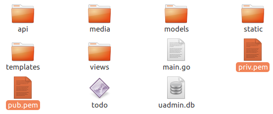
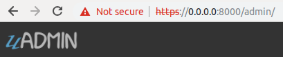
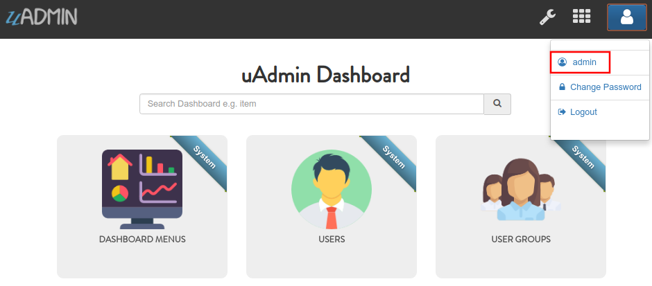
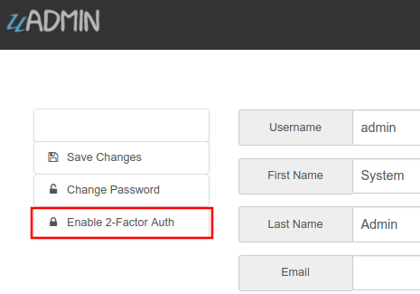
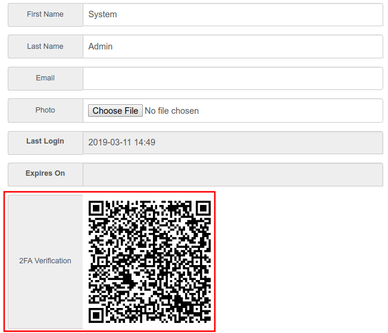

uAdmin Tutorial Part 13 - Advanced Security (Part 1)
====================================================
In this part, we will talk about generating a self-signed SSL certificate using the **openssl** command and implementing two factor authentication (2FA).

SSL
^^^
To enable SSL for your project, you need an SSL certificate. This is a two parts system with a public key and a private key. The public key is used for encryption and the private key is used for decryption. To get an SSL certificate, you can generate one using openssl which is a tool for generating self-signed SSL certificate.

.. code-block:: bash

    openssl req -x509 -nodes -days 365 -newkey rsa:2048 -keyout priv.pem -out pub.pem

It will ask you for several certificate parameters but you can just press “Enter” and skip filling them for development.

You can change the key size by changing 2048 to a higher value like 4096. For production, you would want to get a certificate that is not self-signed to avoid the SSL error message on the browser. For that, you can buy one from any SSL vendor or you can get a free one from `letsencrypt.org`_ or follow the instructions `here`_.

.. _letsencrypt.org: https://letsencrypt.org/
.. _here: https://medium.com/@saurabh6790/generate-wildcard-ssl-certificate-using-lets-encrypt-certbot-273e432794d7

Once installed, move the **pub.pem** and **priv.pem** to your project folder.

|

Afterwards, go to the main.go and apply this function on the last section.

.. code-block:: go

    func main(){
        // Some codes
        uadmin.StartSecureServer("pub.pem", "priv.pem")
    }

Once you start your app, you will notice that your terminal logs are showing a message that says https instead of http:

.. code-block:: bash

    $ ~/go/src/github.com/username/todo$ go build; ./todo
    [   OK   ]   Initializing DB: [12/12]
    [   OK   ]   Server Started: https://0.0.0.0:8000
             ___       __          _
      __  __/   | ____/ /___ ___  (_)___
     / / / / /| |/ __  / __  __ \/ / __ \
    / /_/ / ___ / /_/ / / / / / / / / / /
    \__,_/_/  |_\__,_/_/ /_/ /_/_/_/ /_/

When you open your app make sure that your URL uses https:// instead of http:// and you should get an error message in your browser warning you that your SSL certificate could not be authenticated (because it is self-signed).

.. image:: assets/connectionnotprivate.png

|

Proceed and you will see that your browser marks your URL in red to remind you that there is something wrong with your SSL certificate:

|

2-Factor Authentication
^^^^^^^^^^^^^^^^^^^^^^^
It is also referred to as 2FA which is a way of using a OTP (One Time Password) for your login process to add an extra level of security to your account. uAdmin allows you to enable 2FA per user. To enable it for your account, open your profile:

|

On the left you will see a link that says “Enable 2-Factor Auth” click on that to enable 2FA.

|

Once you enable it, you will see your 2FA QR Code. You can use `Google Authenticator`_ to scan this code.

.. _Google Authenticator: https://play.google.com/store/apps/details?id=com.google.android.apps.authenticator2

|

Now log out and try to login again:

.. image:: assets/verificationcode.png
   :align: center

|

Notice that you have a new field called “Verification Code”. This is the number that you have in your Google Authenticator.

If you locked your self out and because of OTP, you can get your OTP from the terminal where you are running your application:

.. code-block:: bash

    [  INFO  ]   User: admin OTP: 494858

In the `next part`_, we will discuss about password reset, hash salt, and database encryption.

.. _next part: https://uadmin.readthedocs.io/en/latest/tutorial/part14.html

