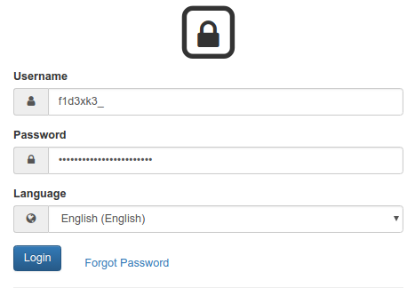
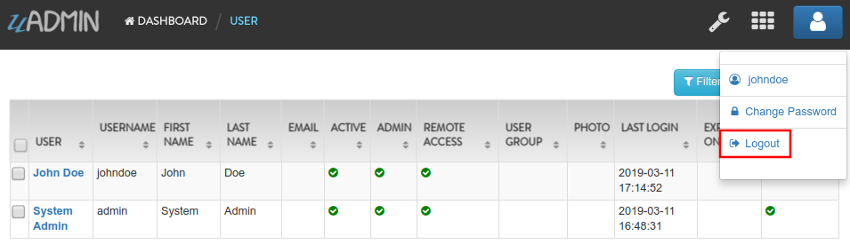
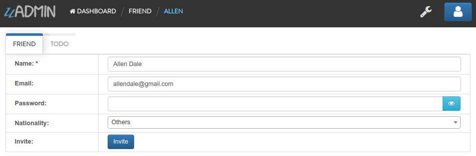
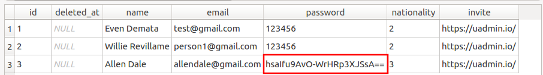

uAdmin Tutorial Part 14 - Advanced Security (Part 2)
====================================================
In this part, we will discuss about password reset, hash salt, and database encryption.

Password Reset
^^^^^^^^^^^^^^
For password reset to work you need to setup an email account that will send the password reset link. Also make sure that your user has an email in the system, otherwise they will not be able to reset their password. To setup an email account, you can use your gmail account or any SMTP account. Open your main.go and add these lines of code:

.. code-block:: go

    func main(){
        uadmin.EmailFrom = "myemail@integritynet.biz"
        uadmin.EmailUsername = "myemail@integritynet.biz"
        uadmin.EmailPassword = "abc123"
        uadmin.EmailSMTPServer = "smtp.integritynet.biz"
        uadmin.EmailSMTPServerPort = 587
        // Some codes
    }

Let’s go back to the uAdmin dashboard, go to Users model, create your own user account and set the email address based on your assigned EmailFrom in the code above.

.. image:: assets/useremailhighlighted.png

|

Log out your account. At the moment, you suddenly forgot your password. How can we retrieve our account? Click Forgot Password at the bottom of the login form.

.. image:: assets/forgotpasswordhighlighted.png

|

Input your email address based on the user account you wish to retrieve it back.

.. image:: assets/forgotpasswordinputemail.png

|

Once you are done, open your email account. You will receive a password reset notification from the Todo List support. To reset your password, click the link highlighted below.

.. image:: assets/passwordresetnotification.png

|

You will be greeted by the reset password form. Input the following information in order to create a new password for you.

.. image:: assets/resetpasswordform.png

Once you are done, you can now access your account using your new password.

Hash Salt
^^^^^^^^^
All user passwords are hashed in the database. That means they are encrypted using a one way encryption meaning, your system does not know any user’s password. It actually encrypts the password again using the same algorithm and compares the two “hashes”. Bcrypt adds standard salt to your password to make it even more secure.

What happens when you get attacked and your database leaks into the Internet? We added one more level on security for you for this scenario. We create a file called .salt to your app’s folder which includes a 128 bytes of extra salt. This means doing any attack on your hashed passwords without knowing that long salt value is useless!

What about when the worst case scenario happens and both your database and your .salt file get hacked and leaked into the Internet. What can you do now to protect your system and yours? The answer is simple: just delete or rename your .salt file and run your system again and uAdmin will generate a new .salt file and create an emergency recovery user for you. This user does not have remote access so make sure you have access to your app from the same network before deleting your .salt file.

.. code-block:: bash

    $ rm .salt
    $ go build; ./todo
    [   OK   ]   Initializing DB: [12/12]
    [ WARNING]   Your salt file was missing, and a new one was generated NO USERS CAN LOGIN UNTIL PASSWORDS ARE RESET.
    [  INFO  ]   uAdmin generated a recovery user for you. Username: f1d3xk3 Password: _edoOmxwqlwBWuyDrHZElpiI
    [   OK   ]   Server Started: https://0.0.0.0:8000
             ___       __          _
      __  __/   | ____/ /___ ___  (_)___
     / / / / /| |/ __  / __  __ \/ / __ \
    / /_/ / ___ / /_/ / / / / / / / / / /
    \__,_/_/  |_\__,_/_/ /_/ /_/_/_/ /_/

Login your account using the generated username and password.

|

Select "USERS".

.. image:: assets/usershighlighted.png

|

Click on System Recovery Admin.

.. image:: assets/systemrecoveryadmin.png

|

Let's change the Username, First Name, Last Name, and password to something like John Doe as an example. Enable the Remote Access on that user.

.. image:: assets/johndoeuser.png

|

Logout your account then re-login to see the result.

|

After you log in, you should see the uAdmin Dashboard as shown below.

.. image:: assets/uadmindashboard.png

|

Database Encryption
^^^^^^^^^^^^^^^^^^^
You can keep your data in the database encrypted for any field. You might do that to protect some data or to comply with standards or fulfill client’s request. Let’s encrypt the name of our Friend model. To do that, open /models/friend.go and add this tag to the Password field:

.. code-block:: go

    // Friend model ...
    type Friend struct {
        uadmin.Model
        Name        string `uadmin:"required"`
        Email       string `uadmin:"email"`
        Password    string `uadmin:"password;list_exclude;encrypt"` // place it here
        Nationality Nationality
        Invite      string `uadmin:"link"`
    }

Rebuild your application. Notice that you have to add encrypt tag to make this field encrypted in your database. Open your application and edit that field in any friend you have and save:

|

Go to your project folder and open uadmin.db.

.. image:: assets/uadmindbopen.png

|

In Execute SQL navigation bar, type SELECT * FROM Friends command then click the right arrow symbol to execute the database. Another way is you can press F5 or Ctrl + Return.

.. image:: assets/dbexecutesqlrun.png

|

When you check your database, you will notice that your data is encrypted there.

|

Congrats, now you know how to generate a self-signed SSL certificate, implement two factor authentication, reset your password by email, hash salt, and encrypt your database.

In the `last part`_ of this tutorial, we will talk about customizing your dashboard and publishing your application for the world to see.

.. _last part: https://uadmin.readthedocs.io/en/latest/tutorial/part15.html
