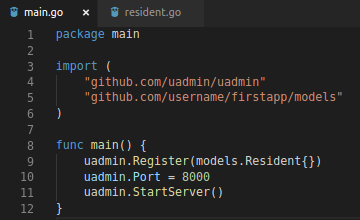
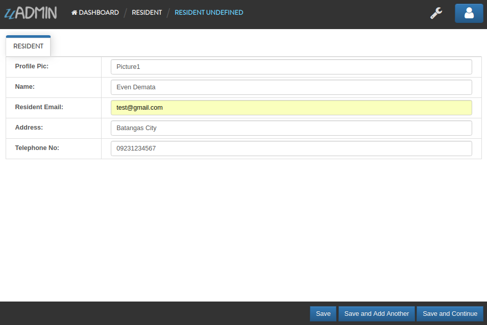
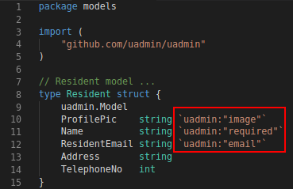
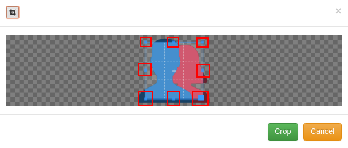
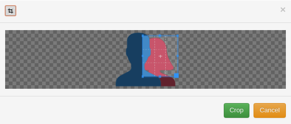
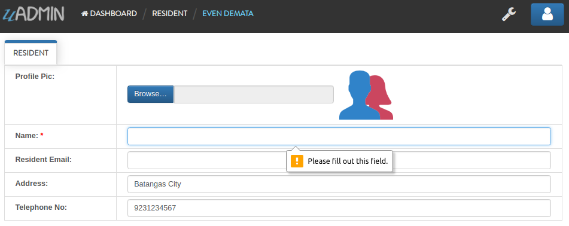
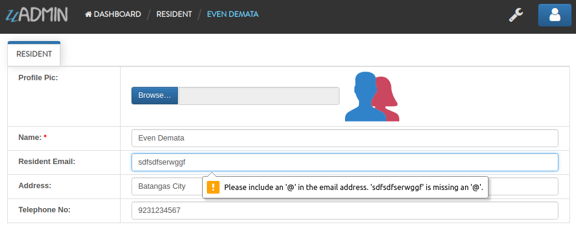

uAdmin Tutorial Part 2
======================
Assume that you have created your first application in main.go. In this part, we will build a go file inside the model folder.

Creating a model
^^^^^^^^^^^^^^^^
Create a file named resident.go inside your models folder, containing the following codes below.

.. code-block:: go

    package models

    import (
	    "github.com/uadmin/uadmin"
    )

    // Resident model ...
    type Resident struct {
	    uadmin.Model
	    ProfilePic    string
	    Name          string
	    ResidentEmail string
	    Address       string
	    TelephoneNo   int
    }

Resident Model User Interface

.. image:: assets/residentmodeldesign.png

|

Now connect the resident model into the main.go by calling the (folder_name).(struct_name){} inside the uadmin.Register.

|

Let's run the code and see what happens:

.. code-block:: bash

    $ cd ~/go/src/github.com/your_name/firstapp
    $ go build; ./firstapp
    [   OK   ]   Initializing DB: [9/9]
    [   OK   ]   Server Started: http://127.0.0.1:8000

|

As expected, the residents model is added in the uAdmin Dashboard.

.. image:: assets/residentmodelselected.png

|

Let's create a new data in the residents model. Press Save button below afterwards.

|

.. image:: assets/residentdataoutput.png

As you notice, all values in the data return an input string. uAdmin has a tag feature that allows a field to change to an appropriate type. Let's tag the ProfilePic as "image", Name as "required", and Resident Email as "email" in resident.go file.

.. code-block:: go

    ProfilePic    string `uadmin:"image"`
    Name          string `uadmin:"required"`
    ResidentEmail string `uadmin:"email"`

|

Let's run the code again. Go back to your residents model and see what happens.

.. image:: assets/residentwithtagapplied.png

As you can see, you can now browse an image file in the ProfilePic. The * symbol after the Name field means that one is required, as well as following the syntax rule in the Resident Email field. Fill up the following information then press Save button afterwards.

.. image:: assets/residentdataoutputwithtag.png

Well done! The output is much cleaner and better than before.

|

.. code-block:: go

    ProfilePic string `uadmin:"image"`

Do you know what is even cooler about the ProfilePic? In uAdmin, the image feature will not only just upload your image file but also allows you to crop your own picture through the model itself. In order to that, click the image icon highlighted below.

.. image:: assets/profilepiciconhighlighted.png

|

Click the crop icon on the top left corner.

.. image:: assets/cropiconhighlighted.png

|

You are now set to edit mode. Click any points highlighted below then drag your mouse in order to crop/resize your image.

Once you are done, click the Crop button below and refresh the webpage to save your progress.

.. image:: assets/croppedprofilepicoutput.png

|

.. code-block:: go

    Name string `uadmin:"required"`

What if I set the name value as empty?

A warning message "Please fill out this field." will display on your screen because the Name field has a "required" tag on it.

|

.. code-block:: go

    ResidentEmail string `uadmin:"email"`

What if I set the Resident Email value to something like this?

A warning message will appear because the Resident Email field has an "email" tag on it.

That is how the uAdmin tag works in this scenario. For more information about tags, click `here`_.

.. _here: file:///home/dev1/go/src/github.com/uadmin/uadmin/docs/_build/html/tags.html