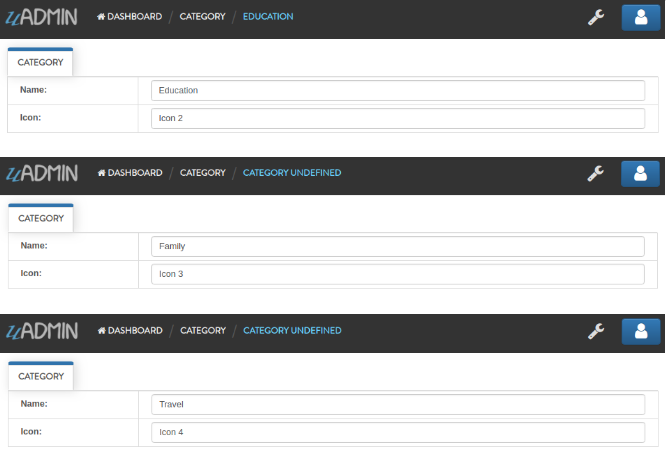
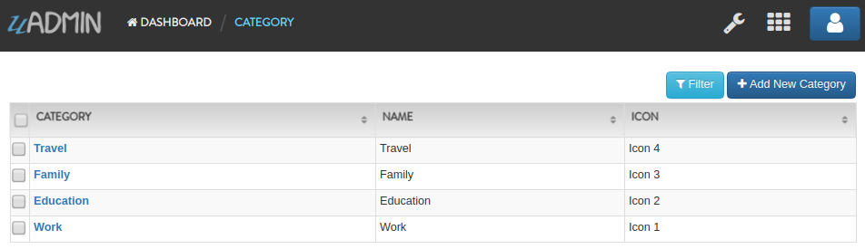
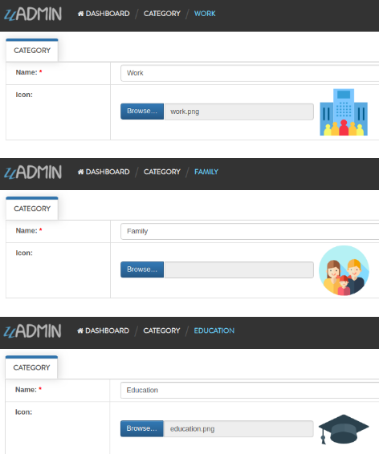
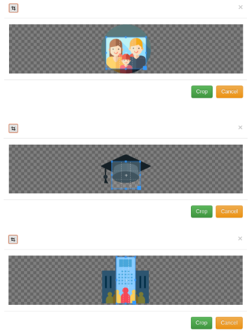
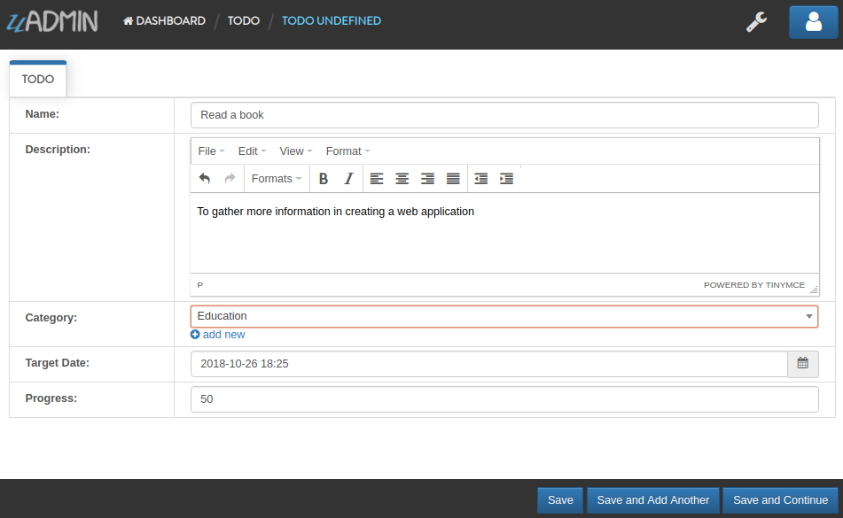
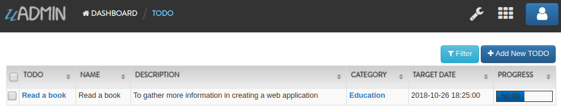

uAdmin Tutorial Part 2
======================
Assume that you have created your first application in main.go. In this part, we will build a go file inside the model folder.

Creating a model
^^^^^^^^^^^^^^^^
Create a file named category.go inside your models folder, containing the following codes below.

.. code-block:: go

    package models

    import "github.com/uadmin/uadmin"

    // Category model ...
    type Category struct {
	    uadmin.Model
	    Name string
	    Icon string
    }

Category Model User Interface

.. image:: assets/categorymodeldesign.png

|

Now connect the category model into the main.go by calling the (folder_name).(struct_name){} inside the uadmin.Register.

Copy this code below

.. code-block:: go

    models.Category{},

To the main.go

.. code-block:: go

    package main

    import (
	    "github.com/rn1hd/todo/models"
	    "github.com/uadmin/uadmin"
    )

    // TODO model ...
    type TODO struct {
	    uadmin.Model
	    Name        string
	    Description string   `uadmin:"html"`
	    TargetDate  time.Time
	    Progress    int `uadmin:"progress_bar"`
    }

    func main() {
	    uadmin.Register(
		    TODO{},
		    models.Category{}, // <-- place it here
	    )
	    uadmin.Port = 8000
	    uadmin.StartServer()
    }

|

Let's run the code and see what happens:

.. code-block:: bash

    $ cd ~/go/src/github.com/your_name/todo
    $ go build; ./firstapp
    [   OK   ]   Initializing DB: [10/10]
    [   OK   ]   Server Started: http://127.0.0.1:8000

|

As expected, the category model is added in the uAdmin Dashboard.

.. image:: assets/categorymodelselected.png

|

Let's create a new data in the category model. Press Save button below afterwards.

.. image:: assets/categorydata.png

|

Output

.. image:: assets/categorydataoutput.png

|

You can add a data as many as you want.

|

Output

|

As you notice, all values in the data return an input string. uAdmin has a tag feature that allows a field to change to an appropriate type. Let's tag the Name as "required" and Icon as "image" in category.go file.

Copy this code below

.. code-block:: go

    Name string `uadmin:"required"`
    Icon string `uadmin:"image"`

To the category.go inside the models folder

.. code-block:: go

    package models

    import "github.com/uadmin/uadmin"

    // Category model ...
    type Category struct {
	    uadmin.Model
	    Name string `uadmin:"required"` // <-- place it here
	    Icon string `uadmin:"image"` // <-- place it here
    }

|

Let's run the code again. Go back to your category model and see what happens.

.. image:: assets/categorywithtagapplied.png

As you can see, you can now browse an image file in the Icon field. The * symbol after the Name field means that one is required. Fill up the following information then press Save button afterwards.

.. image:: assets/categorydataoutputwithtag.png

|

Do the same with the other data.

|

Output

.. image:: assets/categorydataoutputwithtagmultiple.png

Well done! The output is much cleaner and better than before.

|

.. code-block:: go

    Icon string `uadmin:"image"`

Do you know what is even cooler about the Icon? In uAdmin, the image feature will not only just upload your image file but also allows you to crop your own picture through the model itself. In order to that, click the image icon highlighted below.

.. image:: assets/iconhighlighted.png

|

Click the crop icon on the top left corner.

.. image:: assets/cropiconhighlighted.png

|

You are now set to edit mode. Click any points highlighted below then drag your mouse in order to crop/resize your image.

.. image:: assets/croppointshighlighted.png

.. image:: assets/croppedicon.png

|

Once you are done, click the Crop button below and refresh the webpage to save your progress.

.. image:: assets/croppediconoutput.png

|

You can do the same with the other three data.

|

Output

.. image:: assets/croppediconsoutput.png

|

.. code-block:: go

    Name string `uadmin:"required"`

What if I set the name value as empty?

.. image:: assets/namefieldempty.png

A warning message "Please fill out this field." will display on your screen because the Name field has a "required" tag on it.

That is how the uAdmin tag works in this scenario. For more information about tags, click `here`_.

.. _here: file:///home/dev1/go/src/github.com/uadmin/uadmin/docs/_build/html/tags.html

Let's do some cleanup codes in the main.go. Before that, create a file named todo.go in the models folder. Move this code that I have highlighted below.

.. code-block:: go

    package main

    import (
	    "time"
	    "github.com/rn1hd/todo/models"
	    "github.com/uadmin/uadmin"
    )

    // ------------ MOVE THIS PART OF CODE FROM HERE ------------
    // TODO model ... 
    type TODO struct {
	    uadmin.Model
	    Name        string
	    Description string `uadmin:"html"`
	    TargetDate  time.Time
	    Progress    int `uadmin:"progress_bar"`
    }
    // ----------------------- UNTIL HERE -----------------------

    func main() {
	    uadmin.Register(
		    TODO{},
		    models.Category{},
	    )
	    uadmin.Port = 8000
	    uadmin.StartServer()
    }

|

To the todo.go in the models folder

.. code-block:: go

    package models

    import (
	    "time"
	    "github.com/uadmin/uadmin"
    )

    // ---------------- PASTE IT HERE -----------------
    // TODO model ...
    type TODO struct {
	    uadmin.Model
	    Name        string
	    Description string   `uadmin:"html"`
	    TargetDate  time.Time
	    Progress    int `uadmin:"progress_bar"`
    }
    // ---------------- PASTE IT HERE -----------------

|

Go back to the main.go. Replace TODO{} to models.TODO{} in the uAdmin.Register. "models." was added before TODO{} because the TODO struct is located on todo.go in the models folder.

.. code-block:: go

    package main

    import (
	    "github.com/rn1hd/todo/models"
	    "github.com/uadmin/uadmin"
    )

    func main() {
	    uadmin.Register(
		    models.TODO{}, // Replaced from TODO{} to models.TODO{}
		    models.Category{},
	    )
	    uadmin.Port = 8000
	    uadmin.StartServer()
    }

Well done! You have finished the first step in creating an external model.

Linking two models together
^^^^^^^^^^^^^^^^^^^^^^^^^^^
Let's create a relationship between the category and todo models. In order to do that, call the struct name you wish to include on the first line and the ID with the data type on the second line in todo.go.

Copy this code below

.. code-block:: go

    Category    Category
    CategoryID  uint 

To the todo.go inside the models folder

.. code-block:: go

    package models

    import (
	    "time"
	    "github.com/uadmin/uadmin"
    )

    // TODO model ...
    type TODO struct {
	    uadmin.Model
	    Name        string
	    Description string   `uadmin:"html"`
	    Category    Category // <-- place it here
	    CategoryID  uint     // <-- place it here
	    TargetDate  time.Time
	    Progress    int `uadmin:"progress_bar"`
    }

|

Let's run the code again. Go back to your todo model and see what happens.

.. image:: assets/categoryaddedintodo.png

|

Now you can choose which category you want to apply on the specific task. For this one let's choose Education then click Save button afterwards.

|

Output

Well done! You have linked the category and todo models together.