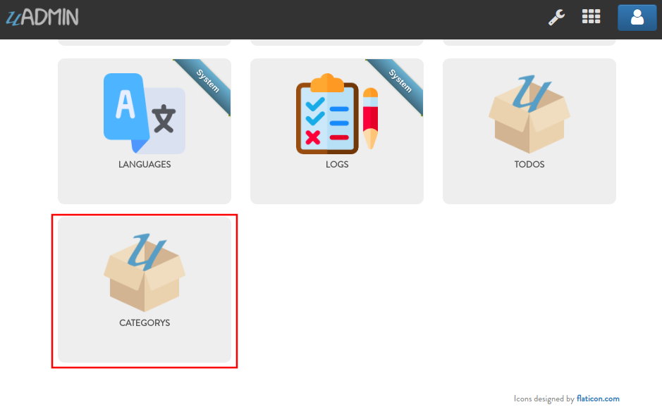
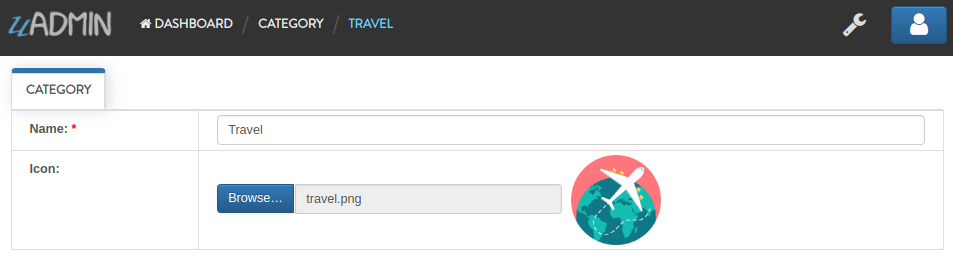
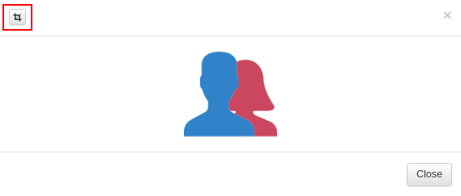
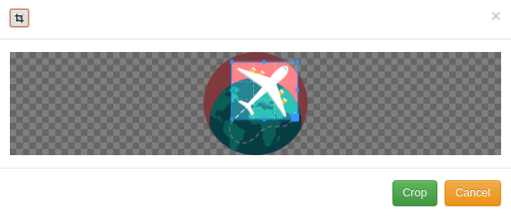

uAdmin Tutorial Part 2 - Internal vs. External Models
=====================================================
In this part, we will discuss about the difference between internal and external models, cropping images in the model and moving a model struct from internal to external file.

Internal Models
^^^^^^^^^^^^^^^
Internal models are models inside your main.go and don’t have their .go file, they are useful if you want to make something quick.

The code below is an example of internal model:

.. code-block:: go

	package main

	import (
	    "time"
	    "github.com/uadmin/uadmin"
	)

	// Todo internal model ... 
	type Todo struct {
	    uadmin.Model
	    Name        string
	    Description string `uadmin:"html"`
	    TargetDate  time.Time
	    Progress    int `uadmin:"progress_bar"`
	}

	func main() {
	    uadmin.Register(
	        Todo{}, // register the Todo struct
	    )
	    uadmin.StartServer()
	}

External Models
^^^^^^^^^^^^^^^
External models are models outside of main.go and have their own .go file. Let’s add a category external model, create a file named category.go and add the following code:

.. code-block:: go

	package models

	import "github.com/uadmin/uadmin"

	// Category model ...
	type Category struct {
	    uadmin.Model
	    Name string `uadmin:"required"`
	    Icon string `uadmin:"image"`
	}

Now register the model on main.go where models is folder name and Category is model/struct name:

.. code-block:: go

	func main() {
	    uadmin.Register(
	        Todo{},
	        models.Category{}, // <-- place it here
	    )
	    uadmin.StartServer()
	}

Run your application. As expected, the category model is added in the uAdmin Dashboard.

|

Let's create a new data in the category model.

As you can see, the Name field is required indicated by the * symbol. Required field cannot be an empty string. In the Icon field, you can browse an image file in .png, .jpg, .jpeg, or .gif in your computer.

uAdmin also allows you to crop your images.

Once you are done, click the Crop button below and refresh the webpage to save your progress.

Move a Struct from Internal to External file
^^^^^^^^^^^^^^^^^^^^^^^^^^^^^^^^^^^^^^^^^^^^
Placing a model struct in external Go file has some advantages over internal ones:

* Easily readable in coding
* Scalability for large size projects
* Minimize code conflicts for the development team
* Relevance for development (e.g. All registers are located in the models folder. Other functionalities are located in the related folders.)

Inside the models folder, create a file named todo.go containing the following codes below:

.. code-block:: go

	package models

	import (
	    "time"
	    "github.com/uadmin/uadmin"
	)

In the main.go, move the Todo struct code:

.. code-block:: go

    package main

    import (
        "time"

        // Specify the username that you used inside github.com folder
        "github.com/username/todo/models"
        "github.com/uadmin/uadmin"
    )

    // -------------------- MOVE THIS CODE --------------------
    type Todo struct {
        uadmin.Model
        Name        string
        Description string `uadmin:"html"`
        TargetDate  time.Time
        Progress    int `uadmin:"progress_bar"`
    }
    // --------------------------------------------------------

    // Main function

To todo.go

.. code-block:: go

	package models

	import (
	    "time"
	    "github.com/uadmin/uadmin"
	)

	// -------------------- PASTE IT HERE --------------------
	type Todo struct {
	    uadmin.Model
	    Name        string
	    Description string `uadmin:"html"`
	    TargetDate  time.Time
	    Progress    int `uadmin:"progress_bar"`
	}
	// -------------------------------------------------------

In main.go, replace the Todo{} to models.Todo{} inside the uadmin.Register.

.. code-block:: go

	func main() {
	    uadmin.Register(
	        models.Todo{}, // replaced from Todo{} to models.Todo{}
	        models.Category{},
	    )
	    uadmin.StartServer()
	}

Congrats, now you know how to create an external model, adding a new data in the model through the server, cropping an image and moving a model struct from internal to external file.

In the `next part`_ we will talk about linking models using a foreign key.

.. _next part: https://uadmin.readthedocs.io/en/latest/tutorial/part3.html
