uAdmin Tutorial Part 2 - Models
===============================
Here are the following subtopics to be discussed in this part:

    * `What is a Model?`_
    * `Why do we need a Model?`_
    * `Internal Models`_
    * `External Models`_
    * `Tags`_
    * `Moving the struct from internal to external`_
    * `Linking Models`_
    * `Creating More Models`_
    * `Applying More uAdmin Tags`_
    * `Register Inlines`_
    * `Drop Down List in a Field`_

What is a Model?
^^^^^^^^^^^^^^^^
In database, it shows the logical structure of a database, including the relationships and constraints that determine how data can be stored and accessed. Individual database models are designed based on the rules and concepts of whichever broader data model the designers adopt. Most data models can be represented by an accompanying database diagram. [#f1]_

Model is where we keep all registered models. It is the standard struct to be embedded in any other struct to make it a model for uAdmin.

Why do we need a Model?
^^^^^^^^^^^^^^^^^^^^^^^
It helps you to reduce unnecessary columns, by constructing an optimal data structure with the fewest tables and columns. It thus helps reduce system complexity and hence reduce cost. [#f2]_

Internal Models
^^^^^^^^^^^^^^^
Internal models are models inside your main.go and don’t have their .go file, they are useful if you want to make something quick but it is advisable to always you external models.

The code below is an example of internal model:

.. code-block:: go

    package main

    import (
	    "time"
	    "github.com/username/todo/models"
	    "github.com/uadmin/uadmin"
    )

    // Todo internal model ... 
    type Todo struct {
	    uadmin.Model
	    Name        string
	    Description string `uadmin:"html"`
	    TargetDate  time.Time
	    Progress    int `uadmin:"progress_bar"`
    }

    func main() {
	    uadmin.Register(
		    Todo{}, // register the Todo struct
		    models.Category{},
	    )
	    uadmin.StartServer()
    }

External Models
^^^^^^^^^^^^^^^^
External models are models outside of main.go and have their own .go file. Let’s add a category external model, create a file named category.go and add the following code:

.. code-block:: go

    package models

    import "github.com/uadmin/uadmin"

    // Category model ...
    type Category struct {
	    uadmin.Model
	    Name string
	    Icon string
    }

Category Model User Interface

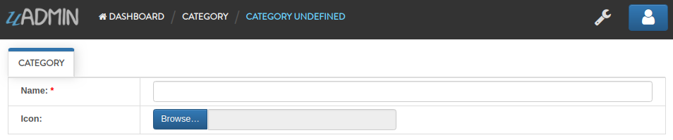

|

Now register the model on main.go where models is folder name and category is model/struct name:

Copy this code below

.. code-block:: go

    "github.com/username/todo/models" // put this code inside import
    models.Category{}, // put this code inside the func main()

To the main.go

.. code-block:: go

    package main

    import (
        "time"
        "github.com/username/todo/models" // <-- place it here
        "github.com/uadmin/uadmin"
    )

    // Some codes are contained in this line ... (ignore this part)

    func main() {
	    uadmin.Register(
		    Todo{},
		    models.Category{}, // <-- place it here
	    )
	    uadmin.StartServer()
    }

|

Let's run the code and see what happens:

.. code-block:: bash

    $ cd ~/go/src/github.com/your_name/todo
    $ go build; ./firstapp
    [   OK   ]   Initializing DB: [10/10]
    [   OK   ]   Server Started: http://0.0.0.0:8080
            ___       __          _
    __  __/   | ____/ /___ ___  (_)___
    / / / / /| |/ __  / __  __ \/ / __ \
    / /_/ / ___ / /_/ / / / / / / / / / /
    \__,_/_/  |_\__,_/_/ /_/ /_/_/_/ /_/

|

As expected, the category model is added in the uAdmin Dashboard.

.. image:: assets/categorymodelselected.png

|

Let's create a new data in the category model.

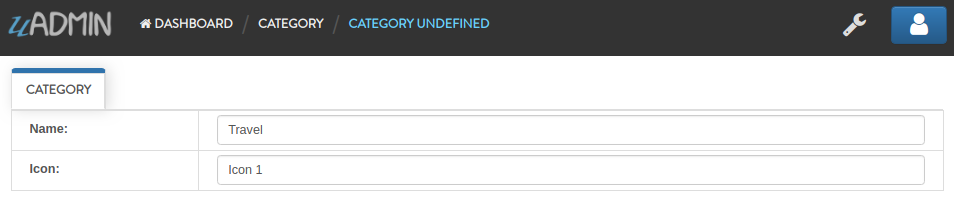

|

Result

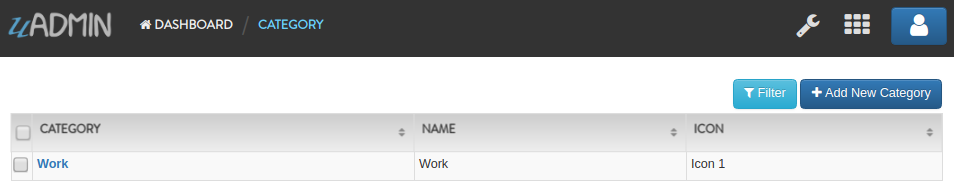

|

Tags
^^^^
uAdmin has a tag feature that allows a field to change to an appropriate type. Let’s tag the Name as “required” and Icon as “image” in our category model.

Tags are added beside the field names after the data type, like this:

.. code-block:: go

    Name string `uadmin:"required"`
    Icon string `uadmin:"image"`

To the category.go inside the models folder

.. code-block:: go

    package models

    import "github.com/uadmin/uadmin"

    // Category model ...
    type Category struct {
	    uadmin.Model
	    Name string `uadmin:"required"` // <-- place it here
	    Icon string `uadmin:"image"` // <-- place it here
    }

|

Let's run the code and see what happens.

.. image:: assets/categorywithtagapplied.png

As you can see, the Name field is now required indicated by the * symbol and the Icon field is now an image type.

|

Output

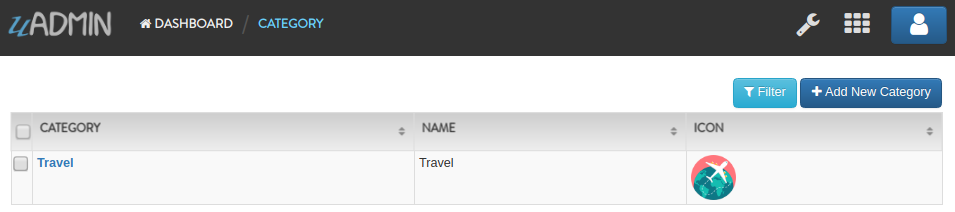

|

.. code-block:: go

    Icon string `uadmin:"image"`

uAdmin also allows you to crop your images. In order to that, click the image icon highlighted below.

.. image:: assets/iconhighlighted.png

|

Click the crop icon on the top left corner.

.. image:: assets/cropiconhighlighted.png

|

You are now set to edit mode. Click any points highlighted below then drag your mouse in order to crop/resize your image.

.. image:: assets/croppointshighlighted.png

.. image:: assets/croppedicon.png

|

Once you are done, click the Crop button below and refresh the webpage to save your progress.

.. image:: assets/croppediconoutput.png

Well done! The travel icon is now cropped in the model structure.

|

.. code-block:: go

    Name string `uadmin:"required"`

What if I set the name value as empty?

.. image:: assets/namefieldempty.png

A warning message "Please fill out this field." will display on your screen because the Name field has a "required" tag on it.

That is how the uAdmin tag works in this scenario. For more information about tags, click `here`_.

.. _here: https://uadmin.readthedocs.io/en/latest/tags.html

Moving the struct from internal to external
^^^^^^^^^^^^^^^^^^^^^^^^^^^^^^^^^^^^^^^^^^^
Let's do some code cleanup in the main.go. Before that, create a file named todo.go in the models folder. Move the code as shown below.

.. code-block:: go

    // Todo model ... 
    type Todo struct {
	    uadmin.Model
	    Name        string
	    Description string `uadmin:"html"`
	    TargetDate  time.Time
	    Progress    int `uadmin:"progress_bar"`
    }

|

To the todo.go in the models folder

.. code-block:: go

    package models

    import (
	    "time"
	    "github.com/uadmin/uadmin"
    )

    // ---------------- PASTE IT HERE -----------------

|

Go back to the main.go. Replace Todo{} to models.Todo{} in the uAdmin.Register. "models." was added before Todo{} because the Todo struct is located on todo.go in the models folder.

.. code-block:: go

    package main

    import (
	    "github.com/username/todo/models"
	    "github.com/uadmin/uadmin"
    )

    func main() {
	    uadmin.Register(
		    models.Todo{}, // Replaced from Todo{} to models.Todo{}
		    models.Category{},
	    )
	    uadmin.StartServer()
    }

Linking Models
^^^^^^^^^^^^^^
Linking a model to another model is as simple as creating a field using a foreign key. ForeignKeys is the link between models' and their inlines. In the example below we linked the Category model into Todo model, now the Todo model will return its data as a field in the Category model.

.. code-block:: go

    package models

    import (
	    "time"
	    "github.com/uadmin/uadmin"
    )

    // Todo model ...
    type Todo struct {
	    uadmin.Model
	    Name        string
	    Description string   `uadmin:"html"`
	    Category    Category // <-- Category Model
	    CategoryID  uint     // <-- CategoryID
	    TargetDate  time.Time
	    Progress    int `uadmin:"progress_bar"`
    }

|

Result

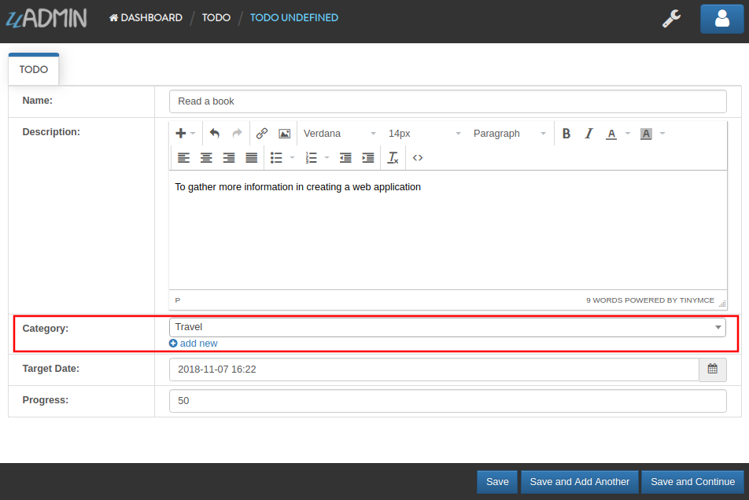

|

Now let's add CreatedAt field in the Todo model, set the tag as "hidden". The "hidden" tag means the field is invisible in the editing section.

Copy this code below

.. code-block:: go

    CreatedAt   time.Time `uadmin:"hidden"`

To the todo.go inside the models folder

.. code-block:: go

    package models

    import (
	    "time"
	    "github.com/uadmin/uadmin"
    )

    // Todo model ...
    type Todo struct {
	    uadmin.Model
	    Name        string
	    Description string `uadmin:"html"`
	    Category    Category
	    CategoryID  uint
	    CreatedAt   time.Time `uadmin:"hidden"` // <-- place it here
	    TargetDate  time.Time
	    Progress    int `uadmin:"progress_bar"`
    }

|

Now let's create a new data in the Todo model. As you can see, the CreatedAt field cannot be seen in the editing section.

.. image:: assets/buildarobotdataintodo.png

|

But when you save it...

.. image:: assets/buildarobotdataintodooutput.png

Tada! The CreatedAt field is shown in the output of the Todo model.

Creating More Models
^^^^^^^^^^^^^^^^^^^^
Create a file named friend.go inside your models folder, containing the following codes below.

.. code-block:: go

    package models

    import "github.com/uadmin/uadmin"

    // Friend model ...
    type Friend struct {
        uadmin.Model
        Name     string `uadmin:"required"`
        Email    string `uadmin:"email"`
        Password string `uadmin:"password;list_exclude"`
    }

Friend Model User Interface

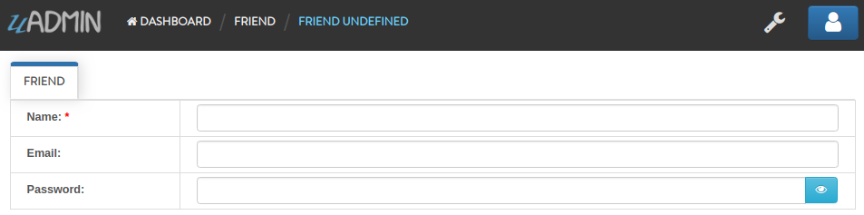

|

Now connect the Friend model into the main.go by calling the models.Friend{} inside the uadmin.Register.

Copy this code below

.. code-block:: go

    models.Friend{}, // put this code inside the func main()

To the main.go

.. code-block:: go

    package main

    import (
	    "github.com/username/todo/models"
	    "github.com/uadmin/uadmin"
    )

    func main() {
	    uadmin.Register(
		    models.Todo{},
		    models.Category{},
		    models.Friend{}, // <-- place it here
	    )
	    uadmin.StartServer()
    }

|

Let's run the code and see what happens:

.. code-block:: bash

    $ cd ~/go/src/github.com/your_name/todo
    $ go build; ./firstapp
    [   OK   ]   Initializing DB: [11/11]
    [   OK   ]   Server Started: http://0.0.0.0:8080
            ___       __          _
    __  __/   | ____/ /___ ___  (_)___
    / / / / /| |/ __  / __  __ \/ / __ \
    / /_/ / ___ / /_/ / / / / / / / / / /
    \__,_/_/  |_\__,_/_/ /_/ /_/_/_/ /_/

|

As expected, the Friend model is added in the uAdmin Dashboard.

.. image:: assets/friendsmodelselected.png

|

Let's create a new data in the Friend model.

.. image:: assets/friendsdata.png

|

Result

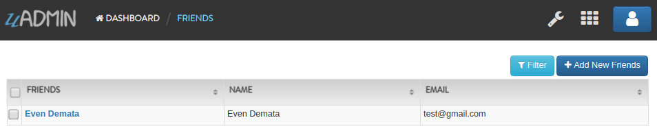

|

As you can see, the password field is not shown in the output. Why? If you go back to the Friend model, the password field has the tag name "list_exclude". It means it will hide the field or column name in the model structure.

In the example below we linked the Friend model into Todo model, now the Todo model will return its data as a field in the Friend model.

.. code-block:: go

    package models

    import (
	    "time"
	    "github.com/uadmin/uadmin"
    )

    // Todo model ...
    type Todo struct {
	    uadmin.Model
	    Name        string
	    Description string `uadmin:"html"`
	    Category    Category
	    CategoryID  uint
	    Friend     Friend   // <-- Friend Model
	    FriendID   uint      // <-- FriendID
	    CreatedAt   time.Time `uadmin:"hidden"`
	    TargetDate  time.Time
	    Progress    int `uadmin:"progress_bar"`
    }

|

Let's run the code again. Go back to your todo model and see what happens.

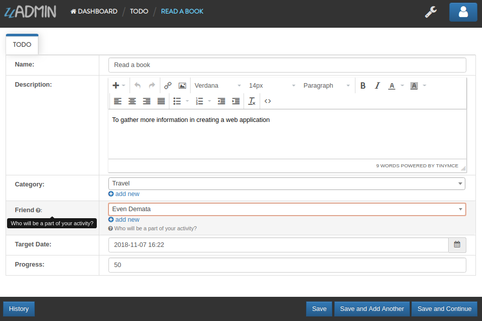

|

Result:

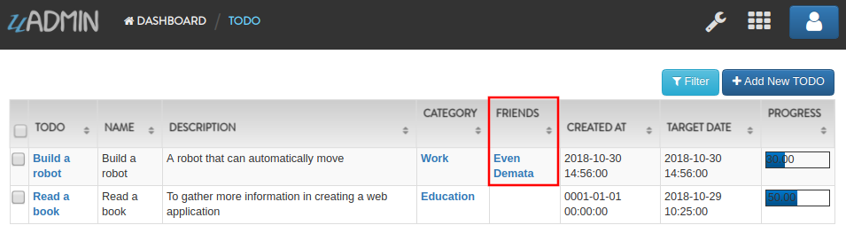

Create a file named item.go inside your models folder, containing the following codes below.

.. code-block:: go

    package models

    import "github.com/uadmin/uadmin"

    // Item model ...
    type Item struct {
	    uadmin.Model
	    Name        string `uadmin:"required"`
	    Description string
	    Cost        int
	    Rating      int
    }

Item Model User Interface

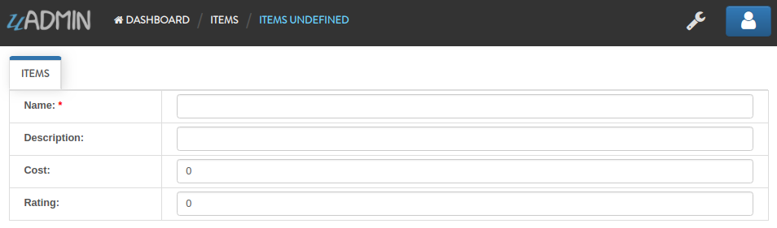

|

Now connect the Item model into the main.go by calling the models.Item{} inside the uadmin.Register.

Copy this code below

.. code-block:: go

    models.Item{}, // put this code inside the func main()

To the main.go

.. code-block:: go

    package main

    import (
	    "github.com/username/todo/models"
	    "github.com/uadmin/uadmin"
    )

    func main() {
	    uadmin.Register(
		    models.Todo{},
		    models.Category{},
		    models.Friends{},
		    models.Item{}, // <-- place it here
	    )
	    uadmin.StartServer()
    }

|

Let's run the code and see what happens:

.. code-block:: bash

    $ cd ~/go/src/github.com/your_name/todo
    $ go build; ./firstapp
    [   OK   ]   Initializing DB: [12/12]
    [   OK   ]   Server Started: http://0.0.0.0:8080
            ___       __          _
    __  __/   | ____/ /___ ___  (_)___
    / / / / /| |/ __  / __  __ \/ / __ \
    / /_/ / ___ / /_/ / / / / / / / / / /
    \__,_/_/  |_\__,_/_/ /_/ /_/_/_/ /_/

|

As expected, the Item model is added in the uAdmin Dashboard.

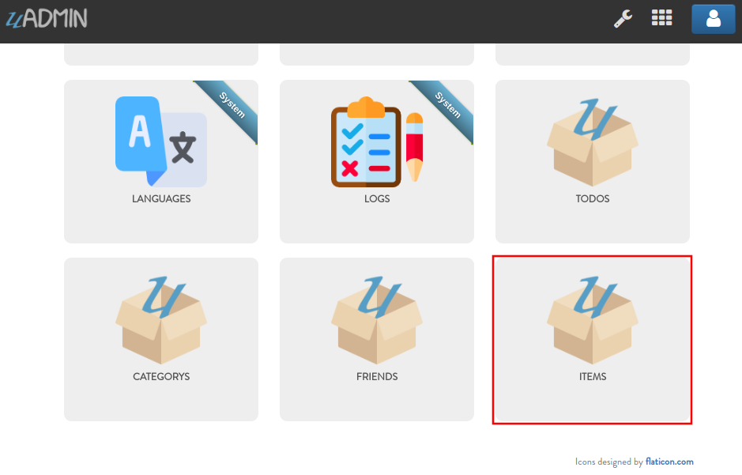

|

Let's create a new data in the Item model.

.. image:: assets/itemsdata.png

|

Result

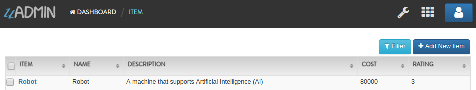

|

In the example below we linked the Item model into Todo model, now the Todo model will return its data as a field in the Item model.

.. code-block:: go

    package models

    import (
	    "time"
	    "github.com/uadmin/uadmin"
    )

    // Todo model ...
    type Todo struct {
	    uadmin.Model
	    Name        string
	    Description string `uadmin:"html"`
	    Category    Category
	    CategoryID  uint
	    Friend     Friend
	    FriendID   uint
	    Item       Item     // <-- Item Model
	    ItemID     uint      // <-- ItemID
	    CreatedAt   time.Time `uadmin:"hidden"`
	    TargetDate  time.Time
	    Progress    int `uadmin:"progress_bar"`
    }

|

Let's run the code again. Go back to your Todo model and see what happens.

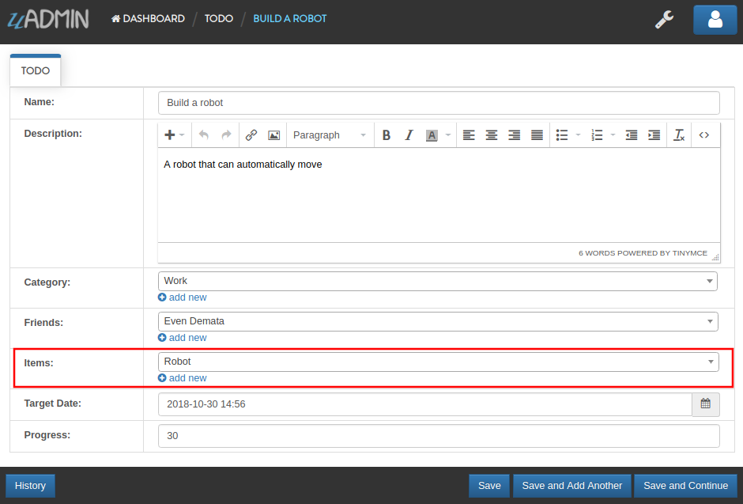

|

Result

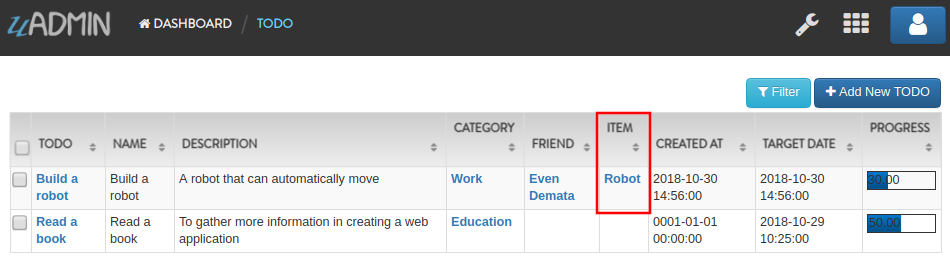

The Item model is now connected into the Todo model.

Applying More uAdmin Tags
^^^^^^^^^^^^^^^^^^^^^^^^^
Now let's try something much cooler that we can apply in the Item model by adding different types of tags. Before we proceed, add more data in your Item model. Once you are done, let's add the "search" tag in the name field of item.go and see what happens.

.. code-block:: go

    package models

    import "github.com/uadmin/uadmin"

    // Item model ...
    type Item struct {
	    uadmin.Model
	    Name        string `uadmin:"required;search"` // <-- place it here
	    Description string
	    Cost        int
	    Rating      int
    }

Result

.. image:: assets/searchtagapplied.png

|

Search the word "mini" and see what happens.

.. image:: assets/searchtagappliedoutput.png

|

Nice! Now go back to item.go and apply the tag categorical_filter and filter in the Name field and see what happens.

.. code-block:: go

	Name string `uadmin:"required;search;categorical_filter;filter"` // <-- place it here

Click the filter button on the upper right.

Result

.. image:: assets/filtertagapplied.png

|

Now let's filter the word "iPad" and see what happens.

.. image:: assets/filtertagappliedoutput.png

|

We can also apply display_name tag with a given value such as "Product Name".

.. code-block:: go

    Name string `uadmin:"required;search;categorical_filter;filter;display_name:Product Name"` // <-- place it here

|

Result

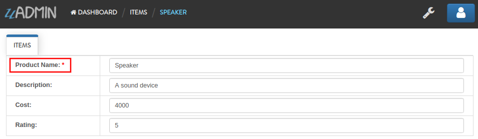

|

uAdmin has a default_value tag which will generate a value automatically in the field. Let's say "Computer".

.. code-block:: go

    Name string `uadmin:"required;search;categorical_filter;filter;display_name:Product Name;default_value:Computer"`

|

Result

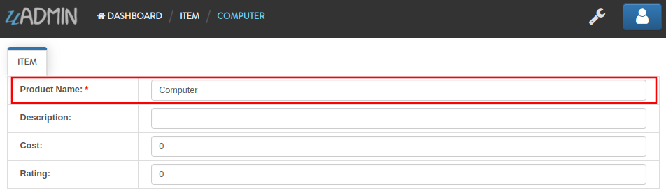

|

You can also add multilingual tag in the Description field. This means you can use more than two languages for input.

.. code-block:: go

    Description string `uadmin:"multilingual"` // <-- place it here

|

Result

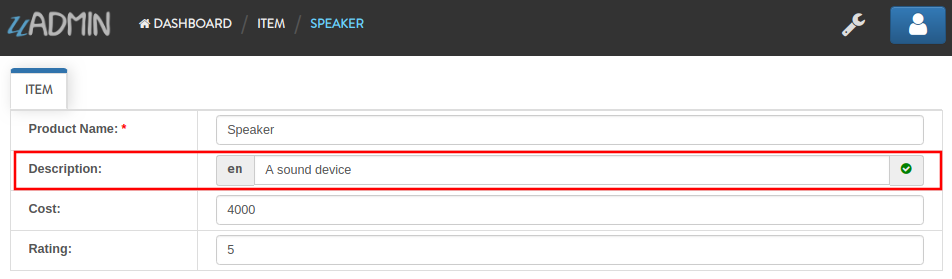

|

If you want to add more languages in your model, go to the Languages in the uAdmin dashboard.

.. image:: assets/languageshighlighted.png

|

Let's say I want to add Chinese and Tagalog in the Items model. In order to do that, set the Active as enabled.

.. image:: assets/activehighlighted.png

|

Now go back to the Items model and see what happens.

.. image:: assets/multilingualtagappliedmultiple.png

|

In the Cost field, set the "money" tag and see what happens.

.. code-block:: go

    Cost int `uadmin:"money"` // <-- place it here

|

Result

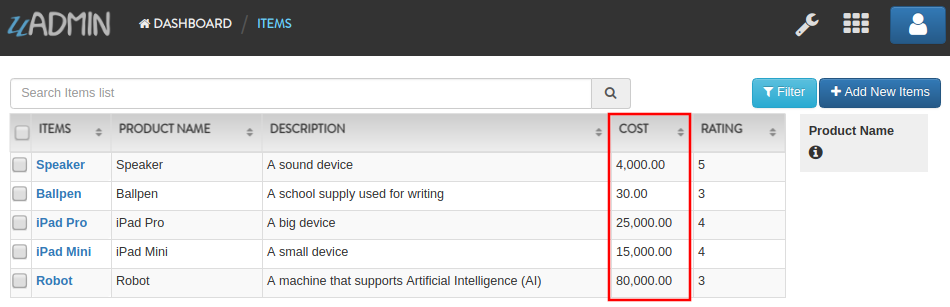

|

You can also set pattern and pattern_msg tag in the Cost field. This means the user must input numbers only. If he inputs otherwise, the pattern message will show up on the screen.

.. code-block:: go

    Cost int `uadmin:"money;pattern:^[0-9]*$;pattern_msg:Your input must be a number."` // <-- place it here

|

Result

.. image:: assets/patterntagapplied.png

|

To solve this case, we can use a help tag feature in order to give users a solution to the complex tasks encountered in the model.

.. code-block:: go

    Cost int `uadmin:"money;pattern:^[0-9]*$;pattern_msg:Your input must be a number.;help:Input numeric characters only in this field."` // <-- place it here

|

Result

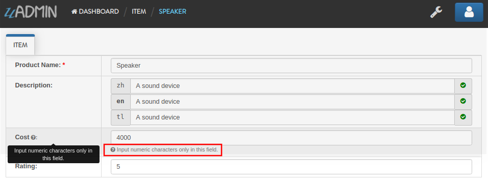

|

We can also use min and max tags in the Rating field. Min tag means the minimum value that a user can input and the max one means the maximum value. Let's set the min value as 1 and the max value as 5.

.. code-block:: go

    Rating int `uadmin:"min:1;max:5"`

|

See what happens if the user inputs the value outside the range.

.. image:: assets/minmaxtagapplied.png

|

uAdmin also has a multiselection feature that allows you to select more than one element inside an input box field. In order to do that, let's add Category on the first line, use the array type, set as "m2m" and "list_exclude", and add CategoryList on the second line with the tag "read_only". This means it cannot be modified.

Copy this code below

.. code-block:: go

    Category     []Category `uadmin:"m2m;list_exclude"`
    CategoryList string     `uadmin:"read_only"`

To the item.go inside the models folder

.. code-block:: go

    package models

    import "github.com/uadmin/uadmin"

    // Item model ...
    type Item struct {
	    uadmin.Model
	    Name         string     `uadmin:"search;categorical_filter;filter;display_name:Product Name"`
	    Description  string     `uadmin:"multilingual"`
	    Category     []Category `uadmin:"m2m;list_exclude"`  // <-- place it here
	    CategoryList string     `uadmin:"read_only"`         // <-- place it here
	    Cost         int        `uadmin:"money;pattern:^[0-9]*$;pattern_msg:Your input must be a number."`
	    Rating       int        `uadmin:"min:1;max:5"`
    }

Copy this one as well and paste it below the Item struct.

.. code-block:: go

    // CategorySave ...
    func (i *Item) CategorySave() {
        catList := ""

        for x, key := range i.Category {
            catList += key.Name
            if x != len(i.Category)-1 {
                catList += ", "
            }
        }

        i.CategoryList = catList
        uadmin.Save(i)
    }

    // Save ...
    func (i *Item) Save() {
        if i.ID == 0 {
            i.CategorySave()
        }

        i.CategorySave()
    }

|

Let's run the application and see what happens.

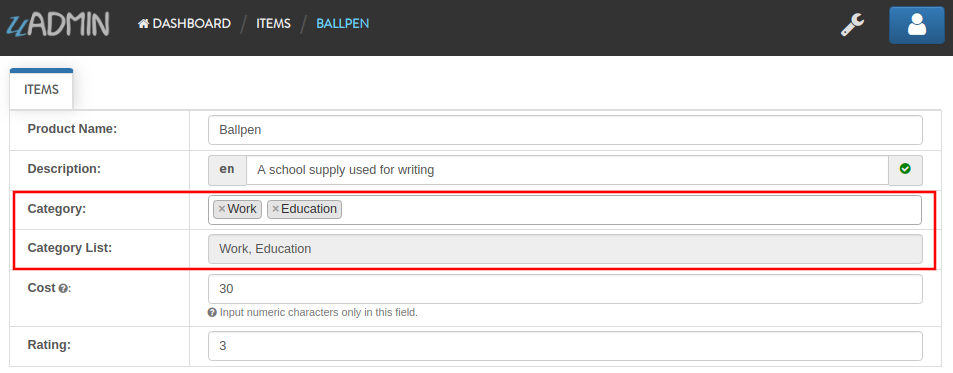

|

Result

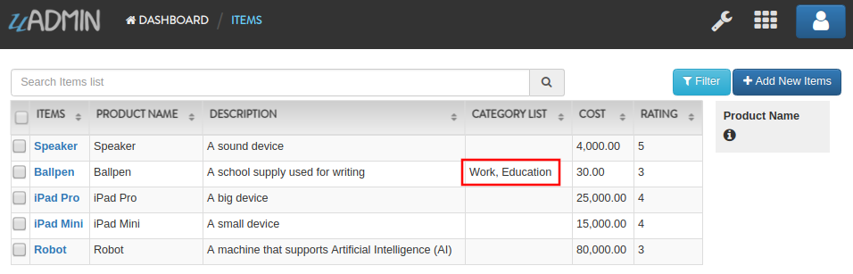

Well done! You already know how to apply most of the tags available in our uAdmin framework that are functional in our Todo List project.

Register Inlines
^^^^^^^^^^^^^^^^
Inlines is where we keep all registered models' inlines. It allows you to merge a parent model to a submodel where the foreign key(s) are specified.

**Why do we use Register inlines?** We use them to show that the field of a model is related to another model as long as there is a foreign key specified.

Syntax:

.. code-block:: go

    uadmin.RegisterInlines(/folder_name/./struct_name of a parent model/{}, map[string]string{
        "/sub_model name/": "/parent_model name/ID",
    })

Now let's apply it in the main.go. Copy the codes below and paste it after the uadmin.Register function.

.. code-block:: go

    uadmin.RegisterInlines(models.Category{}, map[string]string{
        "Todo": "CategoryID",
    })
    uadmin.RegisterInlines(models.Friends{}, map[string]string{
        "Todo": "FriendsID",
    })
    uadmin.RegisterInlines(models.Items{}, map[string]string{
        "Todo": "ItemsID",
    })

Let's run the application and see what happens.

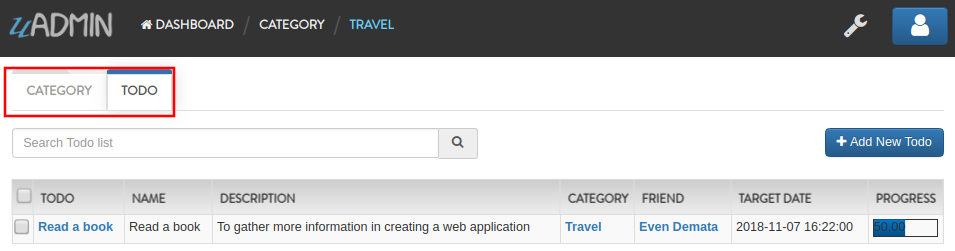

Tada! The parent model Todo is now included in the Category submodel as shown above. You can go to Friends and Items models and it will display the same result.

We can also do that in internal models by replacing the path to (folder_name).(struct_name).

.. code-block:: go

    // Todo model ...
    type Todo struct {
        uadmin.Model
        Name        string
        Description string `uadmin:"html"`
        Category    models.Category // <-- replaced from Category to models.Category
        CategoryID  uint
        Friends     models.Friends // <-- replaced from Category to models.Friends
        FriendsID   uint
        Items       models.Items // <-- replaced from Category to models.Items
        ItemsID     uint
        CreatedAt   time.Time `uadmin:"hidden"`
        TargetDate  time.Time
        Progress    int `uadmin:"progress_bar"`
    }

    // Some codes are contained in this line ... (ignore this part)

    uadmin.Register(
        Todo{}, // <-- calling internal model
        models.Category{},
        models.Friends{},
        models.Items{},
    )

When you run the application, it will still work as expected.

Drop Down List in a Field
^^^^^^^^^^^^^^^^^^^^^^^^^
Go to the friend.go in the models folder. Let's manually add a drop down list selection in the Nationality field. In order to do that, initialize a variable with the type int. Create a function that will set an element and return the integer value inside it. One function is equivalent to one element. Put it above the Friend model.

.. code-block:: go

    // Nationality ...
    type Nationality int

    // Chinese ...
    func (n Nationality) Chinese() Nationality {
        return 1
    }

    // Filipino ...
    func (n Nationality) Filipino() Nationality {
        return 2
    }

    // Others ...
    func (n Nationality) Others() Nationality {
        return 3
    }

    // Friend model ...
    type Friend struct {
        // Some codes contained inside
    }

|

Now inside the Friend model, initialize a Nationality field so that it will be created.

.. code-block:: go

    // Friend model ...
    type Friend struct {
        uadmin.Model
        Name        string `uadmin:"required"`
        Email       string `uadmin:"email"`
        Password    string `uadmin:"password;list_exclude"`
        Nationality Nationality // <-- place it here
    }

Output

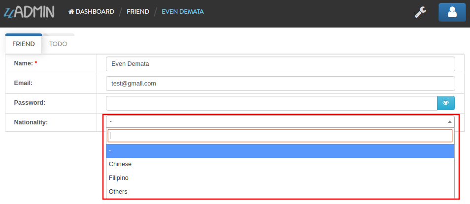

We can also add an Invite field that will direct you to his website. In order to do that, set the field name as "Invite" with the tag "link".

.. code-block:: go

    // Friend model ...
    type Friend struct {
        uadmin.Model
        Name        string `uadmin:"required"`
        Email       string `uadmin:"email"`
        Password    string `uadmin:"password;list_exclude"`
        Nationality Nationality
        Invite      string `uadmin:"link"` // <-- place it here
    }

To make it functional, add the overriding save function after the Friend struct.

.. code-block:: go

    // Save !
    func (f *Friend) Save() {
        f.Invite = "https://uadmin.io/"
        uadmin.Save(f)
    }

Run your application, go to the Friends model and update the elements inside. Afterwards, click the Invite button on the output structure and see what happens.

.. image:: assets/invitebuttonhighlighted.png

|

Result

.. image:: assets/uadminwebsitescreen.png

Congrats, you know now how to manage your models and scale your project to a large scale project using models and how to use different tags and apply business logic to the models.

References
----------
.. [#f1] Lucid Software Inc. (2018). What is a Database Model? Retrieved from https://www.lucidchart.com/pages/database-diagram/database-models
.. [#f2] Morgan, Andrew (2017, August 8). What is the importance of data modeling? Retrieved from https://www.quora.com/What-is-the-importance-of-data-modeling/answer/Andrew-Morgan-28