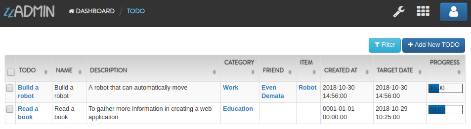
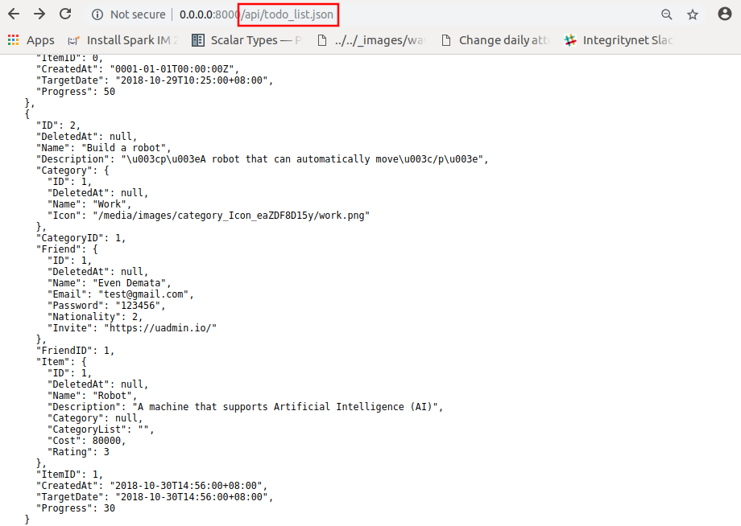

uAdmin Tutorial Part 7 - Introduction to API
============================================
In this part, we will discuss about establishing a connection to the API, setting the path name, and getting the todo list data in the API Handler using JSON.

Create a file named api.go inside the api folder with the following codes below:

.. code-block:: go

    package api

    import (
        "fmt"
        "net/http"
        "strings"
    )

    // APIHandler !
    func APIHandler(w http.ResponseWriter, r *http.Request) {
        // r.URL.Path creates a new path called /api
        r.URL.Path = strings.TrimPrefix(r.URL.Path, "/api")
    }

As shown above, we have to call the variable named "APIHelp" to inform the user what are the methods to visit in the api path. To make the API function, we create a handler named "APIHandler" that handles two parameters which are **http.ResponseWriter** that assembles the HTTP server's response; by writing to it, we send data to the HTTP client; and **http.Request** which is a data structure that represents the client HTTP request. **r.URL.Path** is the path component of the request URL.

Go back to the main.go and apply **uadmin.RootURL** as "/admin/" to make the /api functional. Put it above the uadmin.Register.

.. code-block:: go

    func main() {
        uadmin.RootURL = "/admin/" // <-- place it here
        uadmin.Register(
            // Some codes
        )
    }

Establish a connection in the main.go to the API by using http.HandleFunc. It should be placed after the uadmin.Register and before the StartServer.

.. code-block:: go

    func main() {
        // Some codes

        // API Handler
        http.HandleFunc("/api/", api.APIHandler) // <-- place it here
    }

api is the folder name while APIHandler is the name of the function inside api.go.

Now let's create another file inside the api folder named todo_list.go. This will return the list of your todo activities in JSON format.

.. code-block:: go

    package api

    import (
        "net/http"
        "strings"

        "github.com/username/todo/models"
        "github.com/uadmin/uadmin"
    )

    // TodoListHandler !
    func TodoListHandler(w http.ResponseWriter, r *http.Request) {
        // r.URL.Path creates a new path called /todo_list
        r.URL.Path = strings.TrimPrefix(r.URL.Path, "/todo_list")

        // Fetches all object in the database
        todo := []models.Todo{}
        uadmin.All(&todo)

        // Accesses and fetches data from another model
        for t := range todo {
            uadmin.Preload(&todo[t])
        }

        // Prints the todo in JSON format
        uadmin.ReturnJSON(w, r, todo)
    }

Finally, add this piece of code in the api.go shown below. This will establish a communication between the TodoListHandler and the APIHandler.

.. code-block:: go

    // APIHandler !
    func APIHandler(w http.ResponseWriter, r *http.Request) {
        r.URL.Path = strings.TrimPrefix(r.URL.Path, "/api")

        // ------------------ ADD THIS CODE ------------------
        if strings.HasPrefix(r.URL.Path, "/todo_list") {
            TodoListHandler(w, r)
            return
        }
        // ------------------ ADD THIS CODE ------------------
    }

Now run your application. Suppose you have two records in your Todo model.

|

If you go to /api/todo_list, you will see the list of each data in a more powerful way using JSON format.

|

Congrats, now you know how to do the following:

* Establishing a connection to the API
* Setting the path name using r.URL.Path
* How to use API Handlers
* Fetches data in another model

In the `next part`_, we will discuss about customizing your own API handler such as sorting the record in ascending or descending order, the starting point of execution process start until the assigned limit, and the action you want to perform in your database.

.. _next part: https://uadmin.readthedocs.io/en/latest/tutorial/part8.html