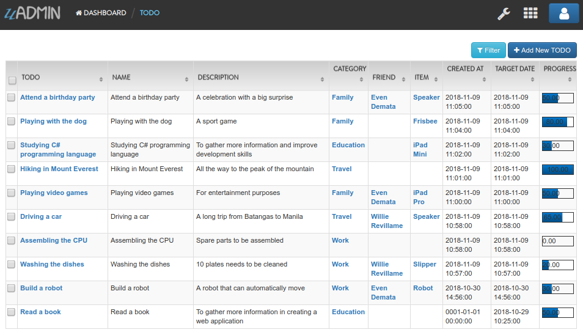

uAdmin Tutorial Part 8 - Customizing your API Handler
=====================================================
Before we proceed to this tutorial, let's create at least 10 records in the Todo model.

|

For the case scenario, our client requests a data that returns only the last 5 activities sorted in descending order. In order to do that, use the public function called **uadmin.AdminPage**. AdminPage fetches records from the database with some standard rules such as sorting data, multiples of, and setting a limit that can be used in pagination. He also requests that the linking models should return only the name, not the other details within that model. Let's create another API file named "custom_list.go" containing the following codes below:

.. code-block:: go

    package api

    import (
        "net/http"
        "strings"

        // Specify the username that you used inside github.com folder
        "github.com/username/todo/models"
        "github.com/uadmin/uadmin"
    )

    // CustomListHandler !
    func CustomListHandler(w http.ResponseWriter, r *http.Request) {
        r.URL.Path = strings.TrimPrefix(r.URL.Path, "/custom_list")

        // Fetch Data from DB
        todo := []models.Todo{}

        // Assigns a map as a string of interface to store any types of values
        results := []map[string]interface{}{}

        // "id" - order the todo model by id
        // false - to sort in descending order
        // 0 - start at index 0
        // 5 - get five records
        // &todo - todo model to execute
        // "" - fetch the id of the model itself
        uadmin.AdminPage("id", false, 0, 5, &todo, "")

        // Loop to fetch the record of todo
        for i := range todo {
            // Accesses and fetches the record of the linking models in Todo
            uadmin.Preload(&todo[i])

            // Assigns the string of interface in each Todo fields
            results = append(results, map[string]interface{}{
                "ID":          todo[i].ID,
                "Name":        todo[i].Name,
                "Description": todo[i].Description,
                // This returns only the name of the Category model, not the
                // other fields
                "Category": todo[i].Category.Name,
                // This returns only the name of the Friend model, not the
                // other fields
                "Friend": todo[i].Friend.Name,
                // This returns only the name of the Item model, not the other
                // fields
                "Item":       todo[i].Item.Name,
                "TargetDate": todo[i].TargetDate,
                "Progress":   todo[i].Progress,
            })
        }

        // Prints the results in JSON format
        uadmin.ReturnJSON(w, r, results)
    }

Finally, add the following pieces of code in the api.go shown below. This will establish a communication between the CustomListHandler and the APIHandler.

.. code-block:: go

    // APIHandler !
    func APIHandler(w http.ResponseWriter, r *http.Request) {
        r.URL.Path = strings.TrimPrefix(r.URL.Path, "/api")

        if strings.HasPrefix(r.URL.Path, "/todo_list") {
            TodoListHandler(w, r)
            return
        }
        // ------------------ ADD THIS CODE ------------------
        if strings.HasPrefix(r.URL.Path, "/custom_list") {
            CustomListHandler(w, r)
            return
        }
        // ------------------ ADD THIS CODE ------------------
    }

Now run your application. If you go to /api/custom_list, you will see the list of your last 5 activities sorted in descending order in a more powerful way using JSON format.

.. image:: assets/todoapicustomjson.png

|

Congrats, now you know how to customize your own API by returning the data based on the limit, sorting the data in descending order, and assigning a value to the submodel that returns only one field.

In the `next part`_, we will talk about inserting the data to the models through the API by using multiple parameters.

.. _next part: https://uadmin.readthedocs.io/en/latest/tutorial/part9.html