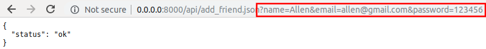

uAdmin Tutorial Part 9 - Inserting and Saving the Record
========================================================
Create a file named "add_friend.go" inside the api folder with the following codes below:

.. code-block:: go

    package api

    import (
        "net/http"
        "strings"

        "github.com/username/todo/models"
        "github.com/uadmin/uadmin"
    )

    // AddFriendHandler !
    func AddFriendHandler(w http.ResponseWriter, r *http.Request) {
        r.URL.Path = strings.TrimPrefix(r.URL.Path, "/add_friend")
        res := map[string]interface{}{}
        if r.URL.Path == "" || r.URL.Path[0] != '.' {
            res["status"] = "ERROR"
            res["err_msg"] = "No data type was specified"
            uadmin.ReturnJSON(w, r, res)
            return
        }

        // Fetch data from Friend DB
        friend := models.Friend{}

        // Set the parameters of Name, Email, and Password
        friendName := r.FormValue("name")
        friendEmail := r.FormValue("email")
        friendPassword := r.FormValue("password")

        // Validate if the friendName variable is empty.
        if friendName == "" {
            res["status"] = "ERROR"
            res["err_msg"] = "Name is required."
            uadmin.ReturnJSON(w, r, res)
            return
        }

        // Store input into the Name, Email, and Password fields
        friend.Name = friendName
        friend.Email = friendEmail
        friend.Password = friendPassword

        // Store input in the Friend model
        uadmin.Save(&friend)

        res["status"] = "ok"
        uadmin.ReturnJSON(w, r, res)
    }

Finally, add the following pieces of code in the api.go shown below. This will establish a communication between the AddFriendHandler and the APIHandler.

.. code-block:: go

    const API_HELP = `TODO API HELP
    For more assistance please contact Integritynet:
    support@integritynet.biz

    // Some information contained inside this part

    // --------------------- ADD THIS CODE ---------------------
    ============
        # method     : add_friend
        # Parameters:  name (string), email (string), password (string)
        # Return    : inserts the information in the Friend model
    // ---------------------------------------------------------
    `

    func APIHandler(w http.ResponseWriter, r *http.Request) {

        // Some codes contained in this part

        // --------------------- ADD THIS CODE ---------------------
        if strings.HasPrefix(r.URL.Path, "/add_friend") {
            AddFriendHandler(w, r)
            return
        }
        // ---------------------------------------------------------
    }

Now run your application. In order to insert the information in the Friend model, put the **?** symbol after /api/add_friend.json path which means **WHERE** in SQL, followed by the parameter name. Set the value of each parameter to store your input and save into the Friend model. **&** symbol is equivalent to **AND** in SQL.

* name = Allen
* email = allen@gmail.com
* password = 123456

|

Go back to the Friend model. You will notice that Allen was added inside it.

.. image:: assets/todomodeladdfriend.png

|

Congrats, now you know how to insert and save a record to the model in the API using multiple parameters.

See `API Reference`_ for more examples.

.. _API Reference: https://uadmin.readthedocs.io/en/latest/api.html